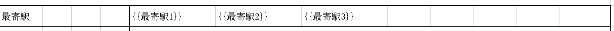
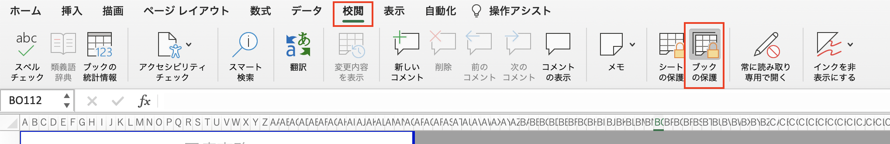
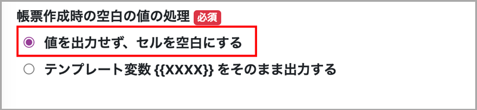
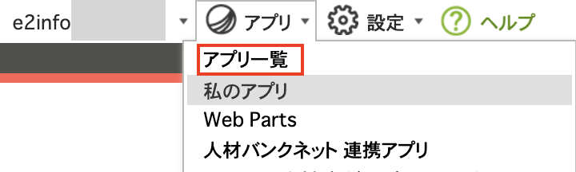
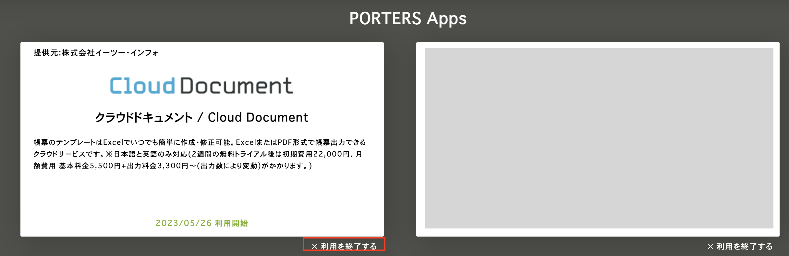
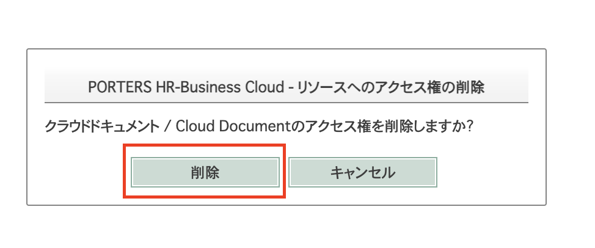

 

  

# クラウドドキュメント よくある質問

  

<h2 id="TOP">お問い合わせの多い質問</h2>

- [PDFで出力したら1枚に収まらない、出力したい部分が含まれていない複数枚にしたいが中途半端に切れてしまう](#document2) 
- [出力結果がPDFとExcelで異なります](#document9) 
- [テンプレートに使用できない関数等はありますか](#output4)  
- [利用開始後のお問い合わせ先はどちらですか](#contact1) 

  

<h2 id="TOP">よくある質問一覧</h2>

- [クラウドドキュメントについて](#about)
  - [クラウドドキュメントの動作環境はどちらになりますか？](#about1)
  - [クラウドドキュメントのレイアウトが崩れる、データが表示されない](#about2)
  - [日本語や英語以外での言語で利用できますか？](#about3)
  - [PORTERSを解約しても利用できますか？](#about4) 
- [クラウドドキュメントへのログインについて](#login)
  - [クラウドドキュメントにログインできません](#login1)
  - [クラウドドキュメントにログインの際エラーとなる](#login2)
  - [ログインすると毎回利用規約の同意を求められます ](#login3)
- [PORTERS設定について](#hrbc)　
  - [PORTERSとの同期とは何ですか](#hrbc0) 
  - [PORTERSのアクションメニューにURLを登録したあと
アクションメニューを押したら「この接続ではプライバシーが保護されません」と表示されました](#hrbc1)
  - [PORTERSのアクションメニューにURLを登録したあと
アクションメニューを押したら 謎の文字列が表示されました](#hrbc2)
- [テンプレートについて](#template) 
  - [テンプレートや出力結果のExcelの動作環境は？](#template4)
  - [テンプレートの作成や修正をお願いすることはできますか？](#template1)
  - [テンプレートの削除とステータス無効はどう違いますか？](#template2)
  - [テンプレートにマクロは使用可能ですか？](#template3)
  - [テンプレートの1つのセルに2つ以上マッピング可能ですか？](#template6)
  - [テンプレートの複数シートにマッピング可能ですか？](#template7)
- [帳票の登録・設定について](#setting) 
  - [エイリアスはどこで確認できますか?](#setting1)
  - [マッピングしたいエイリアスが選択できません](#setting2)
  - [出力ファイル名の「利用可能なエイリアス」に設定したいエイリアスが見つからない](#setting3)
  - [他の帳票からエクスポートしたマッピングデータを新しい帳票へインポートできない](#setting4)
  - [ブック保護パスワードを設定するとどうなりますか](#setting5)
  - [マッピング情報をインポートされる際に指定している「エイリアスが不正です」と表示されます](#setting6) 
- [出力について](#output)
  - [帳票をダウンロードしようとしたらPDFやExcelでのダウンロードボタンが表示されない](#output1)
  - [帳票をダウンロードしようとしたら「PORTERSに保存する」が表示されない](#output2)
  - [特定のテンプレートだけ出力の際500エラーがでてしまう](#output3)
  - [テンプレートに使用できない関数等はありますか](#output4) 
- [出力データについて](#document)
  - [出力した帳票に値が出力されない](#document0)
  - [出力した帳票にセルの枠線が入ってしまいます](#document1)
  - [PDFで出力したら1枚に収まらない、出力したい部分が含まれていない
複数枚にしたいが中途半端に切れてしまう](#document2)
  - [長文の場合枠に入りきらない、自動で枠を広げたい](#document3)
  - [マッピングしたいくつかの項目だけ帳票に出力されない](#document4)
  - [帳票にテンプレート変数 \{\{XXXX\}\} がそのまま出力される](#document5) 
  - [帳票で空欄として出力される](#document6)
  - [テンプレートで複数シートある場合、２シート目はマッピング内容が出力されない](#document7)
  - [画像の出力は可能ですか](#document8) 
  - [出力結果がPDFとExcelで異なります](#document9)
  - [出力ファイル名に使用した記号が_に変換される](#document10) 
  - [数字の3桁カンマを入れたい](#document11) 
- [料金について](#price)
  - [課金タイミングについて](#price1)
  - [どの帳票が課金対象になりますか](#price2)
  - [ご利用料金について](#price3)
  - [銀行振り込み以外の支払い方法はありますか？](#price4)
- [お問い合わせについて](#contact)
  - [利用開始後のお問い合わせ先はどちらですか](#contact1)
- [ご利用終了について](#stop)
  - [利用終了するための手続きについて](#stop1)

<h2 id="about">クラウドドキュメントについて</h2>

<h3 id="about1">Q.クラウドドキュメントの動作環境はどちらになりますか？</h3> 
A.PORTERSに準じ、以下を動作環境としております。  

【OS・ブラウザ：動作環境】 
下記バージョンにて基本動作を確認しています。 
- Windows10 Google Chrome 
- Windows11 Google Chrome 
- Windows10 Microsoft Edge Chromium 
- Windows11 Microsoft Edge Chromium 
※動作環境外のOS・ブラウザや、動作環境ブラウザでも任意設定内容によっては、正しく表示されない場合があります。 
 
【Excel：動作環境】 
メインストリームサポート中の下記バージョンにて基本動作を確認しています。 
- Office 2019 
- Office 2021 
※ただし、上記バージョンであってもOSの組み合わせ等の違いにより、不具合や未発見のバグなどが発生することがあります。 
あらかじめご了承ください。その際は、順次対応してまいります。 
※上記のバージョンでも一部利用できない関数があります。 
 [テンプレートに使用できない関数等はありますか](#output4) でご確認ください。
 
 
[▲TOPに戻る](#TOP)

  

<h3 id="about2">Q.クラウドドキュメントのレイアウトが崩れる、データが表示されない</h3> 
A.まずは動作保証対象の下記OS・ブラウザでご覧いただいているか

[クラウドドキュメントの動作保証環境はどちらになりますか？](#about1)
でご確認をお願いいたします  
 
動作保証対象のOS・ブラウザでご覧いただいている場合 
ブラウザに残っているキャッシュによって、メンテナンスや新機能裏リリース前の情報が表示されていたり、レイアウト崩れ、データが表示されない等が発生する場合がございます。 
お手数ですが下記方法をお試しください。  

#### ①キャッシュクリアについて 
キャッシュ:一度アクセスしたサイトのデータをブラウザで一時的に保管し、次回同じページにアクセスした際の表示を速くするための仕組みです。 
ブラウザでキャッシュを保持している場合、サイト更新後も新しい情報よりも、先に保持しているキャッシュが優先的に表示されてしまう場合がございます。 
表示が変わらない または 表示の崩れがある場合、まずはキャッシュの削除をお試しください。  

#### [Google Chrome - Chromeヘルプ](https://support.google.com/chrome/answer/95582?hl=ja)

#### [Microsoft Edge - Windowsサポート情報](https://support.microsoft.com/ja-jp/microsoft-edge/-00cf7943-a9e1-975a-a33d-ac10ce454ca4)

 

#### ②スーパーリロード 
ブラウザのキャッシュを無視し、強制的に再読み込みを行います 

#### 「Ctrl」キー＋「F5」キーを同時に押下してください。 (Google Chrome、Internet Explorer共通) 

 

#### ①②をお試しいただいても改善されない場合 

ブラウザが最新バージョンになっているかご確認いただき、なっていない場合はアップデートをお願いいたします。 

#### [Google Chrome - Chromeヘルプ](https://support.google.com/chrome/answer/95414?hl=ja&co=GENIE.Platform%3DDesktop)

#### [Microsoft Edge - Windowsサポート情報](https://support.microsoft.com/ja-jp/topic/-af8aaca2-1b69-4870-94fe-18822dbb7ef1)

 
 
上記まですべてお試しいただき、それでも改善されない場合は 
クラウドドキュメント上の左側のメニューの「お問い合せ」からお問い合わせお願いいたします。 

  
 
[▲TOPに戻る](#TOP)

  

 <h3 id="about3">Q.日本語や英語以外での言語で利用できますか？</h3> 

A.言語は日本語、英語のみ対応しております。(それ以外の言語はサポート対象外となります。)

  
 
[▲TOPに戻る](#TOP)
  

<h3 id="about4">Q.PORTERSを解約しても利用できますか？</h3> 

A.クラウドドキュメントはPORTERSと連携したクラウドサービスのためPORTERSをご解約の場合利用できません。 
#### PORTERSご解約手続きとは別にクラウドドキュメントも利用終了の手続きが必要です。 
※利用終了手続きを行いませんと全くご利用がない場合でも月額利用料がかかり続けますのでご注意ください。 

解約手続きは[利用終了するための手続きについて](https://e2info.github.io/cloudreport-docs/faq/faq.html#stop1)をご覧の上、ご対応お願いいたします。　　 

  
[▲TOPに戻る](#TOP)
  

<h2 id="login">クラウドドキュメントへのログインについて</h2>

<h3 id="login1">Q.クラウドドキュメントにログインできません</h3> 
A.クラウドドキュメントにログインするには、PORTERSにログインしている必要があります。 
PORTERSにログインした上で下記方法でお試しください。 

#### ①(PORTERSのアクションメニューにクラウドドキュメントのボタンを設定済みの場合) 
PORTERSにログイン後アクションメニューのボタンから遷移してください  

　　 
　　 
※ボタンが見当たらない場合　　 
[PORTERS設定](https://e2info.github.io/cloudreport-docs/manual/hrbc.html)がまだのようですので、ご対応お願いいたします。　　  
 
     
もしくはPORTERSにログイン後[https://cloud-document.net/hrbc/callback](https://cloud-document.net/hrbc/callback)にアクセスしてください 

 

[▲TOPに戻る](#TOP)

***

<h3 id="login2">Q.クラウドドキュメントにログインの際エラーとなってしまいます</h3> 
A.PORTERSにログインしておりますか？ 
クラウドドキュメントにログインするには、PORTERSにログインしている必要があります。 
PORTERSにログインした上で下記方法でお試しください。 

#### ①(PORTERSのアクションメニューにクラウドドキュメントのボタンを設定済みの場合) 
PORTERSにログイン後アクションメニューのボタンから遷移してください 

　　 
　　 
※ボタンが見当たらない場合　　 
 [PORTERS設定](https://e2info.github.io/cloudreport-docs/manual/hrbc.html)がまだのようですので、ご対応お願いいたします。　　 

 
     
もしくはPORTERSにログイン後[https://cloud-document.net/hrbc/callback](https://cloud-document.net/hrbc/callback) にアクセスしてください 

 

[▲TOPに戻る](#TOP)

***

<h3 id="login3">Q.ログインすると毎回利用規約の同意を求められます</h3> 
A.https://cloud-document.net/hrbc/callback?subscribe　　は利用開始時のみご案内するURLになります。 
PORTERSにログインした上で下記方法でログインをお願いいたします。 

#### ①(PORTERSのアクションメニューにクラウドドキュメントのボタンを設定済みの場合) 
PORTERSにログイン後アクションメニューのボタンから遷移してください 

　　 

　　 
※ボタンが見当たらない場合　　 
[PORTERS設定](https://e2info.github.io/cloudreport-docs/manual/hrbc.html)がまだのようですので、ご対応お願いいたします。　　 
 
     
もしくはPORTERSにログイン後[https://cloud-document.net/hrbc/callback](https://cloud-document.net/hrbc/callback)にアクセスしてください 

 

[▲TOPに戻る](#TOP)

***
<h2 id="hrbc">PORTERS設定について</h2>　 

<h3 id="hrbc0">Q.PORTERSとの同期とは何ですか</h3> 
A.各同期の詳細は下記のとおりです。  
・フィールドの同期 
カスタマイズ > 項目&詳細画面で管理されているデータ 
例） 
Client.P_Id  

・選択肢の同期 
カスタマイズ > 選択肢画面、カスタマイズ > フェーズで管理されているデータ 
例） 
Option.P_Gender 
Option.P_ClientContact  

・ユーザーの同期 
PORTERSに登録されているユーザーをクラウドドキュメントに同期します 
同期しなかった場合、出力履歴の出力ユーザー名が空欄になります  

[▲TOPに戻る](#TOP)

***

<h3 id="hrbc1">Q.PORTERSのアクションメニューにURLを登録したあと
アクションメニューを押したら「この接続ではプライバシーが保護されません」と表示されました</h3> 
A.アクションメニューに設定するURLは正しく設定されているかご確認お願いいたします。 
クラウドドキュメントにログインするには、PORTERSにログインしている必要があります。 
PORTERSにログインした上で下記方法でお試しください。 

#### 【よくある設定ミス】 
【利用中のドメイン】に　https://e2info.cloud-document.net  のすべてを入力してしまい 
https://e2info.cloud-document.net.cloud-document.net　  のように .cloud-document.net　が重複してしまっている 
 

[▲TOPに戻る](#TOP)

***

<h3 id="hrbc2">Q.PORTERSのアクションメニューにURLを登録したあと
アクションメニューを押したら謎の文字列が表示されました</h3>
文字列例 

　　 

A.アクションメニューに設定するURLは正しく設定されているかご確認お願いいたします。 
クラウドドキュメントにログインするには、PORTERSにログインしている必要があります。 
PORTERSにログインした上で下記方法でお試しください。 

#### 【よくある設定ミス】 
【利用中のドメイン】に　https://e2info.cloud-document.net  のすべてを入力してしまい 
https://e2info.cloud-document.net.cloud-document.net　  のように .cloud-document.net　が重複してしまっている 

 

[▲TOPに戻る](#TOP)

***

<h2 id="template">テンプレートについて</h2>

<h3 id="template4">Q.テンプレートや出力結果のExcelの動作環境は？</h3> 

A.[クラウドドキュメントの動作環境はどちらになりますか？](#about1)にてご確認ください。

 

<h3 id="template1">Q.テンプレートの作成や修正をお願いすることはできますか？</h3> 

A.原則としてテンプレートの作成や修正はお客様にてお願いしており、弊社での対応はオプションにて承ります。 
(テンプレート作成:出力項目数、分岐数等により100,000円～) 
まずはお見積もりいたしますのでサポートデスク support_cloudreport@e2info.com にご相談ください。

 

<h3 id="template2">Q.テンプレートの削除とステータス無効はどう違いますか？</h3> 

A.ステータスを無効にした場合、一時的に利用できなくなります。 無効にした場合標準ユーザーの方には表示されません。 
しかし、ステータスを再び有効に戻すことで再度利用が可能になります。 
一方で、削除を行いますと再び戻すことはできません。 ご注意いただき操作をお願いいたします。
必要であれば削除前にダウンロードいただく等バックアップを残すことをお勧めいたします。 

 

 

<h3 id="template3">Q.テンプレートにマクロは使用できますか？</h3> 

A.通常であればマクロを使用したテンプレートについては利用可能です。 
ただし、帳票をダウンロードしファイルを開く際に「ファイル形式またはファイル拡張子が正しくありません」 と警告が出るかと思いますので、 
その場合はダウンロードした帳票の拡張子をxlsmに変更していただくことで開くことが可能です。 
なお、マクロを使用したテンプレート(xlms形式)はPORTERSに保存ができません。

 

[▲TOPに戻る](#TOP)

***

<h3 id="template6">Q.テンプレートの1つのセルに2つ以上マッピング可能ですか？</h3>  

A.１つのセルには１つのプレースフォルダのみ設定可能です。 
ただし、下記のようにPDF化や印刷した際には一つの枠になるようにし、
実際にはテンプレートでは複数のセルに分けて1セルずつマッピングする方法で対応いただくことは可能です。 
  

注意点としては埋め込まれる値の文の長さを考慮してセルの横幅を調整いただく必要があります。 

 

[▲TOPに戻る](#TOP)

***

 

<h3 id="template7">Q.テンプレートの複数シートにマッピング可能ですか？</h3>  

A.値を埋め込めるのはExcelの１シート目のみです。 
 

[▲TOPに戻る](#TOP)

***

<h2 id="setting">帳票の登録・設定について</h2>

<h3 id="setting1">Q.エイリアスはどこで確認できますか？</h3> 

A.PORTERS上からのみ確認できます。 
PORTERSの設定→カスタマイズ→各階層の「詳細画面・項目」を押下いただき、 

エイリアスが知りたい項目のペンマークを押下で表示されるポップアップ内にてご確認いただけます。 

 

<h3 id="setting2">Q.マッピングしたいエイリアスが選択できません</h3> 

A.各リソース(階層)によってマッピングできるエイリアスの種類が異なります。

|リソース(階層)|マッピングできるエイリアスの種類|
|-----|-----|
|コンタクト|SystemField、Client、Contact|
|商談管理|SystemField、Opportunity、Client、Recruiter|
|企業|SystemField、Client|
|企業担当者|SystemField、Recruiter、Client|
|JOB|SystemField、Job、Client、Recruiter|
|個人連絡先|SystemField、Person|
|レジュメ|SystemField、Resume、Person|
|売上|SystemField、Sales、Person、Job、Client、Recruiter、Contract、Resume、Contact|
|アクティビティ|SystemField、Activity、Job、Resume|
|選考プロセス|SystemField、Process、Person、Job、Client、Recruiter、Resume|

上記でマッピング可能なエイリアスに該当しているのにも関わらずクラウドドキュメントに該当のエイリアスが同期されていない可能性があります。 
PORTERSに新しく項目を追加した際は、都度クラウドドキュメントと同期させる必要があります。 
自動ではありませんので、追加した際は必ず実施をお願いします。 
クラウドドキュメント上の「フィールドの同期」を行なってください。 

 

上記を行っても該当のエイリアスが選択できない場合は、選択できないエイリアスとなります。 
選択できない場合はマッピング不可となりますのでご了承ください。 

 

<h3 id="setting3">Q.出力ファイル名の「利用可能なエイリアス」に設定したいエイリアスが見つからない。</h3> 

A.クラウドドキュメントに該当のエイリアスが同期されていない可能性があります。 
PORTERSに新しく項目を追加した際は、都度クラウドドキュメントと同期させる必要があります。 
自動ではありませんので、追加した際は必ず実施をお願いします。 
クラウドドキュメント上の「フィールドの同期」を行なってください。 

 

上記を行っても該当のエイリアスが見つからない場合は、選択できないエイリアスとなります。  

なお、ファイル名に設定するエイリアスを新たに増やしたい場合は 
PORTERSのカスタマイズ画面にて「テキスト1行型」の項目を新規に作成してください。 

 

[▲TOPに戻る](#TOP)

***

<h3 id="setting4">Q.他の帳票からエクスポートしたマッピングデータを新しい帳票へインポートできない。</h3> 

A.お客様のお使いの環境によりエクスポートしたマッピングデータを新しい帳票へインポートしようとするとエラーになることがございます。 
その際は下記の方法をお試しいただきますようお願いいたします。  

1.エラーが出ているマッピングファイルをエクセルで開く 
2.ファイル > 名前をつけて保存 でエラーが出ているファイルとは別にファイルを作成（ファイルの形式は「.xlsx」を選択） 
3.2で作成したマッピングファイルを新規帳票へインポート 

 

[▲TOPに戻る](#TOP)

***

<h3 id="setting5">Q.ブック保護パスワードを設定するとどうなりますか。</h3> 

A.「ブックの保護」は出力後のExcel帳票ファイルのシート構成を変更できないように保護する機能です。 
出力後のExcel帳票ファイルにシートを追加、シートを移動、シートを削除、シートを非表示、シートの名前変更ができないようにパスワードで保護します。 
※出力したExcel帳票ファイル自体の開封に対して制限するためにパスワードをかける機能ではありません。  

出力したExcel帳票ファイルに対し、上記のシート構成変更を行いたい場合は 
Excelの「校閲」から「ブックを保護」を押下するとパスワード入力画面が表示されますので、設定しているパスワードを入力することで変更可能となります 

 

[▲TOPに戻る](#TOP)

***

<h3 id="setting6">Q.マッピング情報をインポートされる際に指定している「エイリアスが不正です」と表示されます</h3> 

A.このエラーはエイリアスが間違っている可能性があります。
PORTERSにて追加したエイリアスがクラウドドキュメントに反映されていない可能性があるため、
まずはクラウドドキュメント上の左側のメニューから「フィールドの同期」を実行し、再度マッピングをお試しください。 
 

[▲TOPに戻る](#TOP)

***
<h2 id="output">出力について</h2>

<h3 id="output1">Q.帳票をダウンロードしようとしたらPDFやExcelでのダウンロードボタンが表示されない</h3> 
A.PDFやExcelでのダウンロードボタンが表示されない場合は以下のいずれかの可能性があります  

#### ①標準ユーザーとして利用 
現在、帳票で個人情報を扱うため標準ユーザーでログインされている場合はPDFやExcelでのダウンロードボタンが表示されません。 
代わりにPORTERSを介しPDFやExcelでのダウンロードすることが可能です。こちらをご利用いただきますようお願いいたします。  

#### ②帳票の設定で表示されないようになっている 
管理者としてログインしている状態で、各帳票の設定で「作成した帳票に許可する操作」をご確認ください。

***
<h3 id="output2">Q.帳票をダウンロードしようとしたら「PORTERSに保存する」が表示されない</h3> 
A.帳票の設定で表示されないようになっている可能性があります。 
管理者としてログインしている状態で、各帳票の設定で「作成した帳票に許可する操作」をご確認ください。 

***

<h3 id="output3">Q.特定のテンプレートだけ出力の際500エラーがでてしまう</h3> 
A.テンプレートに使用できない関数等が使用されている可能性があります。 

[テンプレートに使用できない関数等はありますか](#output4) で使用できない関数等の確認をお願いいたします。 
もし上記一覧に含まれていない場合は調査いたしますのでサポートデスクまでメールでお知らせください。

***

<h3 id="output4">Q.テンプレートに使用できない関数等はありますか</h3> 
A.テンプレートに使用できない関数等が使用されている可能性があります。 
下記ご確認お願いいたします(随時更新) 
当てはまるものがなくエラーになる場合はサポートデスクにご連絡ください。 

|  項目  |  使用不可関数など  |  補足説明や対応策  |
| ---- | ---- | ---- |
|  VLOOKUPの表記について  |  =VLOOKUP(LU8,'Wiser Return'!$O:$S,5,0) 　は使用できません  |  =VLOOKUP(LU8,'Wiser Return'!$O1:$S1024,5,0)  は使用可能  |
|  XLOOKUP  |  PDFとプレビュー機能では非対応のため正しく出力・表示されません。 ※Excelでの出力は可能 |  PDFとプレビュー機能でご利用の場合は他の関数に置き換えをお願いします。  |
|  時間について  |  =TEXT(A1,"hh:mm")　 PDF出力時に値が00:00となってしまう  |  以下の関数に置き換えお願いします =HOUR(A1)&":"&MINUTE(A1)  |
|  時間について  |  PORTERSで7.75で登録されている時間が出力すると8時になる 7時間45分と表示させたい  |  7.75→7時間45分 =HOUR(L84/24)&"時間"&MINUTE(L84/24)&"分" の関数で対応お願いします  |
|  半角「¥」  |  半角「¥」が入っていると帳票出力時に半角「\」に変換されてしまう  |  「¥」を帳票に表示したい場合は全角の￥をご使用ください  |
|  xxxx年x月x日の表記  |  xxxx年x月x日と表示したいのにxxxx/x/xになってしまう  |  =TEXT(TODAY(),"yyyy年mm月dd日") に置き換えか[※補足1](#output5) をご確認ください |
|  名前定義  |  セルに名前定義されたテンプレートを登録すると出力時にエラーになる  |  セルに名前定義は対応していないため外してください ※対応検討中  |
|  LEFT関数とFIND関数の組み合わせ  |  式にエラーが含まれていると帳票が作成できない  |  [※補足2](#output6) をご確認ください  |

 

<h3 id="output5">※補足</h3> 
xxxx年x月x日と表示したいのにxxxx/x/xになってしまう場合、上記の方法以外に下記の方法でも対応可能です。 

まずA1に白い字で {{データ更新日}} と入れておき、 
別のセルにTEXT関数を設定しておき、そこに出力させる方法です。(画像は参考です) 
  

<h3 id="output6">※補足2</h3> 
FIND関数の結果をLEFT関数の第二引数に指定している式において、FIND関数の参照結果がエラーの場合、使用できない関数として処理されてしまいます。 
対応策としては、FIND関数がエラーの際にLEFT関数がエラー結果を受け取らないように、 
FIND関数とLEFT関数の間にIFERROR関数等を介してLEFT関数に数値を渡すことで、使用できない関数エラーを回避できます。  

例) 
エラー：= LEFT(A1, FIND(",", A1) -1) 
正常：= LEFT(A1, IFERROR(FIND(",", A1), 1)-1) 
  
[▲TOPに戻る](#TOP)

***

<h2 id="document">出力データについて</h2>

<h3 id="document0">Q.出力した帳票に値が出力されない</h3> 
A.下記の可能性がないかまずはご確認ください
・PORTERSと同期していないため出力されていない 
「PORTERS設定」→「フィールドの同期」や「選択肢の同期」を行なってください
・マッピングが間違っている場合 
出力したい値のマッピング情報が正しく設定されているか確認してください 

PORTERSとの同期についての詳細は [PORTERSとの同期とは何ですか](#hrbc0) でご確認ください。 

***

<h3 id="document1">Q.出力した帳票にセルの枠線が入ってしまいます</h3> 
A.Excelの設定の確認をお願いします。 
Excelのページ設定→シートの印刷オプションの枠線にチェックが入っておりませんでしょうか？ 
もし入っているようでしたら外していただき、再度テンプレートを登録お願いいたします。 

***

<h3 id="document2">Q.PDFで出力したら1枚に収まらない、出力したい部分が含まれていない、複数枚にしたいが中途半端に切れてしまう</h3> 
A.Excelの設定の確認をお願いします。 
Excelのページ設定や印刷範囲設定をお願いいたします。 
[こちら](https://e2info.github.io/cloudreport-docs/faq/faq_excel.html)でも設定方法をご紹介しております。

 

[▲TOPに戻る](#TOP)

***

<h3 id="document3">Q.長文の場合枠に入りきらない、自動で枠を広げたい</h3> 
A.現状では自動で枠を広げることは難しいため、下記方法にて運用でのカバーをお願いしております。 
①Excelの設定でセルの書式設定→配置→折り返しや縮小して全体を表示に設定 
②あらかじめセルの枠を広げておく 
③出力の際にExcelで出力し、出力後に手動で調整。その後ExcelからPDFに変換していただく 
 

[▲TOPに戻る](#TOP)

***

<h3 id="document4">Q.マッピングしたいくつかの項目だけ帳票に出力されない</h3> 
A.下記のご確認をお願いいたします

①前回PORTERSとの同期したあとに項目を追加したため新しく追加したものだけ同期されていない可能性があります。 
再度クラウドドキュメントの設定より「PORTERSフィールドの同期」または「PORTERS選択肢の同期」を行なってください。 

  

 

②マッピングの際に設定したエイリアスに誤りがある可能性があります。 
PORTERSに設定されたエイリアスとクラウドドキュメントでマッピングしていただいたエイリアスが 
異なっておりマッピングされた値が出力されていない可能性があります。 
下記の通り、赤枠部分が全て同じ値が設定されていないと、マッピングされる値が異なってしまいます。 

特にPORTERSで設定したエイリアスの値は任意で設定しないと自動設定され、
その値が英数字で長い文字数になるため複数項目をマッピングする際間違えやすい場合がございます。
PORTERSに設定する際にわかりやすい名前で設定いただくとクラウドドキュメントへのマッピングの際にわかりやすいためお勧めいたします。

[▲TOPに戻る](#TOP)

***

<h3 id="document5">Q.帳票にテンプレート変数がそのまま出力される</h3> 
A. \{\{XXXX\}\} が帳票の設定で表示されないようになっている可能性があります。 
管理者としてログインしている状態で、各帳票の設定で「帳票作成時の空白の値の処理」をご確認ください。 

 

[▲TOPに戻る](#TOP)

***

<h3 id="document6">Q.帳票で空欄として出力される</h3> 
A.以下のいずれかの可能性があります。 
①帳票の設定で表示されないようになっている 
管理者としてログインしている状態で、各帳票の設定で「帳票作成時の空白の値の処理」をご確認ください。 

②マッピングがうまくされていない可能性があります。PORTERSのエイリアスが正しいものが設定されているかご確認お願いします。 

 

[▲TOPに戻る](#TOP)

***

<h3 id="document7">Q.テンプレートで複数シートある場合、２シート目はマッピング内容が出力されない</h3> 
A.項目のマッピングは1シート目のみとなっています。 
そのため複数シートある場合は２シート目以降が空の状態で出力されてしまうので、２シート目以降はマッピングせず、 
必要に応じてExcelの印刷設定で印刷範囲に含まない設定変更をお願いします。 

 

[▲TOPに戻る](#TOP)

***

<h3 id="document8">Q.画像の出力は可能ですか</h3> 
A.はい。可能です。 
他の項目と同じようにマッピングしていただければPORTERSに登録されている画像を出力することができます。 
その際、テンプレートでは画像が入るようにセルを広げる等の対応をお願いします。 

 

[▲TOPに戻る](#TOP)

***

<h3 id="document9">Q.出力結果がPDFとExcelで異なります</h3> 
A.「ダウンロード」から遷移したページで、PDFまたはExcelの出力方式を選択できますが 
ダウンロードの仕組みが異なるため、PDFとExcelの出力結果が全く同じにならない場合がございます。 
「プレビュー」機能についてもPDF化して表示しているため、Excelでの出力結果と全く同じにならない場合がございます。 
そのためExcelで出力されてからお客様にてPDFに変換する場合、改行位置等が異なる場合がございますので 
最終的に出力されたい形式に合わせてテンプレートの調整をお願いいたします。  

PDFとプレビューでご利用可能な関数は[こちら](https://e2info.github.io/cloudreport-docs/faq/faq_pdf.html)をご確認ください。

 

[▲TOPに戻る](#TOP)

***

<h3 id="document10">Q.出力ファイル名に使用した記号が_に変換される</h3> 

A.「帳票更新」画面から「出力ファイル名」を設定した際、ファイル名に使用できない記号が含まれている場合は自動的に _ (アンダーバー)に変換して出力されます。 
特に、PORTERSのエイリアスを設定している場合に使用できない記号が含まれている場合がございますのでご注意ください。  

 【使用できない記号】 
 
  ¥	円マーク 
  /	スラッシュ 
  \:	コロン 
  \*	アスタリスク 
  ?	クエスチョンマーク 
  \"	2重引用符 
  \<	不等号（大） 
  \>	不等号（小） 
  \|	バーティカルバー 
　　　　

 

***

<h3 id="document11">Q.数字の3桁カンマを入れたい</h3> 
A.どちらかの方法でテンプレートに設定してください。  

・カンマ区切りをセル書式に設定（通貨） 
・FIXED関数を使用してカンマ区切り 

 

[▲TOPに戻る](#TOP)

***

<h2 id="price">料金について</h2>

<h3 id="price1">Q.課金タイミングについて</h3> 
A.下記にて詳しくご説明しております。 

[管理者マニュアル 帳票のご利用料金について](https://e2info.github.io/cloudreport-docs/manual/admin.html#price)で詳しくご説明しております。 

  

[▲TOPに戻る](#TOP)

***

<h3 id="price2">Q.どの帳票が課金対象になりますか</h3> 
A.本番環境で出力した場合すべて課金対象になります(トライアル期間内を除く) 
検証環境で出力した場合はすべて無課金となります。 

 
[管理者マニュアル 帳票のご利用料金について](https://e2info.github.io/cloudreport-docs/manual/admin.html#price)で詳しくご説明しております。 

  

[▲TOPに戻る](#TOP)

***

<h3 id="price3">Q.ご利用料金について</h3> 
A.ご利用料金は下記の通り設定しております。(下記価格は税別です)  

**新規の場合は初期費用 20,000円**
 
**基本利用料(毎月)　5,000円　+ 出力料金**
  
**出力料金** 
1～200枚まで　… 3,000円 
201～500枚まで　… 4,000円 
501～1,000枚まで　… 5,000円 
1,001～2,000枚まで　… 10,000円 
2,001枚～　… 1枚5円  
  

[▲TOPに戻る](#TOP)

<h3 id="price4">Q.銀行振り込み以外の支払い方法はありますか？</h3> 
A.口座振替、またはコンビニ払いにも対応しております。 ※ご利用前に審査がございます。 
詳細についてはサポートデスクまでお問い合わせください。 

  

[▲TOPに戻る](#TOP)

***

<h2 id="contact">お問い合わせについて</h2>

<h3 id="contact1">Q.利用開始後のお問い合わせ先はどちらですか</h3> 
A.利用開始後のお問い合わせはクラウドドキュメントサポートデスクにメールにてお願いいたします。  

クラウドドキュメント上の左側のメニュー「お問い合わせ」よりお問い合わせください。
  

特に不具合等でのお問い合わせをいただく際には、
初回のお問い合わせ時にご状況について詳細にお知らせいただくことでその後スムーズに対応に入らせていただけます。
恐れ入りますがご協力の程よろしくお願いいたします。

※2〜3営業日ほどで回答させていただきます。 
※お電話でのお問い合わせは承っておりません 
※お問い合わせいただいた内容は順番に対応させていただきますがお問い合わせの内容によって順番が前後する場合もございます。 

  

[▲TOPに戻る](#TOP)

***

<h2 id="stop">ご利用終了について</h2>

<h3 id="stop1">Q.利用終了するための手続きについて</h3> 
A.ご利用終了の手続きを行うと即時クラウドドキュメントを利用できなくなります。 
そのため、利用終了手続きを行う前に、テンプレート・マッピング情報など必要な情報はダウンロードやエクスポートを必ず行ってから利用終了手続きをお願いします。 
※PORTERSを利用終了する場合は、クラウドドキュメントも利用できなくなります。PORTERSの解約手続きとは別に下記の利用終了手続きが必ず必要になります。
   

1.PORTERS画面右上の「アプリ」から「アプリ一覧」を選択します 
  

2.クラウドドキュメントのすぐ下に「利用を終了する」がございますので押下してください。 
  

3.クラウドドキュメントのアクセス権を削除するか確認画面が出ますので「削除」を押下してください。 
  

4.利用終了完了しますと登録されているメールアドレスにその旨メールが届きます。 
これで利用終了となります。  

※注意事項 
・月額の基本利用料並びに出力料金については日割りをおこなっておりません。 
 まったくご利用いただいていない場合でも月額の費用はかかりますので、利用終了日にご注意ください。 

  

[▲TOPに戻る](#TOP)

***

-----
* 2021年10月11日新規作成
* 2023年11月30日更新


