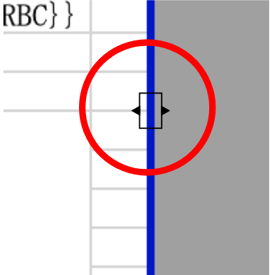

 

  

# クラウドドキュメント テンプレートに不要な行・列が出力時に含まれないように設定する方法

PDFで出力したら1枚に収まらない、出力したい部分が含まれていない、複数枚にしたいが中途半端に切れてしまう場合、
テンプレートのExcelの設定をご確認ください。

<h3 id="１">テンプレート設定 
不要な行・列が出力時に含まれないように設定する方法①</h3>

①エクセル　表示タブの「改ページプレビュー」をクリック

　　 

②青い枠が表示されます。この枠が印刷範囲です。
印刷しない部分が枠に入っていないことを確認してください
　　 

逆に印刷したい部分が入っていない場合は
青い線にカーソルを合わせると
　　 
のようなマークが出てきますのでそのまま伸ばしたいところまでドラッグしてください

③もし下記のように点線が出た場合は２ページ以上あり、ページの区切り部分を示しています。

　　 

1ページ目に含めたい部分が異なる場合は②と同様に点線にカーソルを合わせて正しい位置までドラッグします。

④情報は1ページまでしかないのにも関わらず2ページ目が表示されている場合は2ページ目も印刷範囲に入っています。

　　 
このまま印刷すると、２ページ目は無地のまま余分に印刷されます。  

その際は2ページの端にカーソルを合わせて1ページの恥までドラッグします。そうすると2ページ目が消えます。 
　　 

<h3 id="2">テンプレート設定 
不要な行・列が出力時に含まれないように設定する方法②</h3>

印刷したい範囲を選択した状態で 
　　 

ファイル→印刷範囲→プリント範囲の設定をし保存します。
　　 

[▲TOPに戻る](#TOP) 

-----


