#### クラウド帳票 作成マニュアル（管理者用）

<h2 id="TOP">目次</h2>

- [はじめに](#introduction)
  - [主なフローについて](#flow)
  - [クラウド帳票のログインについて](#login)
- [1.HRBCとの同期](#hrbc)
  - [1-1.HRBCフィールドの取得](#hrbc_1)
  - [1-2.HRBC選択肢の取得](#hrbc_2)
- [2.帳票テンプレート用ファイルの作成](#document_temp_file)
  - [2-1.テンプレート用ファイルの作成](#document_temp_file_1)
- [3.帳票テンプレートの作成](#document_temp)
  - [3-1.テンプレートの新規作成](#document_temp_1)
  - [3-2.テンプレートの更新](#document_temp_2)
- [4.マッピングの設定](#mapping)
  - [4-1.マッピングの更新](#mapping_1)
  - [4-2.マッピングの削除](#mapping_2)
- [5.HRBCからクラウド帳票をダウンロードする](#hrbc_dl)
  - [5-1.クラウド帳票を1件ダウンロードする](#hrbc_dl_1)
  - [5-2.クラウド帳票を一括ダウンロードする](#hrbc_dl_2)
- [6.クラウド帳票から成約IDを入力して ダウンロードする](#dl)
  - [6-1.「帳票一覧」からクラウド帳票を出力する](#dl_1)
  - [6-2.「ダウンロード」からクラウド帳票を出力する](#dl_2)
  - [6-3.「一括ダウンロード」からクラウド帳票を出力する](#dl_3)
  - [6-4.「出力履歴」からクラウド帳票を出力する](#dl_4)
- [7.台帳(一覧表)をダウンロードする](#dl_ledger)
  - [7-1.HRBCの設定](#dl_ledger_1)
  - [7-2.テンプレートの作成](#dl_ledger_2)
  - [7-3.テンプレートの登録](#dl_ledger_3)
  - [7-4.出力](#dl_ledger_4)
 
<h2 id="introduction">はじめに</h2>

<h3 id="flow">主なフローについて</h3>

#### 1.HRBCの同期（管理者のみ利用可能）

初回はクラウド帳票の「HRBCフィールド取得」「HRBC選択肢の取得」画面にて、HRBCのデータと紐づける項目を同期します。
なお、HRBCで項目の追加・削除などの変更があった場合、クラウド帳票側も都度同期する必要があります。

詳細は[1.HRBCとの同期](#hrbc)をご確認ください。

 

#### 2.帳票テンプレートの作成（管理者のみ利用可能）

「帳票一覧」画面より、クラウド帳票に出力する帳票のテンプレートを新規作成します。 
テンプレートを新規作成あるいは更新する場合、Excelファイルで作成したテンプレートを取り込みます。 
その後、「マッピング設定」画面にて、出力項目とHRBCのデータを紐づけします。

詳細は[2.帳票テンプレート用ファイルの作成](#document_temp_file)　[3.帳票テンプレートの作成](#document_temp)　[4.マッピングの設定](#mapping)をご確認ください。

 

#### 3.ダウンロード（管理者/一般ユーザー共通で利用可能）

作成した帳票テンプレートをユーザーPCかHRBCにダウンロードします。 
ダウンロードは、「HRBCから出力したい成約IDの画面から出力する方法」と「クラウド帳票から成約IDを入力する方法」があります。 

詳細は[5.HRBCからクラウド帳票をダウンロードする](#hrbc_dl)　　[6.クラウド帳票から成約IDを入力してダウンロードする](#dl)をご確認ください。
  

<h3 id="login">クラウド帳票のログインについて</h3>
初回の設定を行う上で、クラウド帳票の画面は一度HRBCを経由してログインする必要があります。
お知らせしたクラウド帳票URLにアクセスいただき、HRBCのログインを経てご使用いただけます。

[▲TOPに戻る](#TOP)
   

<h2 id="hrbc">1.HRBCとの同期</h2>

#### HRBCのフィールドや選択肢の変更した場合、クラウド帳票を手動で同期する必要があります。

<h3 id="hrbc_1">1-1.HRBCフィールドの同期</h3>
(1) 左側の「HRBCフィールド同期」を選択します。 

(2)「HRBCフィールド情報の同期」を押下します。
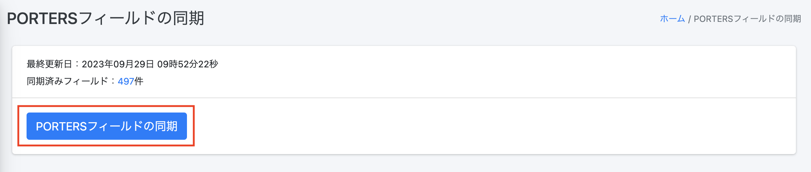

HRBCフィールドの取得が完了すると管理画面に遷移し、「HRBCフィールド情報を同期しました。」という緑色の帯が表示されます。

  

<h3 id="hrbc_2">1-2.HRBC選択肢の取得</h3>
(1) 左側の「HRBC選択肢取得」を選択します。

(2)「HRBC選択肢情報の同期」を押下します。

HRBCフィールドの取得が完了すると管理画面に遷移し、「HRBC選択肢情報を同期しています。処理完了までおよそ10分程度かかります。」という緑色の帯が表示されます。
10分程度置いていただければ完了となります。

※現状、「HRBC選択肢情報を同期しました。」と表示されませんが処理は完了しております。(現在改修中です)

[▲TOPに戻る](#TOP)
   

<h2 id="document_temp_file">2.帳票テンプレート用ファイルの作成</h2>
クラウド帳票のテンプレートはExcelファイルで作成したものを取り込む必要があります。
ここでは、テンプレート用ファイルの作成について説明いたします。

<h3 id="document_temp_file_1">2-1.テンプレート用ファイルの作成</h3>
(1) Excelファイルでテンプレートファイルを作成します。このときクラウド帳票に出力したい　箇所は
\{\{\}\}で囲みます。 

(2) 保存する際は、下記の拡張子でファイルを保存してください。

[▲TOPに戻る](#TOP)

   

<h2 id="document_temp">3.帳票テンプレートの作成</h2>

[2．帳票テンプレート用ファイルの作成](#document_temp_file)で作成したファイルを取り込みます。
ファイルを取り込むことで、クラウド帳票に出力したい項目を抽出することができます。

<h3 id="document_temp_1">3-1.テンプレートの新規作成</h3>
(1) 「帳票一覧」を選択し、「＋新規登録」を押下します。

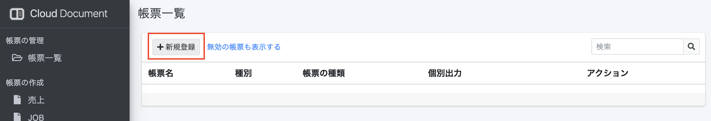

(2) 「タイトル」欄に帳票名を入力、「リソース」欄にHRBCリソースを選択し、「保存する」を押下します。
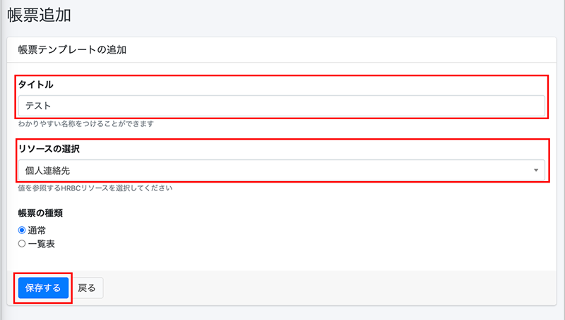

(3) 「テンプレート」欄の「ファイルをアップロードしてください」または「Browse」を押下します。

(4) 表示されるエクスプローラーの中からファイルを選択し、アップロードします。

(5) 作成する帳票の操作について許可、不許可を選択してください。
※デフォルトではすべて「許可」となっています。

(6) 帳票制作時の空白の値の処理について選択してください。
※デフォルトでは「値を出力せず、セルを空白にする」となっています。

(7)「保存する」を押下すると帳票一覧に追加されます。

テンプレートが作成されると帳票一覧に遷移し、「更新しました」という緑色の帯が表示され、帳票一覧に作成したテンプレートが表示されます。

出力したい項目が正しく抽出されたかを確認する場合、「帳票一覧」を選択し、右側の「アクション」にある「マッピング」を押下してご確認ください。

注意事項 ：「帳票更新」画面の「ステータス」欄の「有効」をOFFにした場合
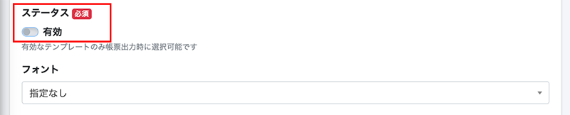

「帳票更新」画面の「ステータス」欄の「有効」をOFFにした場合、「帳票一覧」に表示されなくなります。

「無効の帳票も表示する」を選択することで表示されます。

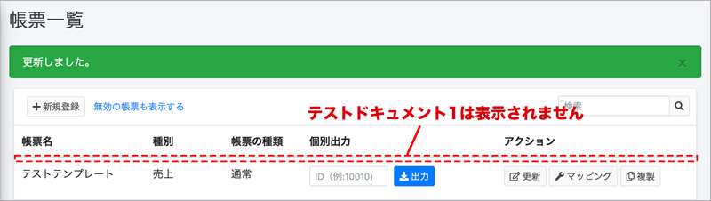

またマッピングが必要な場合、「無効の帳票も表示する」を選択し[3-2.テンプレートの更新](#document_temp_2)にて「ステータス」の「有効」をONに変更する必要があります。

  

<h3 id="document_temp_2">3-2.テンプレートの更新</h3>
(1) 「帳票一覧」を選択し、右側の「アクション」にある「更新」を押下します。

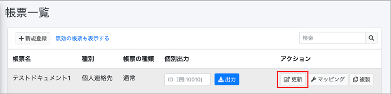

(2) 「テンプレート」欄の「ファイルをアップロードしてください」または「Browse」を押下します。

(3) 表示されるエクスプローラーの中からファイルを選択し、アップロードします。

(4)「保存する」を押下すると「帳票一覧」に追加されます

テンプレートが作成されると「帳票一覧」に遷移し、「更新しました」という緑色の帯が表示され、作成したテンプレートが表示されます。

[▲TOPに戻る](#TOP)
   

<h2 id="mapping">4．マッピングの設定</h2>

ここでは[3.帳票テンプレートの作成](#document_temp) で取り込んだ出力用の項目を、HRBCデータに紐づけを行います。

<h3 id="mapping_1">4-1.マッピングの更新</h3>
(1) 「帳票一覧」を選択し、右側の「アクション」にある「マッピング」を押下します。

(2) 「マッピング設定」に遷移するので、右側の「アクション」にある「更新」アイコンを押下します。
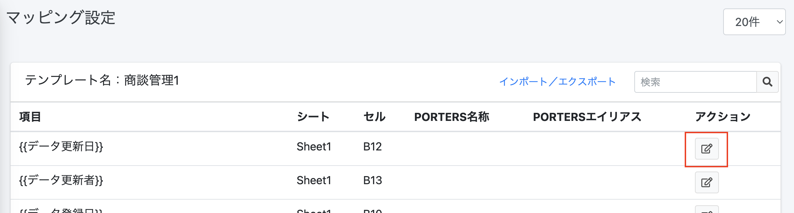

(3) 「HRBCフィールド」欄からHRBCに紐づける項目を選択します。

(4) 「保存する」を押下します。

更新が完了すると「マッピング設定」に遷移し、「マッピング情報を更新しました。」という緑色の帯が表示され、「HRBC名称」と「HRBCエイリアス」が反映されます。

  

<h3 id="mapping_2">4-2.マッピングの削除</h3>
(1) 「帳票一覧」を選択し、右側の「アクション」にある「マッピング」を押下します。

(2) 「マッピング設定」に遷移するので、右側の「アクション」にある「更新」アイコンを押下します。

(3) 「HRBCフィールド」欄から「選択してください」を選択し、マッピングを外します。

(4)マッピングが解除されると「マッピング設定」に遷移し、指定した行が削除されております。

[▲TOPに戻る](#TOP)
   

<h2 id="hrbc_dl">5.HRBCからクラウド帳票をダウンロードする</h2>

ここでは[3.帳票テンプレートの作成](#document_temp) で取り込んだ出力用の項目を、HRBCデータに紐づけを行います。

<h3 id="hrbc_dl_1">5-1.クラウド帳票を1件ダウンロードする</h3>
(1) HRBC画面左上のタブで「成約」または「売上」を選択し、ドロップダウンから「すべての成約」または「すべての売上」を選択すると一覧が表示されます。

(2) クラウド帳票を作成したいHRBCデータのIDをクリックします

(3) 左上のタブで「クラウド帳票(本番)」を選択し、ダウンロード画面に切り替えます。

※検証環境がある場合、検証環境でダウンロードしたい場合は「クラウド帳票(検証)」を選択します。

<h3 id="hrbc_dl_1_4"></h3>
(4) ダウンロード画面のSales ID欄に表示されているIDが正しいことを確認し、
テンプレートのドロップダウンから利用したいテンプレート名称を選択します。

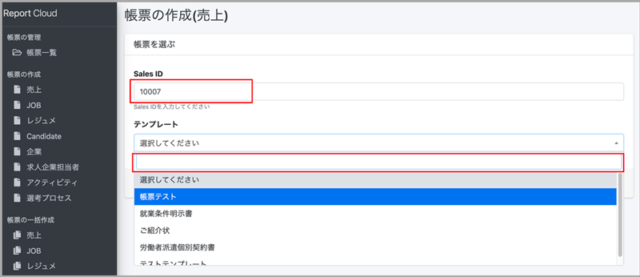

(5)「ダウンロードする」ボタンを押下すると、帳票ダウンロード画面に切り替わります。

  

①アクション＝「ダウンロードする」の場合

(1)「ダウンロードする」の右側にあるEXCEL/PDFのボタンを押下します。
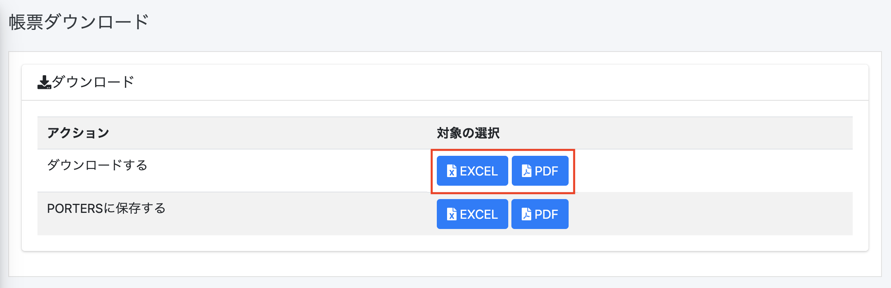

(2) 画面左下に表示されるブラウザのダウンロードバーをクリックするとダウンロードしたEXCEL/PDFファイルが確認できます。

(3) PCのダウンロードフォルダにEXCEL/PDFファイルが保存されます。
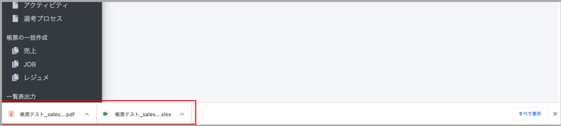

▼EXCELの場合

▼PDFの場合

##### ※マッピング項目先（HRBC側の値）に半角「¥」が入っていると帳票出力時に半角「\」に変換されてしまいます。 
##### 「¥」を帳票に表示したい場合は全角の￥をご使用ください。

  

②アクション＝ 「HRBCに保存する」の場合

(1)「HRBCに保存する」の右側にあるEXCEL/PDFのボタンを押下します。

(2)上部に「HRBCにファイルを添付しました。」という緑色の帯が表示されたら「HRBCを開く」をクリックします。

(3)HRBC画面に切り替わり、「成約」ウィンドウが表示されます。「サブリスト｜ 添付ファイル」でダウンロードしたEXCEL/PDFファイルが確認できます。
  

  

<h3 id="hrbc_dl_2">5-2.クラウド帳票を一括ダウンロードする</h3>
※現在準備中です。利用開始までもうしばらくお待ちください。

  

<h2 id="dl">6.クラウド帳票から成約IDを入力してダウンロードする</h2>

ここでは[3.帳票テンプレートの作成](#document_temp) で取り込んだ出力用の項目を、HRBCデータに紐づけを行います。

<h3 id="dl_1">6-1.「帳票一覧」からクラウド帳票を出力する</h3>

(1) 「帳票一覧」を選択し、「テスト出力」欄に成約IDを入力します。

(2) 「出力」を押下すると、帳票ダウンロード画面に切り替わります。

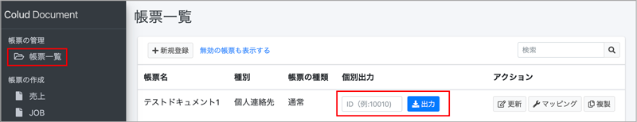

(3) 以降の操作は [5-1.クラウド帳票を1件ダウンロードする(4)](#hrbc_dl_1_4)をご参照ください。

  

<h3 id="dl_2">6-2.「帳票の作成」からクラウド帳票を出力する</h3>
(1)「帳票の作成」から出力したいメニューを選択し、Sales ID欄に成約IDを入力します。

(2) 以降の操作は [5-1.クラウド帳票を1件ダウンロードする(4)](#hrbc_dl_1_4)をご参照ください。

  

<h3 id="dl_3">6-3.「帳票の一括作成」からクラウド帳票を出力する</h3>
(1)「一括ダウンロード」を選択し、Sales ID欄に成約IDを入力します。複数入力する場合、成約IDの間に「,(カンマ)」で区切ります。

(2) 以降の操作は [5-1.クラウド帳票を1件ダウンロードする(4)](#hrbc_dl_2_4)をご参照ください。

  

<h3 id="dl_4">6-4.「出力履歴」からクラウド帳票を出力する</h3>
「出力履歴」では、過去に出力したクラウド帳票の履歴を確認し、再出力できます。

(1)「出力履歴」を選択し、右側の「対象データ」にあるIDを押下します。

(2) 別ウィンドウでHRBCの「売上一覧」が表示されます。左上のタブで「クラウド帳票(本番)」を選択し、ダウンロード画面に切り替えます。

※検証環境がある場合、検証環境でダウンロードしたい場合は「クラウド帳票(検証)」を選択します。

(3) 以降の操作は [5-1.クラウド帳票を1件ダウンロードする(4)](#hrbc_dl_1_4)をご参照ください。

[▲TOPに戻る](#TOP)
   

<h2 id="dl_ledger">7.台帳(一覧表)をダウンロードする</h2>
同じリソースに対して、HRBCで複数選択したデータの台帳が出力します。

<h3 id="dl_ledger_1">7-1.HRBCの設定</h3>
※HRBCにシステム管理者権限でのログインが必要です。  
(1)設定→カスタマイズの順に選択します  
(2)アクションメニュー編集を選択  
(3)アクションメニューを設定するリソースを選択します  
(4)一括アクションを選択します

 

(5)新規でアクションメニューを作成し、下の表を元にURLを設定します

|利用可能リソース|URL|
|-----|-----|
|企業|https://【利用中のドメイン】.report-cloud.com/report/list/client/\{\{Client.P_Id\}\}?user=\{\{Session.P_UserId\}\}|
|企業担当者|https://【利用中のドメイン】.report-cloud.com/report/list/recruiter/\{\{Recruiter.P_Id\}\}?user=\{\{Session.P_UserId\}\}|
|JOB|https://【利用中のドメイン】.report-cloud.com/report/list/job/\{\{Job.P_Id\}\}?user=\{\{Session.P_UserId\}\}|
|個人連絡先|https://【利用中のドメイン】.report-cloud.com/report/list/candidate/\{\{Person.P_Id\}\}?user=\{\{Session.P_UserId\}\}|
|レジュメ|https://【利用中のドメイン】.report-cloud.com/report/list/resume/\{\{Resume.P_Id\}\}?user=\{\{Session.P_UserId\}\}|
|売上|https://【利用中のドメイン】.report-cloud.com/report/list/sales/\{\{Sales.P_Id\}\}?user=\{\{Session.P_UserId\}\}|
|アクティビティ|https://【利用中のドメイン】.report-cloud.com/report/list/activity/\{\{Activity.P_Id\}\}?user=\{\{Session.P_UserId\}\}|
|選考プロセス|https://【利用中のドメイン】.report-cloud.com/report/list/process/\{\{Process.P_Id\}\}?user=\{\{Session.P_UserId\}\}|

  

<h3 id="dl_ledger_2">7-2.テンプレートの作成</h3>

繰り返し行の前後を　　　{{LOOP_START}}　　～　　{{LOOP_END}}　　　で囲みます。(この行は削除されます)  
   

<h3 id="dl_ledger_3">7-3.テンプレートの登録</h3> 

帳票一覧→新規登録から一覧表を選んで保存し、テンプレートを設定し、マッピングを行います。

  

<h3 id="dl_ledger_4">7-4.出力</h3>

(1)一括アクションボタンのプルダウンから、 [7-1.HRBCの設定](#dl_ledger_1)でHRBCに設定した一覧表メニューを選びます。

  

(2)表示されているデータ全てorチェックを入れたデータかを選びます。 

  

(3)[7-2.テンプレートの作成](#dl_ledger_2)で登録したテンプレートを選択しダウンロードします。
 

(4) 以降の操作は [5-1.クラウド帳票を1件ダウンロードする(4)](#hrbc_dl_1_4)をご参照ください。
  

[▲TOPに戻る](#TOP)
   
-----
* 2021年8月25日新規作成
* 2021年8月30日更新


