 

  

# クラウドドキュメント 作成マニュアル（管理者用）

<h2 id="TOP">目次</h2>

- [はじめに](#introduction)
  - [クラウドドキュメントの動作保証環境について](#os) 
  - [主なフローについて](#flow)
  - [クラウドドキュメントのログインについて](#login)
  - [帳票のご利用料金について](#price)
- [1.PORTERSとの同期](#porters)
  - [1-1.PORTERSフィールドの取得](#porters_1)
  - [1-2.PORTERS選択肢の取得](#PORTERS_2)
- [2.テンプレート用ファイルの作成](#document_temp_file)
  - [2-1.テンプレート用ファイルの作成](#document_temp_file_1)
- [3.テンプレートの作成](#document_temp)
  - [3-1.テンプレートの新規作成](#document_temp_1)
  - [3-2.テンプレートの更新](#document_temp_2)
  - [3-3.テンプレートの削除](#document_temp_3) 
  - [3-4.テンプレートのステータス(有効/無効)について](#document_temp_4) 
- [4.マッピングの設定](#mapping)
  - [4-1.マッピングの更新](#mapping_1)
  - [4-2.マッピングのインポート/エクスポート](#mapping_2)
  - [4-3.マッピングの削除](#mapping_3)
- [5.PORTERSからクラウドドキュメントをダウンロードする](#porters_dl)
  - [5-1.クラウドドキュメントを1件ダウンロードする](#porters_dl_1)
- [6.クラウドドキュメントからIDを入力して ダウンロードする](#dl)
  - [6-1.「帳票一覧」からクラウドドキュメントを出力する](#dl_1)
  - [6-2.「ダウンロード」からクラウドドキュメントを出力する](#dl_2)
  - [6-3.「出力履歴」からクラウドドキュメントを出力する](#dl_4)
- [7.台帳(一覧表)をダウンロードする](#dl_ledger)
  - [7-1.PORTERSの設定](#dl_ledger_1)
  - [7-2.テンプレートの作成](#dl_ledger_2)
  - [7-3.テンプレートの登録](#dl_ledger_3)
  - [7-4.出力](#dl_ledger_4)
 
<h2 id="introduction">はじめに</h2>

<h3 id="os">クラウドドキュメントの動作保証環境について</h3>
PORTERSに準じ、動作保証環境を設定しています。

[クラウドドキュメント よくある質問 「クラウドドキュメントの動作保証環境はどちらになりますか？」](https://e2info.github.io/cloudreport-docs/faq/faq.html#about1)でご確認ください。
  

<h3 id="flow">主なフローについて</h3>

 

  

#### 1.PORTERSの同期（管理者のみ利用可能）

初回はクラウドドキュメントの「PORTERSフィールド取得」「PORTERS選択肢の取得」画面にて、PORTERSのデータと紐づける項目を同期します。
なお、PORTERSで項目の追加・削除などの変更があった場合、クラウドドキュメント側も都度同期する必要があります。

詳細は[1.PORTERSとの同期](#porters)をご確認ください。

 

#### 2.帳票テンプレートの作成（管理者のみ利用可能）

「帳票一覧」画面より、クラウドドキュメントに出力する帳票のテンプレートを新規作成します。 
テンプレートを新規作成あるいは更新する場合、Excelファイルで作成したテンプレートを取り込みます。 
その後、「マッピング設定」画面にて、出力項目とPORTERSのデータを紐づけします。

詳細は[2.帳票テンプレート用ファイルの作成](#document_temp_file)　[3.帳票テンプレートの作成](#document_temp)　[4.マッピングの設定](#mapping)をご確認ください。

 

#### 3.ダウンロード（管理者/標準ユーザー共通で利用可能）

作成した帳票テンプレートをユーザーPCかPORTERSにダウンロードします。 
ダウンロードは、「PORTERSから出力したい成約IDの画面から出力する方法」と「クラウドドキュメントから成約IDを入力する方法」があります。 

詳細は[5.PORTERSからクラウドドキュメントをダウンロードする](#porters_dl)　　[6.クラウドドキュメントから成約IDを入力してダウンロードする](#dl)をご確認ください。
  

<h3 id="login">クラウドドキュメントのログインについて</h3>
初回の設定を行う上で、クラウドドキュメントの画面は一度PORTERSを経由してログインする必要があります。
お知らせしたクラウドドキュメントURLにアクセスいただき、PORTERSのログインを経てご使用いただけます。

<h3 id="price">帳票のご利用料金について</h3>

#### 本番環境にて出力した帳票全てが課金対象となります。(トライアル期間・テスト環境での利用を除く)

(1) 課金のタイミングについて 
「ダウンロード」ボタンを押すと１帳票分課金となります。 
その後遷移する画面にてPDFやExcelのダウンロードボタン、もしくは「PORTERSに保存する」のPDFやExcelのダウンロードボタンを押しても課金されません。

(2) 出力枚数の確認について 
クラウドドキュメントのメニュー 利用状況 統計に各月における各帳票の出力枚数の確認ができます。

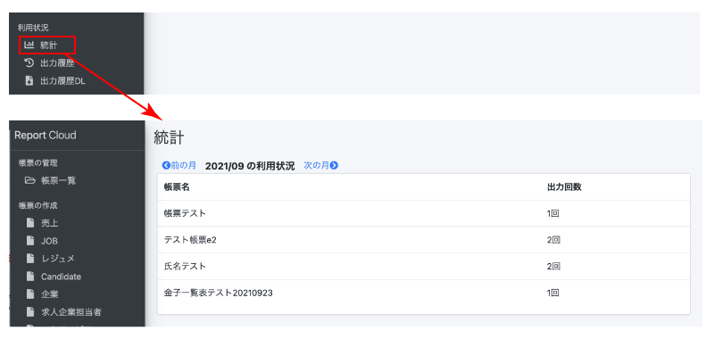

[▲TOPに戻る](#TOP)
   

<h2 id="porters">1.PORTERSとの同期</h2>

#### PORTERSのフィールドや選択肢の変更した場合、クラウドドキュメントを手動で同期する必要があります。

<h3 id="porters_1">1-1.PORTERSフィールドの同期</h3>
(1) 左側の「PORTERSフィールド同期」を選択します。 

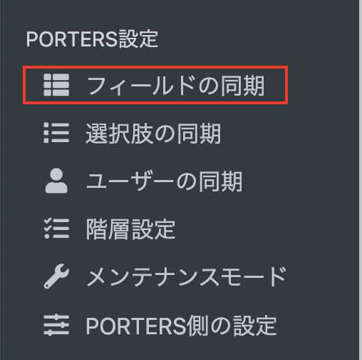

(2)「PORTERSフィールド情報の同期」を押下します。

PORTERSフィールドの取得が完了すると管理画面に遷移し、「PORTERSフィールド情報を同期しました。」という緑色の帯が表示されます。

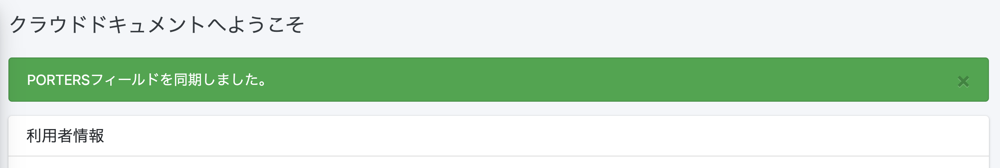

  

<h3 id="porters_2">1-2.PORTERS選択肢の取得</h3>
(1) 左側の「PORTERS選択肢取得」を選択します。

(2)「PORTERS選択肢情報の同期」を押下します。

PORTERSフィールドの取得が完了すると管理画面に遷移し、「PORTERS選択肢情報を同期しています。処理完了までおよそ10分程度かかります。」という緑色の帯が表示されます。
10分程度置いていただければ完了となります。

※現状、「PORTERS選択肢情報を同期しました。」と表示されませんが処理は完了しております。(現在改修中です)
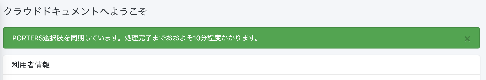

[▲TOPに戻る](#TOP)
   

<h2 id="document_temp_file">2.帳票テンプレート用ファイルの作成</h2>
クラウドドキュメントのテンプレートはExcelファイルで作成したものを取り込む必要があります。
ここでは、テンプレート用ファイルの作成について説明いたします。

#### <注意事項>
#### ・原則としてテンプレートの作成や修正はお客様にてお願いしており、弊社での対応はオプションにて承ります。 
#### (テンプレート作成:出力項目数、分岐数等により100,000円～) 
#### ・PDFでの出力はエクセルでの出力結果と全く同じにならない場合がございます。
#### ・マクロを使用したテンプレート(xlms形式)は出力について注意点がございます。　 詳細は[よくある質問 Q.テンプレートにマクロは使用できますか？ ](https://e2info.github.io/cloudreport-docs/faq/faq.html#template3)でご確認ください。
 

<h3 id="document_temp_file_1">2-1.テンプレート用ファイルの作成</h3>
(1) Excelファイルでテンプレートファイルを作成します。このときクラウドドキュメントに出力したい　箇所は
\{\{\}\}で囲みます。 

(2) 保存する際は、下記の拡張子でファイルを保存してください。

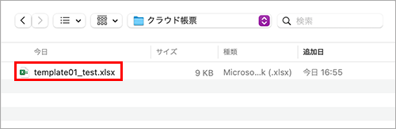

[▲TOPに戻る](#TOP)

   

<h2 id="document_temp">3.帳票テンプレートの作成</h2>

[2．帳票テンプレート用ファイルの作成](#document_temp_file)で作成したファイルを取り込みます。
ファイルを取り込むことで、クラウドドキュメントに出力したい項目を抽出することができます。

<h3 id="document_temp_1">3-1.テンプレートの新規作成</h3>
(1) 「帳票一覧」を選択し、「＋新規登録」を押下します。

(2) 「タイトル」欄に帳票名を入力、「リソース」欄にPORTERSリソースを選択し、「保存する」を押下します。

(3) 「テンプレート」欄の「ファイルをアップロードしてください」または「Browse」を押下します。

(4) 表示されるエクスプローラーの中からファイルを選択し、アップロードします。

(5) 作成する帳票の操作について許可、不許可を選択してください。
※デフォルトではすべて「許可」となっています。

(6) 帳票制作時の空白の値の処理について選択してください。
※デフォルトでは「値を出力せず、セルを空白にする」となっています。
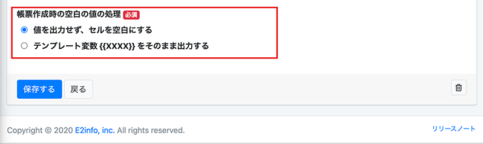

(7)「保存する」を押下すると帳票一覧に追加されます。
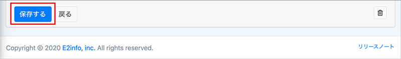

テンプレートが作成されると帳票一覧に遷移し、「更新しました」という緑色の帯が表示され、帳票一覧に作成したテンプレートが表示されます。

出力したい項目が正しく抽出されたかを確認する場合、「帳票一覧」を選択し、右側の「アクション」にある「マッピング」を押下してご確認ください。

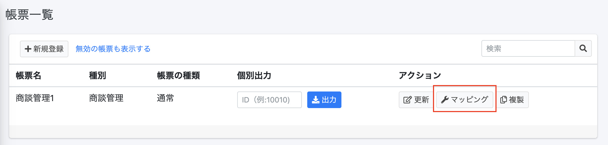

注意事項 ：「帳票更新」画面の「ステータス」欄の「有効」をOFFにした場合

「帳票更新」画面の「ステータス」欄の「有効」をOFFにした場合、「帳票一覧」に表示されなくなります。

「無効の帳票も表示する」を選択することで表示されます。

またマッピングが必要な場合、「無効の帳票も表示する」を選択し[3-2.テンプレートの更新](#document_temp_2)にて「ステータス」の「有効」をONに変更する必要があります。

  

<h3 id="document_temp_2">3-2.テンプレートの更新</h3>
(1) 「帳票一覧」を選択し、右側の「アクション」にある「更新」を押下します。

(2) 「テンプレート」欄の「ファイルをアップロードしてください」または「Browse」を押下します。
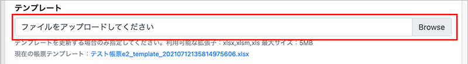

(3) 表示されるエクスプローラーの中からファイルを選択し、アップロードします。

(4)「保存する」を押下すると「帳票一覧」に追加されます

テンプレートが作成されると「帳票一覧」に遷移し、「更新しました」という緑色の帯が表示され、作成したテンプレートが表示されます。

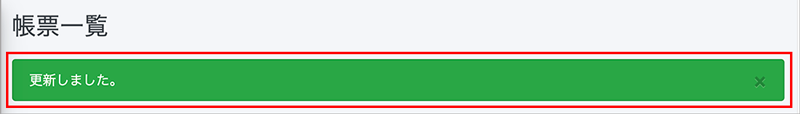

  

<h3 id="document_temp_3">3-3.テンプレートの削除</h3> 
(1) 「帳票一覧」を選択し、右側の「アクション」にある「更新」を押下します。 

  

(2) 「帳票更新」画面下の「この帳票を削除する」ボタンを押下します。 
  

(3)帳票削除について確認画面が表示されます。 
#### 【ご注意ください】　削除するともとに戻すことはできません。 よくご確認の上「削除する」を押下します。 
  

(4)削除が完了すると「帳票を削除しました」と確認の案内がでます。 
  

  

<h3 id="document_temp_3">3-4.テンプレートのステータス(有効/無効)について</h3> 
テンプレートのステータスを無効にすることで一時的にテンプレートを利用できないようにします。 
標準ユーザーの方には無効のテンプレートは表示されないため選択できません。 
(1) 「帳票一覧」を選択し、右側の「アクション」にある「更新」を押下します。 

  

(2) 「帳票更新」画面下の「この帳票を無効する」ボタンを押下します。 
  

(3)デフォルトの状態では無効の帳票は一覧に表示されません。 
無効とした帳票を表示したい場合は赤枠の「無効の帳票も表示する」を押下してください。 
  

(4)ステータスを有効に変更したい場合は「帳票更新」の項目から「ステータス」を有効にしてください。 
  

[▲TOPに戻る](#TOP)
   

<h2 id="mapping">4．マッピングの設定</h2>

ここでは[3.帳票テンプレートの作成](#document_temp) で取り込んだ出力用の項目を、PORTERSデータに紐づけを行います。

<h3 id="mapping_1">4-1.マッピングの更新</h3>
(1) 「帳票一覧」を選択し、右側の「アクション」にある「マッピング」を押下します。

(2) 「マッピング設定」に遷移するので、右側の「アクション」にある「更新」アイコンを押下します。

(3) 「PORTERSフィールド」欄からPORTERSに紐づける項目を選択します。

(4) 「保存する」を押下します。

更新が完了すると「マッピング設定」に遷移し、「マッピング情報を更新しました。」という緑色の帯が表示され、「PORTERS名称」と「PORTERSエイリアス」が反映されます。
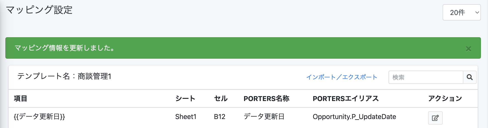

  

<h3 id="mapping_2">4-2.マッピングのインポート/エクスポート</h3>
(1)「インポート」よりマッピングを一括で行うことが可能です。

(2) まずはエクスポート用に「項目」と「エイリアス」の一覧表をExcelで作成してください

(3)作成した一覧表をアップロードし、インポートしてください。

(4)インポートした内容が表示されますので、内容を確認し、問題なければ「登録する」ボタンを押してください。

(5)「マッピング情報を更新しました」と表示されましたらインポート完了です。

(6)「エクスポート」では設定済みの「項目」と「エイリアス」の一覧表をExcelにてダウンロードが可能です。

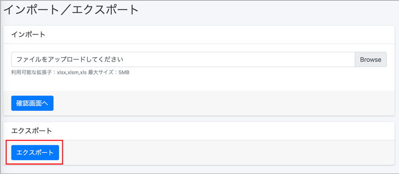

<h3 id="mapping_3">4-3.マッピングの削除</h3>
(1) 「帳票一覧」を選択し、右側の「アクション」にある「マッピング」を押下します。

(2) 「マッピング設定」に遷移するので、右側の「アクション」にある「更新」アイコンを押下します。

(3) 「PORTERSフィールド」欄から「選択してください」を選択し、マッピングを外します。
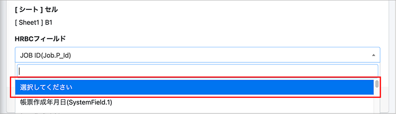

(4)マッピングが解除されると「マッピング設定」に遷移し、指定した行が削除されております。

[▲TOPに戻る](#TOP)
   

<h2 id="porters_dl">5.PORTERSから帳票をダウンロードする</h2>

ここでは[3.帳票テンプレートの作成](#document_temp) で取り込んだ出力用の項目を、PORTERSデータに紐づけを行います。 

#### 【ご注意ください】本番環境にて出力した帳票すべてが課金対象になります(トライアル期間内、テスト環境での利用を除く) 詳細は[帳票のご利用料金について](#price)をご確認ください。　 
#### ※マクロを使用したテンプレート(xlms形式)は出力について注意点がございます。　 詳細は[よくある質問 Q.テンプレートにマクロは使用できますか？ ](https://e2info.github.io/cloudreport-docs/faq/faq.html#template3)でご確認ください。

<h3 id="porters_dl_1">5-1.クラウドドキュメントを1件ダウンロードする</h3>
(1) PORTERS画面左上のタブで「成約」または「売上」を選択し、ドロップダウンから「すべての成約」または「すべての売上」を選択すると一覧が表示されます。

(2) クラウドドキュメントを作成したいPORTERSデータのIDをクリックします

(3) 左上のタブで「クラウド帳票(本番)」を選択し、ダウンロード画面に切り替えます。

※検証環境がある場合、検証環境でダウンロードしたい場合は「クラウド帳票(検証)」を選択します。

<h3 id="porters_dl_1_4"></h3>
(4) ダウンロード画面のSales ID欄に表示されているIDが正しいことを確認し、
テンプレートのドロップダウンから利用したいテンプレート名称を選択します。

(5)「ダウンロードする」ボタンを押下すると、帳票ダウンロード画面に切り替わります。

  

①アクション＝「ダウンロードする」の場合

(1)「ダウンロードする」の右側にあるEXCEL/PDFのボタンを押下します。

(2) 画面左下に表示されるブラウザのダウンロードバーをクリックするとダウンロードしたEXCEL/PDFファイルが確認できます。
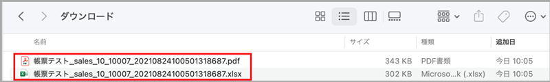

(3) PCのダウンロードフォルダにEXCEL/PDFファイルが保存されます。

▼EXCELの場合

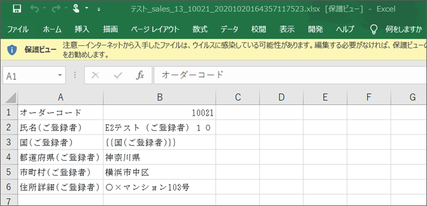

▼PDFの場合

##### ※マッピング項目先（PORTERS側の値）に半角「¥」が入っていると帳票出力時に半角「\」に変換されてしまいます。 
##### 「¥」を帳票に表示したい場合は全角の￥をご使用ください。

  

②アクション＝ 「PORTERSに保存する」の場合
#### ※マクロを使用したテンプレート(xlms形式)はPORTERSに保存できません。

(1)「PORTERSに保存する」の右側にあるEXCEL/PDFのボタンを押下します。
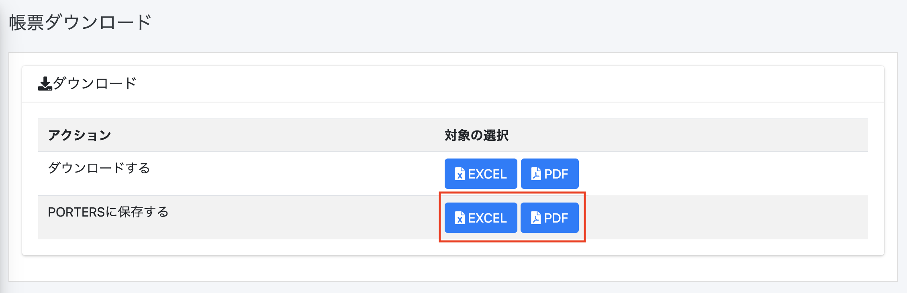

(2)上部に「PORTERSにファイルを添付しました。」という緑色の帯が表示されたら「PORTERSを開く」をクリックします。
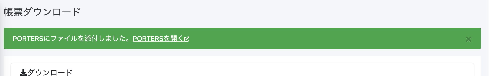

(3)PORTERS画面に切り替わり、「成約」ウィンドウが表示されます。「サブリスト｜ 添付ファイル」でダウンロードしたEXCEL/PDFファイルが確認できます。
  
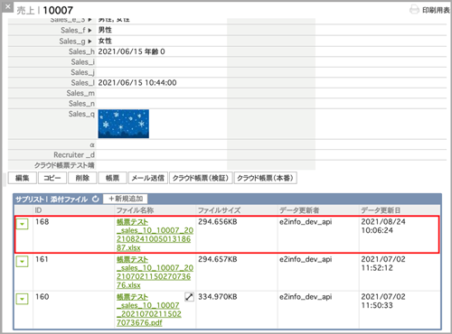

[▲TOPに戻る](#TOP)
   

<h2 id="dl">6.クラウドドキュメントからIDを入力してダウンロードする</h2>

ここでは[3.帳票テンプレートの作成](#document_temp) で取り込んだ出力用の項目を、PORTERSデータに紐づけを行います。

<h3 id="dl_1">6-1.「帳票一覧」からクラウド帳票を出力する</h3>

#### 【ご注意ください】本番環境にて出力した帳票すべてが課金対象になります(トライアル期間内、テスト環境での利用を除く)　 詳細は[帳票のご利用料金について](#price)をご確認ください。
#### ※マクロを使用したテンプレート(xlms形式)は出力について注意点がございます。　 詳細は[よくある質問 Q.テンプレートにマクロは使用できますか？ ](https://e2info.github.io/cloudreport-docs/faq/faq.html#template3)でご確認ください。

(1) 「帳票一覧」を選択し、「個別出力」欄に成約IDを入力します。

(2) 「出力」を押下すると、帳票ダウンロード画面に切り替わります。

(3) 以降の操作は [5-1.クラウド帳票を1件ダウンロードする(4)](#porters_dl_1_4)をご参照ください。

#### 【ご注意ください】個別出力にIDを入力し出力された場合も課金対象になります(トライアル期間内、テスト環境での利用を除く) 詳細は[帳票のご利用料金について](#price)をご確認ください。

  

<h3 id="dl_2">6-2.「帳票の作成」からクラウドドキュメントを出力する</h3>

#### 【ご注意ください】本番環境にて出力した帳票すべてが課金対象になります(トライアル期間内、テスト環境での利用を除く) 詳細は[帳票のご利用料金について](#price)をご確認ください。　 
#### ※マクロを使用したテンプレート(xlms形式)は出力について注意点がございます。　 詳細は[よくある質問 Q.テンプレートにマクロは使用できますか？ ](https://e2info.github.io/cloudreport-docs/faq/faq.html#template3)でご確認ください。

(1)「帳票の作成」から出力したいメニューを選択し、Sales ID欄に成約IDを入力します。

(2) 以降の操作は [5-1.クラウドドキュメントを1件ダウンロードする(4)](#porters_dl_1_4)をご参照ください。

  

<h3 id="dl_3">6-3.「出力履歴」からクラウドドキュメントを出力する</h3>

#### 【ご注意ください】本番環境にて出力した帳票すべてが課金対象になります(トライアル期間内、テスト環境での利用を除く) 詳細は[帳票のご利用料金について](#price)をご確認ください。　 
#### ※マクロを使用したテンプレート(xlms形式)は出力について注意点がございます。　 詳細は[よくある質問 Q.テンプレートにマクロは使用できますか？ ](https://e2info.github.io/cloudreport-docs/faq/faq.html#template3)でご確認ください。

「出力履歴」では、過去に出力したクラウド帳票の履歴を確認し、再出力できます。

(1)「出力履歴」を選択し、右側の「対象データ」にあるIDを押下します。

(2) 別ウィンドウでPORTERSの「売上一覧」が表示されます。左上のタブで「クラウド帳票(本番)」を選択し、ダウンロード画面に切り替えます。

※検証環境がある場合、検証環境でダウンロードしたい場合は「クラウド帳票(検証)」を選択します。

(3) 以降の操作は [5-1.クラウドドキュメントを1件ダウンロードする(4)](#porters_dl_1_4)をご参照ください。

[▲TOPに戻る](#TOP)
   

<h2 id="dl_ledger">7.台帳(一覧表)をダウンロードする</h2>

#### 【ご注意ください】本番環境にて出力した帳票すべてが課金対象になります(トライアル期間内、テスト環境での利用を除く)　 詳細は[帳票のご利用料金について](#price)をご確認ください。 

同じリソースに対して、PORTERSで複数選択したデータの台帳が出力します。

<h3 id="dl_ledger_1">7-1.PORTERSの設定</h3>
※PORTERSにシステム管理者権限でのログインが必要です。  
(1)設定→カスタマイズの順に選択します  
(2)アクションメニュー編集を選択  
(3)アクションメニューを設定するリソースを選択します  
(4)一括アクションを選択します

 

(5)新規でアクションメニューを作成し、URLを設定します

クラウドドキュメント上の左側のメニュー「HRBC側の設定」に入ります 
 

### URLが https://【利用中のドメイン】.report-cloud.com の場合  
該当するリソースのURLをコピーしてください
 

  

<h3 id="dl_ledger_2">7-2.テンプレートの作成</h3>

繰り返し行の前後を　　　{{LOOP_START}}　　～　　{{LOOP_END}}　　　で囲みます。(この行は削除されます)  
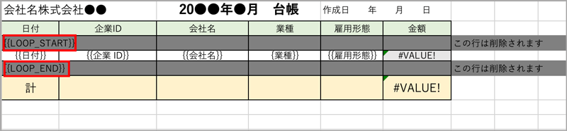   

<h3 id="dl_ledger_3">7-3.テンプレートの登録</h3> 

帳票一覧→新規登録から一覧表を選んで保存し、テンプレートを設定し、マッピングを行います。

  

<h3 id="dl_ledger_4">7-4.出力</h3>

(1)一括アクションボタンのプルダウンから、 [7-1.PORTERSの設定](#dl_ledger_1)でPORTERSに設定した一覧表メニューを選びます。

  

(2)表示されているデータ全てorチェックを入れたデータかを選びます。 

  

(3)[7-2.テンプレートの作成](#dl_ledger_2)で登録したテンプレートを選択しダウンロードします。
 

(4) 以降の操作は [5-1.クラウドドキュメントを1件ダウンロードする(4)](#porters_dl_1_4)をご参照ください。
  

[▲TOPに戻る](#TOP)
  

-----

* 2021年8月25日新規作成
* 2022年11月16日更新


