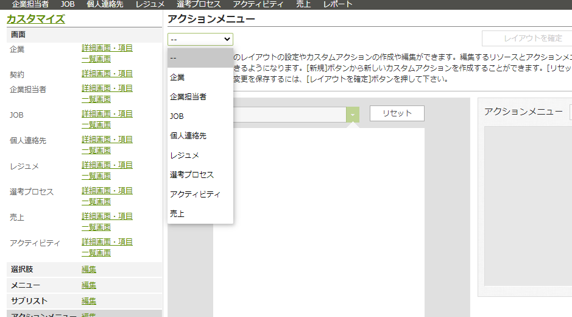
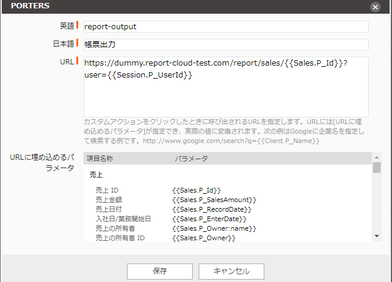

 

  

# クラウドドキュメント PORTERS設定マニュアル

## PORTERSからクラウドドキュメントへの画面遷移

PORTERSからクラウドドキュメントを利用する場合、PORTERSのアクションメニューから遷移します。

### 設定手順

※PORTERSにシステム管理者権限でのログインが必要です。

1. 設定→カスタマイズの順に選択します
2. アクションメニュー編集を選択
3. アクションメニューを設定するリソースを選択します
   
4. 隣に表示されたリストからアクションメニューを選択します
5. アクションメニューを追加します
   
    * 英語：任意の文字列　例：report-output
    * 日本語：任意の文字列　例：帳票出力
    * URL：URL一覧を参照

### URL一覧

#### 利用可能

URLが https://【利用中のドメイン】.report-cloud.com の場合
※【利用中のドメイン】について
　(例)https://e2info.report-cloud.com →利用中のドメインは　e2info の部分です。

|リソース|URL|
|-----|-----|
|企業|https://【利用中のドメイン】.report-cloud.com/report/client/\{\{Client.P_Id\}\}?user=\{\{Session.P_UserId\}\}|
|企業担当者|https://【利用中のドメイン】.report-cloud.com/report/recruiter/\{\{Recruiter.P_Id\}\}?user=\{\{Session.P_UserId\}\}|
|JOB|https://【利用中のドメイン】.report-cloud.com/report/job/\{\{Job.P_Id\}\}?user=\{\{Session.P_UserId\}\}|
|個人連絡先|https://【利用中のドメイン】.report-cloud.com/report/candidate/\{\{Person.P_Id\}\}?user=\{\{Session.P_UserId\}\}|
|レジュメ|https://【利用中のドメイン】.report-cloud.com/report/resume/\{\{Resume.P_Id\}\}?user=\{\{Session.P_UserId\}\}|
|売上|https://【利用中のドメイン】.report-cloud.com/report/sales/\{\{Sales.P_Id\}\}?user=\{\{Session.P_UserId\}\}|
|アクティビティ|https://【利用中のドメイン】.report-cloud.com/report/activity/\{\{Activity.P_Id\}\}?user=\{\{Session.P_UserId\}\}|
|選考プロセス|https://【利用中のドメイン】.report-cloud.com/report/process/\{\{Process.P_Id\}\}?user=\{\{Session.P_UserId\}\}|

#### 利用可能

URLが https://【利用中のドメイン】.cloud-document.net　の場合
※【利用中のドメイン】について
　(例)https://e2info.cloud-document.net →利用中のドメインは　e2info の部分です。

|リソース|URL|
|-----|-----|
|企業|https://【利用中のドメイン】.cloud-document.net/report/client/\{\{Client.P_Id\}\}?user=\{\{Session.P_UserId\}\}|
|企業担当者|https://【利用中のドメイン】.cloud-document.net/report/recruiter/\{\{Recruiter.P_Id\}\}?user=\{\{Session.P_UserId\}\}|
|JOB|https://【利用中のドメイン】.cloud-document.net/report/job/\{\{Job.P_Id\}\}?user=\{\{Session.P_UserId\}\}|
|個人連絡先|https://【利用中のドメイン】.cloud-document.net/report/candidate/\{\{Person.P_Id\}\}?user=\{\{Session.P_UserId\}\}|
|レジュメ|https://【利用中のドメイン】.cloud-document.net/report/resume/\{\{Resume.P_Id\}\}?user=\{\{Session.P_UserId\}\}|
|売上|https://【利用中のドメイン】.cloud-document.net/report/sales/\{\{Sales.P_Id\}\}?user=\{\{Session.P_UserId\}\}|
|アクティビティ|https://【利用中のドメイン】.cloud-document.net/report/activity/\{\{Activity.P_Id\}\}?user=\{\{Session.P_UserId\}\}|
|選考プロセス|https://【利用中のドメイン】.cloud-document.net/report/process/\{\{Process.P_Id\}\}?user=\{\{Session.P_UserId\}\}|

-----
* 2020年12月25日新規作成
* 2022年5月27日更新


