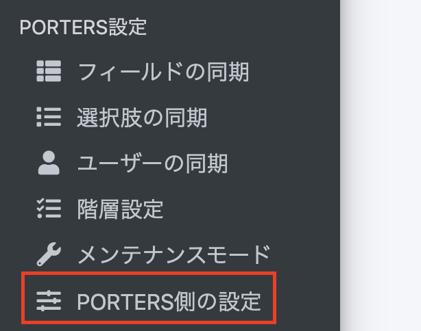
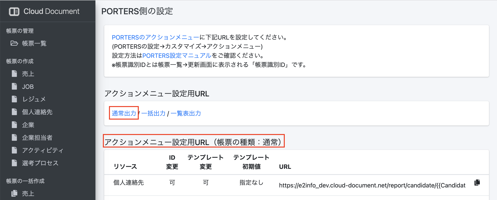

 

  

# クラウドドキュメント PORTERS設定マニュアル

### 設定手順

※PORTERSにシステム管理者アカウントでのログインが必要です。

1. 設定→カスタマイズ→デスクトップの順に選択します
2. アクションメニュー編集を選択
3. アクションメニューを設定するリソースを選択します
   
   
4. 隣に表示されたリストからアクションメニューを選択します 
5. アクションメニューを追加します 
    
   
    * 英語：任意の文字列　例：report-output
    * 日本語：任意の文字列　例：帳票出力
    * URL：URL一覧を参照
 
6.URLを設定します 
クラウドドキュメント上の左側のメニュー「PORTERS設定」の「PORTERS側の設定」

 
「アクションメニュー設定用URL（帳票の種類：通常）」の
URLをコピーして、先ほどのPORTERSアクションメニューの設定の「URL」部分に貼り付けます。

  

## 応用編
ID・テンプレートが可または不可、初期値が指定有りまたは無し　でURLが異なります。 
どのURLを入れるかによりアクションボタン押下で帳票出力画面に遷移後の表示が異なります。 
くわしくは[こちら](https://e2info.github.io/cloudreport-docs/manual/admin.html#dl_sp_2)をご確認ください。  

※【利用中のドメイン】については、通常お使いのドメインが自動で挿入された状態で表示されます。
　(例)https://e2info.cloud-document.net →利用中のドメインは　e2info の部分です。

|リソース|URL|
|-----|-----|
|企業|https://【利用中のドメイン】.cloud-document.net/report/client/\{\{Client.P_Id\}\}?user=\{\{Session.P_UserId\}\}|
|企業担当者|https://【利用中のドメイン】.cloud-document.net/report/recruiter/\{\{Recruiter.P_Id\}\}?user=\{\{Session.P_UserId\}\}|
|JOB|https://【利用中のドメイン】.cloud-document.net/report/job/\{\{Job.P_Id\}\}?user=\{\{Session.P_UserId\}\}|
|個人連絡先|https://【利用中のドメイン】.cloud-document.net/report/candidate/\{\{Person.P_Id\}\}?user=\{\{Session.P_UserId\}\}|
|レジュメ|https://【利用中のドメイン】.cloud-document.net/report/resume/\{\{Resume.P_Id\}\}?user=\{\{Session.P_UserId\}\}|
|売上|https://【利用中のドメイン】.cloud-document.net/report/sales/\{\{Sales.P_Id\}\}?user=\{\{Session.P_UserId\}\}|
|アクティビティ|https://【利用中のドメイン】.cloud-document.net/report/activity/\{\{Activity.P_Id\}\}?user=\{\{Session.P_UserId\}\}|
|選考プロセス|https://【利用中のドメイン】.cloud-document.net/report/process/\{\{Process.P_Id\}\}?user=\{\{Session.P_UserId\}\}|

  
上記設定を終えますと
PORTERSに設定いただいたアクションメニューからクラウドドキュメントに遷移し、出力が可能となります。

-----
* 2020年12月25日新規作成
* 2024年3月28日更新


