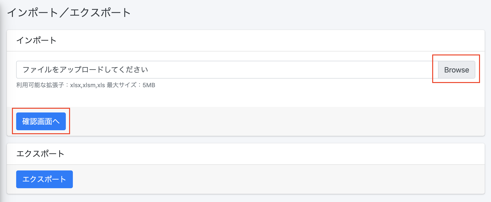

 

  

# クラウドドキュメント 新環境への移行手順

### 移行期間

#### 2022年1月4日(水)〜2023年6月30日(金)まで
※2023年7月1日(土)より旧環境はご利用いただけなくなります。

上記期間中に新環境への移行を開始〜完了させてください。 
利用開始日〜翌月末までが1環境毎の個別の移行期間となり、利用開始日〜翌月末までの新環境での出力分については 
新環境での出力テストを想定しご請求対象外となります。 
詳しくは[移行期間の出力分について](https://notepm.jp)　をご確認ください。 

本番環境の他にテスト環境のご利用がある場合にはそれぞれで移行作業が必要となります。 
※その際お申し込みのメールアドレスを本番と検証で別のアドレスにてお申し込みをお願いします。 
このメールアドレスは重要なご案内等をお送りする予定ですので、必ずご確認可能なアドレスの設定をお願いいたします。  

### 1.新環境での利用開始

PORTERSに管理者としてログイン後、下記の開始用URLにアクセスいただき、新環境の利用を開始してください。  
利用開始URL 
https://cloud-document.net/hrbc/callback?subscribe
 

 

クラウドドキュメント 利用規約をご確認後 
問題なければ 
・法人名 
・法人名フリガナ 
・ご担当者名 
・メールアドレス 
上記をご記入いただき、「利用規約に同意して利用開始する」ボタンを押下してください。  

その後、「PORTERS HR-Business Cloud-リソースへのアクセス権の承認」という画面が表示されます。 
 

御社PORTERSのデータへのアクセス権をクラウドドキュメントに承諾いただくことでPORTERSと連携可能になります。 
ご利用開始されますと、弊社に通知が来るためその通知を持って利用開始日といたします。 
利用開始時点ではトライアル期間は２週間となりますが、確認取れ次第弊社側で翌月末までの期限延長いたします。  

### 2.マニュアルに沿ってPORTERSの設定を行う

下記のマニュアルを参考にPORTERS側の設定をお願いいたします。 
※旧環境利用開始時に設定いただいた内容とほぼ同じ内容での作業となります。 
https://e2info.github.io/cloudreport-docs/manual/hrbc.html  

PORTERSとの同期を行う 
(PORTERSフィールドの同期、選択肢の取得、ユーザーの同期) 
https://e2info.github.io/cloudreport-docs/manual/admin.html#porters  

### 3.新環境へのテンプレート設定

①旧環境から各テンプレートをダウンロードします 
帳票一覧から該当の帳票の「更新」を押下します 
 
 
②帳票更新画面のテンプレート「現在の帳票テンプレート」を押下いただくとダウンロードできます
 

 
 

③旧環境から各テンプレートに設定されたマッピング情報をエクスポートします
帳票一覧から該当の帳票の「マッピング」を押下します
 
 
 

インポート/エクスポートを押下します
 
 
 

エクスポートを押下いただくと、マッピング情報がエクセルファイル形式でダウンロードされます。
 
 
 

④旧環境からダウンロードした帳票とマッピング情報を新環境に設定します 
旧環境と同様に、新環境に帳票を新規作成し、先ほどダウンロードしたテンプレートを設定します。 
インポート/エクスポートを押下します
 
 
 
インポート部分で先ほどエクスポートしたマッピング情報のエクセルをアップロードいただき確認画面へ・設定を完了してください.
 
 
 

### 移行期間の出力分について

新環境利用開始月の翌月末までの新環境での出力分は新環境での出力テストを想定しご請求対象外とします。 
※旧環境の出力分はご請求対象となります。  

利用開始３ヶ月目以降は旧環境・新環境での出力分はすべてご請求対象となります。 
※1-2までの作業をおこないますと利用開始となり弊社に通知が来ます。その通知受信日を利用開始日とします。  

※利用開始日が月の途中でも、１ヶ月としてカウントいたします。 
　そのため月の初旬に新環境での利用開始対応されることをお勧めいたします。 
（例:2023年1月15日に新環境を利用開始でも、2023年1月31日開始でも、利用開始を1月とし、2023年2月末までの出力分が対象です)  

<例> 
2023年1月4日から利用開始した場合 
2023年1月4日〜2月28日 
・新環境での出力は請求対象外 
・旧環境での出力は請求対象 
2023年3月1日〜 
・新環境と旧環境の出力すべてが請求対象   

### よくある質問
Q.旧環境と新環境でどちらが新環境かわからなくなってしまいました
A.見分け方は下記の通りです。

#### 新環境
URLが
https://【利用中のドメイン】.cloud-document.net/
 
左上のアイコンが新英語名称のCloud Document 
 

#### 旧環境
URLが
https://【利用中のドメイン】.report-cloud.com/
 
左上のアイコンが旧英語名称のReport cloud 
 

-----
* 2022年12月26日新規作成


