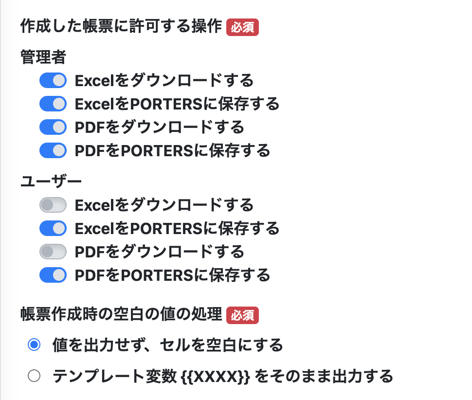
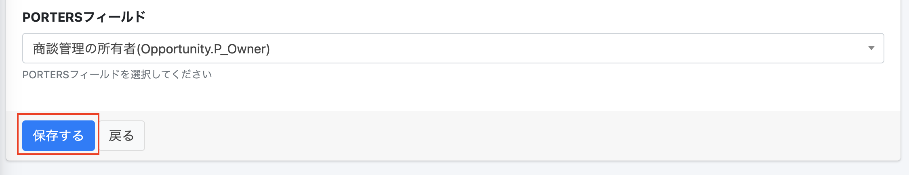
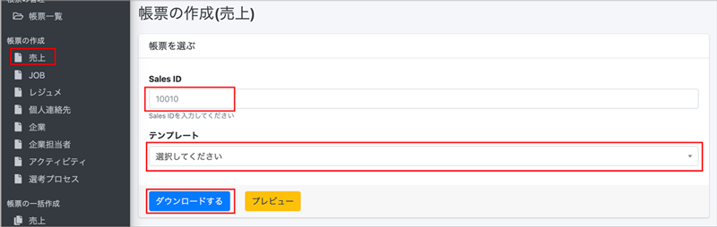
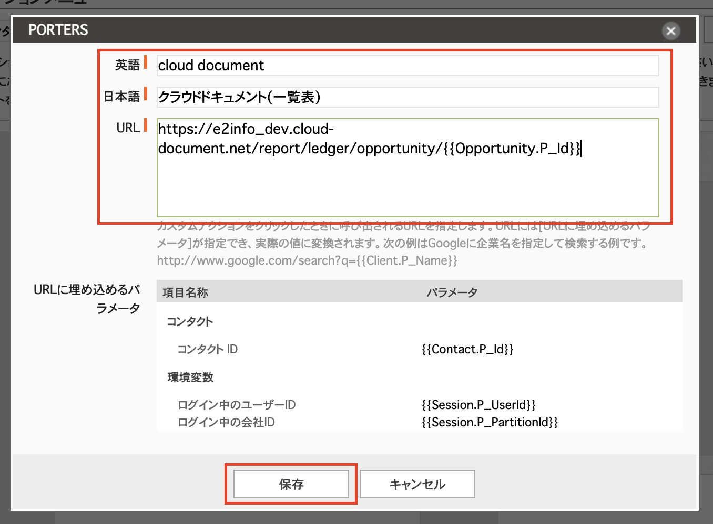
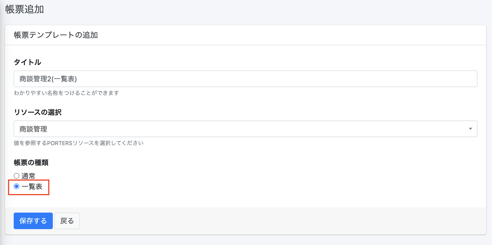

 

  

# クラウドドキュメント 商談管理階層対応マニュアル（管理者用）

<h2 id="TOP">目次</h2>

- [1.PORTERSとの同期](#porters)
  - [1-1.PORTERSフィールドの取得](#porters_1)
  - [1-2.PORTERS選択肢の取得](#porters_2)
  - [1-3.PORTERSユーザーの取得](#porters_3)
- [2.PORTERS側にアクションボタンを設定](#porters_action)
- [3.帳票の新規登録](#document)
- [4.マッピングの設定](#mapping)
- [5.PORTERSからクラウドドキュメントをダウンロードする](#porters_dl)
- [6.クラウドドキュメントからIDを入力して ダウンロードする](#dl)
  - [6-1.「帳票一覧」からクラウドドキュメントを出力する](#dl_1)
  - [6-2.「ダウンロード」からクラウドドキュメントを出力する](#dl_2)
- [7.台帳(一覧表)をダウンロードする](#dl_ledger)
  - [7-1.PORTERSの設定](#dl_ledger_1)
  - [7-2.テンプレートの作成](#dl_ledger_2)
  - [7-3.テンプレートの登録](#dl_ledger_3)
  - [7-4.一覧表の出力](#dl_ledger_4)
- [8.PORTERSに設定するURLの種類について](#dl_sp)
 

<h2 id="porters">1.PORTERSとの同期</h2>

#### 商談管理階層利用開始に伴い、PORTERSとクラウドドキュメントを手動で同期する必要があります。

<h3 id="porters_1">1-1.PORTERSフィールドの同期</h3>
(1) 左側メニューから「PORTERSフィールド同期」を選択します。 

(2)「PORTERSフィールド情報の同期」を押下します。

PORTERSフィールドの取得が完了すると管理画面に遷移し、 
「PORTERSフィールド情報を同期しました。」という緑色の帯が表示されます。

  

<h3 id="porters_2">1-2.PORTERS選択肢の取得</h3>
(1) 左側の「PORTERS選択肢取得」を選択します。

(2)「PORTERS選択肢情報の同期」を押下します。

PORTERSフィールドの取得が完了すると管理画面に遷移し、「PORTERS選択肢情報を同期しています。 
処理完了までおよそ10分程度かかります。」という緑色の帯が表示されます。 
10分程度置いていただければ完了となります。 

※現状、「PORTERS選択肢情報を同期しました。」と表示されませんが処理は完了しております。(現在改修中です)

  

<h3 id="porters_1">1-3.PORTERSユーザーの同期</h3>
(1) 左側メニューから「PORTERSユーザーの同期」を選択します。 

(2)「PORTERSユーザーの同期」を押下します。

PORTERSフィールドの取得が完了すると管理画面に遷移し、 
「PORTERSユーザーを同期しました。」という緑色の帯が表示されます。

  

[▲TOPに戻る](#TOP)
   

<h2 id="porters_action">2.PORTERS側にアクションボタンを設定</h2>
PORTERS側から、商談管理IDを押下した際にクラウドドキュメントに遷移するアクションボタンを設定します。

(1) PORTERSの「設定」→「カスタマイズ/デスクトップ」に入ります 

(2) 「アクションメニュー」の編集を押下します 

(3) 左上のプルダウンから「商談管理」を選択、その隣のプルダウンから「アクションメニュー」を選択し、右側の「新規」を押下します 

(4) アクションボタンの名称とURLを設定します。 

URLはクラウドドキュメントから取得可能です。 
クラウドドキュメント「PORTERS設定」から「PORTERS側の設定」に入ります。 

一番上に表示されている「アクションメニュー設定用URL(帳票の種類:通常)」の欄から下にスクロールし 

 
リソース　商談管理からURLをコピーします。 

コピーしたものをPORTERSの下記画面のURL欄にペーストし、「保存」します。

追加したアクションボタンを左の枠内にドラッグし、最後に必ず「レイアウトを確定」を押下してください。

(5)以上の作業でアクションボタンの設定が完了です 

※設定するURLの違いについては [8.PORTERSに設定するURLの種類について](#dl_sp)をご参照ください。

[▲TOPに戻る](#TOP)

   

<h2 id="document">3.帳票の新規登録</h2>
商談管理用の帳票を新規登録します。
※登録の仕方は他の階層と同様です

(1) 「帳票一覧」を選択し、「＋新規登録」を押下します。

(2) 「タイトル」欄に帳票名を入力、「リソース」欄に「商談管理」を選択し、「保存する」を押下します。

(3) 「テンプレート」欄の「ファイルをアップロードしてください」または「Browse」を押下し、ファイルをアップロードします。 

(4) その他帳票の設定について 
・作成した帳票に許可する操作 
・帳票制作時の空白の値の処理 
の設定を選択してください。 
※作成した帳票に許可する操作は管理者はすべて許可、 
 ユーザーはPORTERSに保存することのみ許可がデフォルトで設定されています。 
※帳票制作時の空白の値の処理についてはデフォルトでは「値を出力せず、セルを空白にする」となっています。 

(7)最後に「保存する」を押下すると帳票一覧に追加されます。

テンプレートが作成されると帳票一覧に遷移し、「更新しました」という緑色の帯が表示され、帳票一覧に作成したテンプレートが表示されます。

[▲TOPに戻る](#TOP)
   

<h2 id="mapping">4．マッピングの設定</h2>
登録した帳票にマッピングを行います。

(1) 「帳票一覧」を選択し、右側の「アクション」にある「マッピング」を押下します。

(2) 「マッピング設定」に遷移するので、右側の「アクション」にある「更新」アイコンを押下します。 

(3) 「PORTERSフィールド」欄からPORTERSに紐づける項目を選択します。 
プルダウンから選択したり、キーワードを入力し検索することも可能です。 

   
なお、各リソース(階層)によってマッピングできるエイリアスの種類が異なります。
詳細は下記の通りです。 

|リソース(階層)|マッピングできるエイリアスの種類|
|-----|-----|
|商談管理|SystemField、Opportunity、Client、Recruiter|
|企業|SystemField、Client|
|企業担当者|SystemField、Recruiter、Client|
|JOB|SystemField、Job、Client、Recruiter|
|個人連絡先|SystemField、Person|
|レジュメ|SystemField、Resume、Person|
|売上|SystemField、Sales、Person、Job、Client、Recruiter、Contract、Resume|
|アクティビティ|SystemField、Activity、Job、Resume|
|選考プロセス|SystemField、Process、Person、Job、Client、Recruiter、Resume|

  
(4)設定が完了したら最後に 「保存する」を押下します。

更新が完了すると「マッピング設定」に遷移し、「マッピング情報を更新しました。」という緑色の帯が表示され、 
「PORTERS名称」と「PORTERSエイリアス」が反映されます。

  
[▲TOPに戻る](#TOP)
   

<h2 id="porters_dl">5.PORTERSから帳票をダウンロードする</h2>

#### 【ご注意ください】本番環境にて出力した帳票すべてが課金対象になります(トライアル期間内、テスト環境での利用を除く) 詳細は[帳票のご利用料金について](#price)をご確認ください。　 
#### ※マクロを使用したテンプレート(xlms形式)は出力について注意点がございます。　 詳細は[よくある質問 Q.テンプレートにマクロは使用できますか？ ](https://e2info.github.io/cloudreport-docs/faq/faq.html#template3)でご確認ください。

(1) PORTERSでクラウドドキュメントを作成したい商談管理IDをクリックし、アクションボタン「クラウドドキュメント」を押下します。 

(3) クラウドドキュメントに遷移します。先ほど選択した商談管理IDが挿入された状態になっています。 
出力したいテンプレートをプルダウンから指定し「ダウンロード」をします。もしくは「プレビュー」も可能です。 
「ダウンロードする」ボタンを押下すると、帳票ダウンロード画面に切り替わります。 

  

①アクション＝「ダウンロードする」の場合

(1)「ダウンロードする」の右側にあるEXCEL/PDFのボタンを押下します。

(2) 画面左下に表示されるブラウザのダウンロードバーをクリックするとダウンロードしたEXCEL/PDFファイルが確認できます。

もしくはPCのダウンロードフォルダにEXCEL/PDFファイルが保存され確認できます。

  

②アクション＝ 「PORTERSに保存する」の場合
#### ※マクロを使用したテンプレート(xlms形式)はPORTERSに保存できません。

(1)「PORTERSに保存する」の右側にあるEXCEL/PDFのボタンを押下します。

(2)上部に「PORTERSにファイルを添付しました。」という緑色の帯が表示されたら「PORTERSを開く」をクリックします。

(3)PORTERS画面に切り替わり、出力したい各階層のウィンドウが表示されます。 
「サブリスト｜ 添付ファイル」でダウンロードしたEXCEL/PDFファイルが確認、ファイル名押下でダウンロードできます。 
  

#### PORTERS上にサブリストが表示されない場合は
(1) PORTERの「設定」→「カスタマイズ/デスクトップ」に入ります 

(2) 「サブリスト」の編集を押下し、左上のプルダウンから「商談管理」を選びます 

(3)「添付ファイル」のサブリスト項目を中央の枠内にドラッグし、最後に必ず「レイアウトを確定」を押下します 

上記の設定で表示されます。

  
[▲TOPに戻る](#TOP)
   

<h2 id="dl">6.クラウドドキュメントからIDを入力してダウンロードする</h2>

[5.PORTERSからクラウドドキュメントをダウンロードする](#porters_dl)でご紹介した方法以外の出力方法を紹介します。

<h3 id="dl_1">6-1.「帳票一覧」から帳票を出力する</h3>

#### 【ご注意ください】本番環境にて出力した帳票すべてが課金対象になります(トライアル期間内、テスト環境での利用を除く)　 詳細は[帳票のご利用料金について](#price)をご確認ください。
#### ※マクロを使用したテンプレート(xlms形式)は出力について注意点がございます。　 詳細は[よくある質問 Q.テンプレートにマクロは使用できますか？ ](https://e2info.github.io/cloudreport-docs/faq/faq.html#template3)でご確認ください。

(1) 「帳票一覧」を選択し、「個別出力」欄に出力したい各階層のIDを入力します。 

(2) 「出力」を押下すると、帳票ダウンロード画面に切り替わります。 

以降の操作は [5.クラウド帳票をダウンロードする](#porters_dl)をご参照ください。

  

<h3 id="dl_2">6-2.「帳票の作成」から帳票を出力する</h3>

#### 【ご注意ください】本番環境にて出力した帳票すべてが課金対象になります(トライアル期間内、テスト環境での利用を除く) 詳細は[帳票のご利用料金について](#price)をご確認ください。　 
#### ※マクロを使用したテンプレート(xlms形式)は出力について注意点がございます。　 詳細は[よくある質問 Q.テンプレートにマクロは使用できますか？ ](https://e2info.github.io/cloudreport-docs/faq/faq.html#template3)でご確認ください。

(1)「帳票の作成」から出力したいメニューを選択し、ID欄に出力したい各階層のIDを入力します。

(2) 以降の操作は [5.クラウドドキュメントをダウンロードする](#porters_dl)をご参照ください。

  
[▲TOPに戻る](#TOP)
   

<h2 id="dl_ledger">7.一覧表をダウンロードする</h2>

#### 【ご注意ください】本番環境にて出力した帳票すべてが課金対象になります(トライアル期間内、テスト環境での利用を除く)　 詳細は[帳票のご利用料金について](#price)をご確認ください。 

同じリソースに対して、PORTERSで複数選択したデータの一覧表を出力します。

<h3 id="dl_ledger_1">7-1.PORTERSの設定</h3>
(1) PORTERの「設定」→「カスタマイズ/デスクトップ」に入ります 

(2) 「アクションメニュー」の編集を押下します 

(3) 左上のプルダウンから「商談管理」を選択、その隣のプルダウンから「一括アクション」を選択し、右側の「新規」を押下します 

(4) アクションボタンの名称とURLを設定します。 

URLはクラウドドキュメントから取得可能です。 
クラウドドキュメント「PORTERS設定」から「PORTERS側の設定」に入ります。 

赤枠の「一覧表出力」を押下すると 

「アクションメニュー設定用URL(帳票の種類:一覧表出力)」にページ内遷移しますのでそのまま下にスクロールし

リソース　商談管理からURLをコピーします。 

コピーしたものをPORTERSの下記画面のURL欄にペーストし、「保存」します。

追加したアクションボタンを左の枠内にドラッグし、最後に必ず「レイアウトを確定」を押下してください。

(5)以上の作業で一括アクションボタンの設定が完了です 

※設定するURLの違いについては [8.PORTERSに設定するURLの種類について](#dl_sp)をご参照ください。

  

<h3 id="dl_ledger_2">7-2.テンプレートの作成</h3>

繰り返し行の前後を　\{\{LOOP_START\}\}　　～　　　\{\{LOOP_END\}\}で囲みます。(この行は削除されます)  
   

<h3 id="dl_ledger_3">7-3.テンプレートの登録</h3> 

帳票一覧→新規登録を行い帳票の種類に「一覧表」を選んで保存し、テンプレートを設定し、マッピングを行います。

  

<h3 id="dl_ledger_4">7-4.一覧表の出力</h3>

(1)一覧表として出力したいIDにチェックを入れて、「一括アクションボタン」に設定したボタンを押下します。

  

(2)表示されているデータ全てorチェックを入れたデータかを選びます。 
※いずれの場合も選択できるデータの上限は1000件です。 

  

(3)[7-2.テンプレートの作成](#dl_ledger_2)で登録したテンプレートを選択しダウンロードします。
 

(4) 以降の操作は [5.クラウドドキュメントをダウンロードする](#porters_dl)をご参照ください。
  

[▲TOPに戻る](#TOP)
  

<h3 id="dl_sp">8.PORTERSに設定するURLの種類について</h3>

### どのURLを入れるかによりアクションボタン押下で帳票出力画面に遷移後の表示が異なります。 
※ここではJOB階層での設定を例に説明します。  

#### ID変更:可　　テンプレート変更:可　　　テンプレート初期値：なし 
IDを変更可能、テンプレートも変更可能 

  

#### ID変更:不可　　テンプレート変更:可　　　テンプレート初期値：なし 
IDは固定、テンプレートは変更可能 

  

#### ID変更:可　　テンプレート変更:可　　　テンプレート初期値：あり 
IDは変更可能、テンプレートは指定されたものが自動的に設定されるが変更可能 

  

#### ID変更:可　　テンプレート変更:不可　　　テンプレート初期値：あり 
IDは変更可能、テンプレートは指定されたものが自動的に設定される(変更不可) 

  

#### ID変更:不可　　テンプレート変更:可　　　テンプレート初期値：あり

IDは変更不可、テンプレートは指定されたものが自動的に設定されるが変更可能 

#### ID変更:不可　　テンプレート変更:不可　　　テンプレート初期値：あり

IDは変更不可、テンプレートは指定されたものが自動的に設定される(変更不可) 

上記を必要に応じて設定することで、帳票出力毎の設定の工程を短縮できます。

[▲TOPに戻る](#TOP)
    

-----

* 2023年9月29日新規作成


