 

  

# クラウドドキュメント 商談管理階層対応マニュアル（管理者用）

<h2 id="TOP">目次</h2>

- [1.PORTERSとの同期](#porters)
  - [1-1.PORTERSフィールドの取得](#porters_1)
  - [1-2.PORTERS選択肢の取得](#PORTERS_2)
- [2.テンプレート用ファイルの作成](#document_temp_file)
  - [2-1.テンプレート用ファイルの作成](#document_temp_file_1)
- [3.テンプレートの作成](#document_temp)
  - [3-1.テンプレートの新規作成](#document_temp_1)
  - [3-2.テンプレートの更新](#document_temp_2)
  - [3-3.テンプレートの削除](#document_temp_3) 
  - [3-4.テンプレートのステータス(有効/無効)について](#document_temp_4) 
- [4.マッピングの設定](#mapping)
  - [4-1.マッピングの更新](#mapping_1)
  - [4-2.マッピングのエクスポート/インポート](#mapping_2)
  - [4-3.マッピングの削除](#mapping_3)
- [5.PORTERSからクラウドドキュメントをダウンロードする](#porters_dl)
  - [5-1.クラウドドキュメントを1件ダウンロードする](#porters_dl_1)
  - [5-2.クラウドドキュメントを一括ダウンロードする](#porters_dl_2)
- [6.クラウドドキュメントからIDを入力して ダウンロードする](#dl)
  - [6-1.「帳票一覧」からクラウドドキュメントを出力する](#dl_1)
  - [6-2.「ダウンロード」からクラウドドキュメントを出力する](#dl_2)
  - [6-3.「一括ダウンロード」からクラウドドキュメントを出力する](#dl_3)
  - [6-4.「出力履歴」からクラウドドキュメントを出力する](#dl_4)
- [7.台帳(一覧表)をダウンロードする](#dl_ledger)
  - [7-1.PORTERSの設定](#dl_ledger_1)
  - [7-2.テンプレートの作成](#dl_ledger_2)
  - [7-3.テンプレートの登録](#dl_ledger_3)
  - [7-4.出力](#dl_ledger_4)
- [8.特定の帳票をアクションボタンに設定する](#dl_sp)
  - [8-1.PORTERSの設定](#dl_sp_1)
  - [8-2.出力](#dl_sp_2)
 

<h2 id="porters">1.PORTERSとの同期</h2>

#### 商談管理階層利用開始に伴い、PORTERSとクラウドドキュメントを手動で同期する必要があります。

<h3 id="porters_1">1-1.PORTERSフィールドの同期</h3>
(1) 左側メニューから「PORTERSフィールド同期」を選択します。 

(2)「PORTERSフィールド情報の同期」を押下します。

PORTERSフィールドの取得が完了すると管理画面に遷移し、「PORTERSフィールド情報を同期しました。」という緑色の帯が表示されます。

  

<h3 id="porters_2">1-2.PORTERS選択肢の取得</h3>
(1) 左側の「PORTERS選択肢取得」を選択します。

(2)「PORTERS選択肢情報の同期」を押下します。

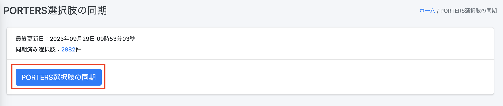

PORTERSフィールドの取得が完了すると管理画面に遷移し、「PORTERS選択肢情報を同期しています。処理完了までおよそ10分程度かかります。」という緑色の帯が表示されます。
10分程度置いていただければ完了となります。

※現状、「PORTERS選択肢情報を同期しました。」と表示されませんが処理は完了しております。(現在改修中です)

[▲TOPに戻る](#TOP)
   

<h2 id="porters_action">2.PORTERS側にアクションボタンを設定</h2>
PORTERS側から、商談階層IDを押下した際にクラウドドキュメントに遷移するアクションボタンを設定します。

(1) PORTERの「設定」→「カスタマイズ/デスクトップ」に入ります 

(2) 「アクションメニュー」の編集を押下します 

(3) 左上のプルダウンから「商談階層」を選択、その隣のプルダウンから「アクションメニュー」を選択し、右側の「新規」を押下します 

(4) アクションボタンの名称とURLを設定します。 

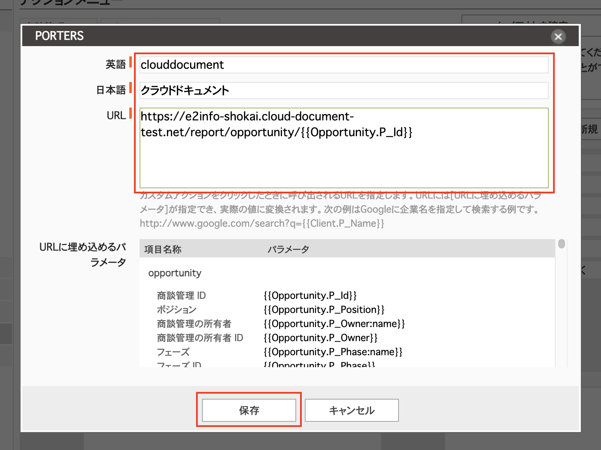

URLはクラウドドキュメントから取得可能です。 
クラウドドキュメント「PORTERS設定」から「PORTERS側の設定」に入ります。 

一番上に表示されている「アクションメニュー設定用URL(帳票の種類:通常)」の欄から下にスクロールし 

 
リソース　商談階層からURLをコピーします。 

コピーしたものをPORTERSの下記画面のURL欄にペーストし、「保存」します。

(5)以上の作業でアクションボタンの設定が完了です 

[▲TOPに戻る](#TOP)

   

<h2 id="document">3.帳票の新規登録</h2>
商談階層用の帳票を新規登録します。
※登録の仕方は他の階層と同様です

<h3 id="document_1">3-1.テンプレートの新規作成</h3>
(1) 「帳票一覧」を選択し、「＋新規登録」を押下します。

(2) 「タイトル」欄に帳票名を入力、「リソース」欄に「商談階層」を選択し、「保存する」を押下します。

(3) 「テンプレート」欄の「ファイルをアップロードしてください」または「Browse」を押下し、ファイルをアップロードします。
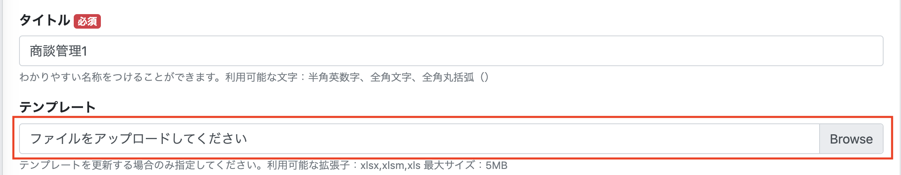

(4) 作成する帳票の操作について許可、不許可を選択してください。 
※デフォルトではすべて「許可」となっています。 
帳票制作時の空白の値の処理について選択してください。 
※デフォルトでは「値を出力せず、セルを空白にする」となっています。 

(7)最後に「保存する」を押下すると帳票一覧に追加されます。

テンプレートが作成されると帳票一覧に遷移し、「更新しました」という緑色の帯が表示され、帳票一覧に作成したテンプレートが表示されます。

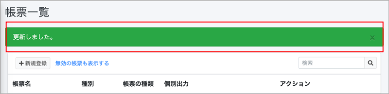

<h2 id="mapping">4．マッピングの設定</h2>
登録した帳票にマッピングを行います。

<h3 id="mapping_1">4-1.マッピングの更新</h3>
(1) 「帳票一覧」を選択し、右側の「アクション」にある「マッピング」を押下します。

(2) 「マッピング設定」に遷移するので、右側の「アクション」にある「更新」アイコンを押下します。 

(3) 「PORTERSフィールド」欄からPORTERSに紐づける項目を選択します。 
プルダウンから選択したり、キーワードを入力し検索することも可能です。 

   
なお、各リソース(階層)によってマッピングできるエイリアスの種類が異なります。
詳細は下記の通りです。 

|リソース(階層)|マッピングできるエイリアスの種類|
|-----|-----|
|商談階層|SystemField、Opportunity、Client、Recruiter|
|企業|SystemField、Client|
|企業担当者|SystemField、Recruiter、Client|
|JOB|SystemField、Job、Client、Recruiter|
|個人連絡先|SystemField、Person|
|レジュメ|SystemField、Resume、Person|
|売上|SystemField、Sales、Person、Job、Client、Recruiter、Contract、Resume|
|アクティビティ|SystemField、Activity、Job、Resume|
|選考プロセス|SystemField、Process、Person、Job、Client、Recruiter、Resume|

  
(4)設定が完了したら最後に 「保存する」を押下します。

更新が完了すると「マッピング設定」に遷移し、「マッピング情報を更新しました。」という緑色の帯が表示され、 
「PORTERS名称」と「PORTERSエイリアス」が反映されます。

  

<h2 id="porters_dl">5.PORTERSから帳票をダウンロードする</h2>

ここでは[3.帳票テンプレートの作成](#document_temp) で取り込んだ出力用の項目を、PORTERSデータに紐づけを行います。 

#### 【ご注意ください】本番環境にて出力した帳票すべてが課金対象になります(トライアル期間内、テスト環境での利用を除く) 詳細は[帳票のご利用料金について](#price)をご確認ください。　 
#### ※マクロを使用したテンプレート(xlms形式)は出力について注意点がございます。　 詳細は[よくある質問 Q.テンプレートにマクロは使用できますか？ ](https://e2info.github.io/cloudreport-docs/faq/faq.html#template3)でご確認ください。

<h3 id="porters_dl_1">5-1.クラウドドキュメントを1件ダウンロードする</h3>
(1) PORTERS画面左上のタブで出力したい各階層を選択し、ドロップダウンからすべてのID分を表示するように選択すると一覧が表示されます。

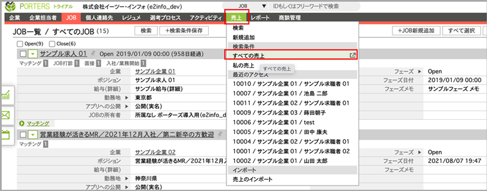

(2) PORTERSでクラウドドキュメントを作成したい商談階層IDをクリックし、アクションボタン「クラウドドキュメント」を押下します。

(3) クラウドドキュメントに遷移します。先ほど選択した商談管理IDが挿入された状態になっています。
出力したいテンプレートをプルダウンから指定し「ダウンロード」をします。もしくは「プレビュー」も可能です。

(4)「ダウンロードする」ボタンを押下すると、帳票ダウンロード画面に切り替わります。
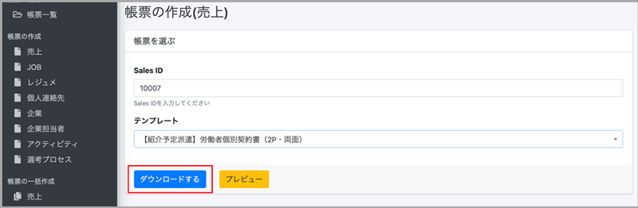

  

①アクション＝「ダウンロードする」の場合

(1)「ダウンロードする」の右側にあるEXCEL/PDFのボタンを押下します。

(2) 画面左下に表示されるブラウザのダウンロードバーをクリックするとダウンロードしたEXCEL/PDFファイルが確認できます。

(3) PCのダウンロードフォルダにEXCEL/PDFファイルが保存されます。

▼EXCELの場合

▼PDFの場合

##### ※マッピング項目先（PORTERS側の値）に半角「¥」が入っていると帳票出力時に半角「\」に変換されてしまいます。 
##### 「¥」を帳票に表示したい場合は全角の￥をご使用ください。

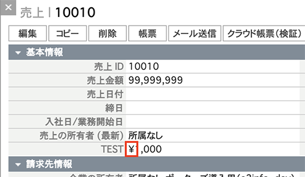

  

②アクション＝ 「PORTERSに保存する」の場合
#### ※マクロを使用したテンプレート(xlms形式)はPORTERSに保存できません。

(1)「PORTERSに保存する」の右側にあるEXCEL/PDFのボタンを押下します。

(2)上部に「PORTERSにファイルを添付しました。」という緑色の帯が表示されたら「PORTERSを開く」をクリックします。

(3)PORTERS画面に切り替わり、出力したい各階層のウィンドウが表示されます。「サブリスト｜ 添付ファイル」でダウンロードしたEXCEL/PDFファイルが確認できます。
  

  

<h3 id="porters_dl_2">5-2.クラウドドキュメントを一括ダウンロードする</h3>

#### ※マクロを使用したテンプレート(xlms形式)は出力について注意点がございます。　 詳細は[よくある質問 Q.テンプレートにマクロは使用できますか？ ](https://e2info.github.io/cloudreport-docs/faq/faq.html#template3)でご確認ください。

まずPORTERSの設定から行います。 
※PORTERSの設定は管理者の方のみ設定可能です。 
(1)PORTERSの「カスタマイズ」ページに入り 
 
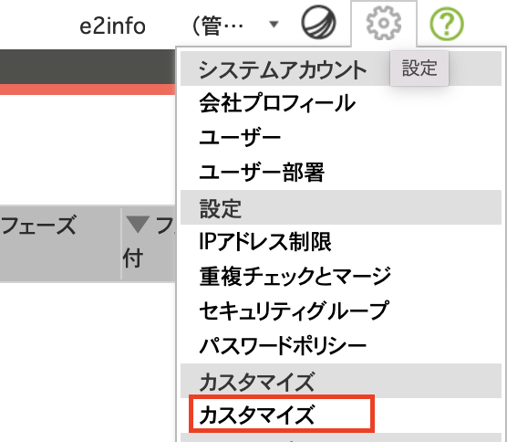  
アクションメニュー→レジュメ or 売上　or JOBを選択→一括アクションを選択します。 
新規の項目を作成します。 
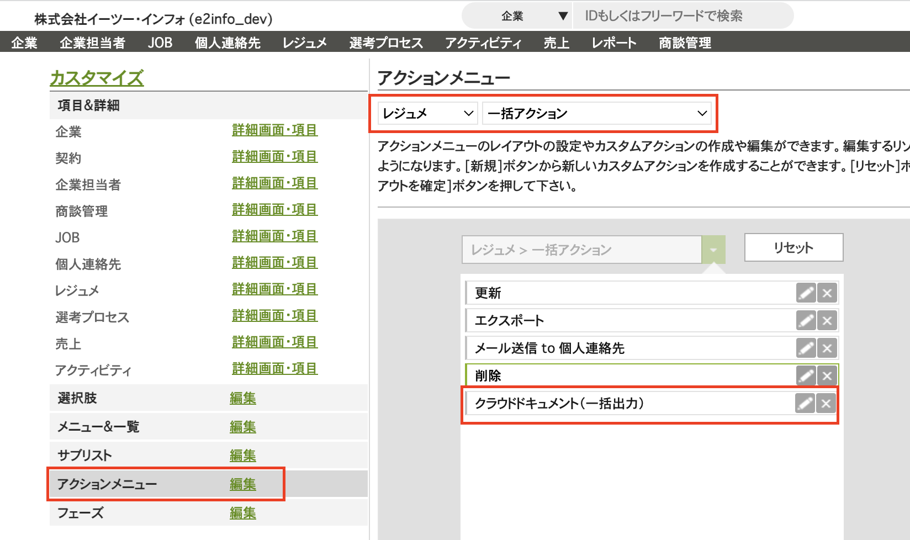

(2)項目名は任意で設定してください。 
　URLは下記の通り、【ご利用中のドメイン】にはご利用中のドメインを置き換えて設定してください。 
 (例)https://e2info.cloud-document.net →利用中のドメインは　e2info の部分です。 
 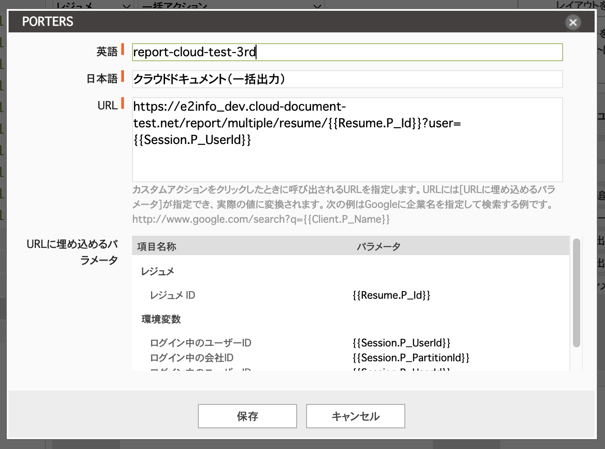 
 
売上 
https://【ご利用中のドメイン】.cloud-document.net/report/multiple/sales/\{\{Sales.P_Id\}\}?user=\{\{Session.P_UserId\}\}
 
レジュメ 
https://【ご利用中のドメイン】.cloud-document.net/report/multiple/resume/\{\{Resume.P_Id\}\}?user=\{\{Session.P_UserId\}\}
 
JOB 
https://【ご利用中のドメイン】.cloud-document.net/report/multiple/job/\{\{ob.P_Id\}\}?user=\{\{Session.P_UserId\}\}
  

(3)PORTERSの各階層で、出力したいIDにチェックを入れて、先ほど設定したアクションメニューを選択します。 
もしくはページに表示されている全件のIDの出力を希望の場合はチェックを入れる必要はありません。 
※一度に一括出力できるIDは100件までです 
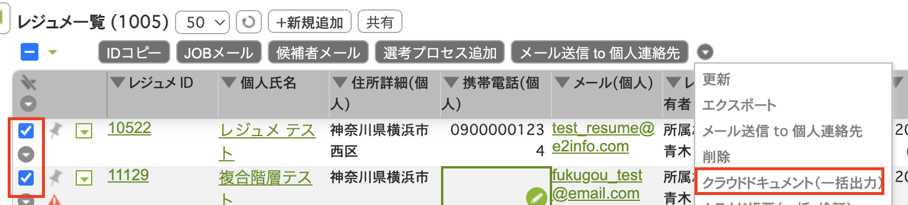  

(4)「チェックされているデータ」を選択し「OK」を押下します。 
ページに表示されている全件のIDの出力を希望の場合は「表示されているデータ」を選択し「OK」を押下します。 
※この場合でも上限は100件です 
  

(5)クラウドドキュメントに遷移し、先ほどチェックを入れた複数のIDが自動的に入力されます。 
テンプレートを選択して「ダウンロードする」ボタンを押下します。 
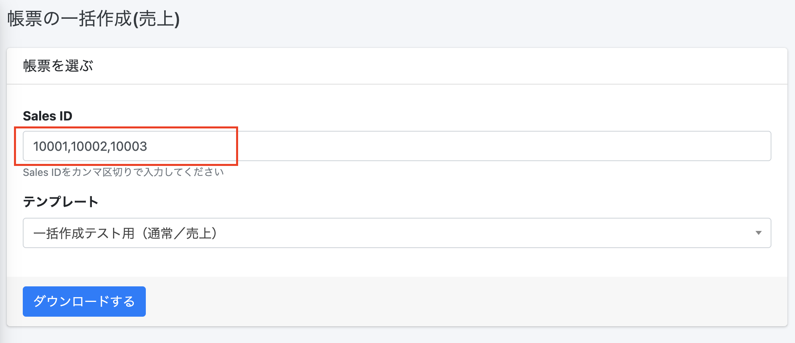  

(6)左側のメニュー「帳票の一括作成」の中の「処理結果DL」ページに入り、 
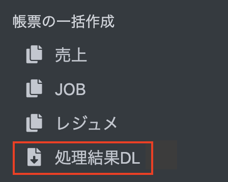  

(7)処理結果からExcelまたはPDFを選択します。 
※処理結果にExcelまたはPDFのボタンが表示されるまで少々お待ちください。 
※ダウンロードできるのは5の「ダウンロードする」ボタンを押してから30分以内となりますのでお気をつけください。
  

(8)zipファイルにてダウンロードされますので解凍してご確認ください。 
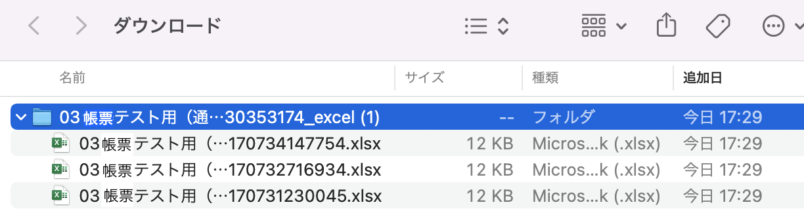  

  

<h2 id="dl">6.クラウドドキュメントからIDを入力してダウンロードする</h2>

ここでは[3.帳票テンプレートの作成](#document_temp) で取り込んだ出力用の項目を、PORTERSデータに紐づけを行います。

<h3 id="dl_1">6-1.「帳票一覧」から帳票を出力する</h3>

#### 【ご注意ください】本番環境にて出力した帳票すべてが課金対象になります(トライアル期間内、テスト環境での利用を除く)　 詳細は[帳票のご利用料金について](#price)をご確認ください。
#### ※マクロを使用したテンプレート(xlms形式)は出力について注意点がございます。　 詳細は[よくある質問 Q.テンプレートにマクロは使用できますか？ ](https://e2info.github.io/cloudreport-docs/faq/faq.html#template3)でご確認ください。

(1) 「帳票一覧」を選択し、「個別出力」欄に出力したい各階層のIDを入力します。 

(2) 「出力」を押下すると、帳票ダウンロード画面に切り替わります。 

(3) 以降の操作は [5-1.クラウド帳票を1件ダウンロードする(4)](#porters_dl_1_4)をご参照ください。

#### 【ご注意ください】個別出力にIDを入力し出力された場合も課金対象になります(トライアル期間内、テスト環境での利用を除く) 詳細は[帳票のご利用料金について](#price)をご確認ください。

  

<h3 id="dl_2">6-2.「帳票の作成」からクラウドドキュメントを出力する</h3>

#### 【ご注意ください】本番環境にて出力した帳票すべてが課金対象になります(トライアル期間内、テスト環境での利用を除く) 詳細は[帳票のご利用料金について](#price)をご確認ください。　 
#### ※マクロを使用したテンプレート(xlms形式)は出力について注意点がございます。　 詳細は[よくある質問 Q.テンプレートにマクロは使用できますか？ ](https://e2info.github.io/cloudreport-docs/faq/faq.html#template3)でご確認ください。

(1)「帳票の作成」から出力したいメニューを選択し、ID欄に出力したい各階層のIDを入力します。

(2) 以降の操作は [5-1.クラウドドキュメントを1件ダウンロードする(4)](#porters_dl_1_4)をご参照ください。

  

<h3 id="dl_3">6-3.「帳票の一括作成」からクラウドドキュメントを出力する</h3>

(1) クラウドドキュメントの左側のメニュー「帳票の一括作成」から、該当する階層を選びます。 
 
  

(2) 出力したいIDをコンマで区切り入力し、テンプレートを選択して「ダウンロードする」ボタンを押下します。 
※一度に一括出力できるIDは100件までです 
  

(3) 左側のメニュー「帳票の一括作成」の中の「処理結果DL」ページに入り、 
  

(4) 処理結果からExcelまたはPDFを選択します。 
※処理結果にExcelまたはPDFのボタンが表示されるまで少々お待ちください。 
※ダウンロードできるのは2の「ダウンロードする」ボタンを押してから30分以内となりますのでお気をつけください。 
  

(5) zipファイルにてダウンロードされますので解凍してご確認ください。 
  

  

<h3 id="dl_4">6-4.「出力履歴」からクラウドドキュメントを出力する</h3>

#### 【ご注意ください】本番環境にて出力した帳票すべてが課金対象になります(トライアル期間内、テスト環境での利用を除く) 詳細は[帳票のご利用料金について](#price)をご確認ください。　 
#### ※マクロを使用したテンプレート(xlms形式)は出力について注意点がございます。　 詳細は[よくある質問 Q.テンプレートにマクロは使用できますか？ ](https://e2info.github.io/cloudreport-docs/faq/faq.html#template3)でご確認ください。

「出力履歴」では、過去に出力したクラウド帳票の履歴を確認し、再出力できます。

(1)「出力履歴」を選択し、右側の「対象データ」にあるIDを押下します。

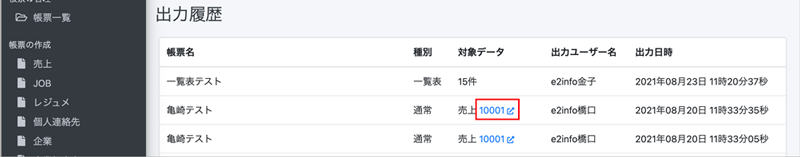

(2) 別ウィンドウでPORTERSの「売上一覧」が表示されます。左上のタブで「クラウド帳票(本番)」を選択し、ダウンロード画面に切り替えます。

※検証環境がある場合、検証環境でダウンロードしたい場合は「クラウド帳票(検証)」を選択します。

(3) 以降の操作は [5-1.クラウドドキュメントを1件ダウンロードする(4)](#porters_dl_1_4)をご参照ください。

[▲TOPに戻る](#TOP)
   

<h2 id="dl_ledger">7.台帳(一覧表)をダウンロードする</h2>

#### 【ご注意ください】本番環境にて出力した帳票すべてが課金対象になります(トライアル期間内、テスト環境での利用を除く)　 詳細は[帳票のご利用料金について](#price)をご確認ください。 

同じリソースに対して、PORTERSで複数選択したデータの台帳が出力します。

<h3 id="dl_ledger_1">7-1.PORTERSの設定</h3>
※PORTERSにシステム管理者権限でのログインが必要です。  
(1)設定→カスタマイズの順に選択します  
(2)アクションメニュー編集を選択  
(3)アクションメニューを設定するリソースを選択します  
(4)一括アクションを選択します

 

(5)新規でアクションメニューを作成し、URLを設定します

クラウドドキュメント上の左側のメニュー「PORTERS側の設定」に入ります 
 

該当するリソースのURLをコピーしてください  
※IDやテンプレートの変更可否やテンプレート初期値の指定あり・なしでURLが変わります。  
　詳しくは [8.特定の帳票をアクションボタンに設定する](#dl_sp)をご参照ください。  
 

  

<h3 id="dl_ledger_2">7-2.テンプレートの作成</h3>

繰り返し行の前後を　\{\{LOOP_START\}\}　　～　　　\{\{LOOP_END\}\}で囲みます。(この行は削除されます)  
   

<h3 id="dl_ledger_3">7-3.テンプレートの登録</h3> 

帳票一覧→新規登録から一覧表を選んで保存し、テンプレートを設定し、マッピングを行います。

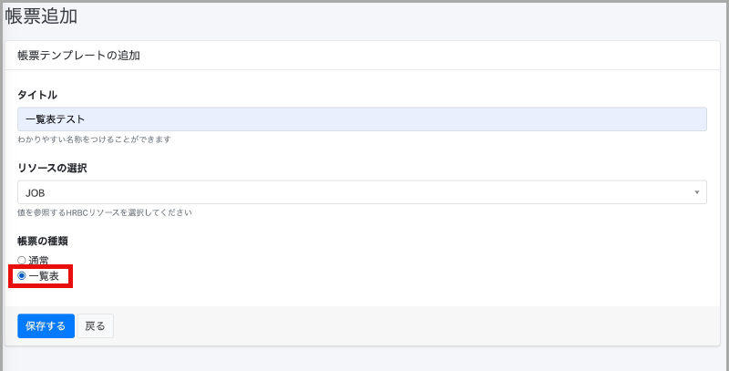

  

<h3 id="dl_ledger_4">7-4.出力</h3>

(1)一括アクションボタンのプルダウンから、 [7-1.PORTERSの設定](#dl_ledger_1)でPORTERSに設定した一覧表メニューを選びます。

  

(2)表示されているデータ全てorチェックを入れたデータかを選びます。 
※いずれの場合も選択できるデータの上限は1000件です。 

  

(3)[7-2.テンプレートの作成](#dl_ledger_2)で登録したテンプレートを選択しダウンロードします。
 

(4) 以降の操作は [5-1.クラウドドキュメントを1件ダウンロードする(4)](#porters_dl_1_4)をご参照ください。
  

[▲TOPに戻る](#TOP)
  

<h2 id="dl_sp">8.特定の帳票をアクションボタンに設定する</h2> 

よく使う帳票はアクションボタンに設定することが可能です。 
この設定により、帳票の種類を選ぶ工程等を省くことができます。 

<h3 id="dl_sp_1">8-1.PORTERSの設定</h3>
※PORTERSにシステム管理者権限でのログインが必要です。  
(1)設定→カスタマイズの順に選択します  
(2)アクションメニュー編集を選択  
(3)アクションメニューを設定するリソースを選択します  
(4)新規アクションメニューを追加します 
(5)URLを設定します 

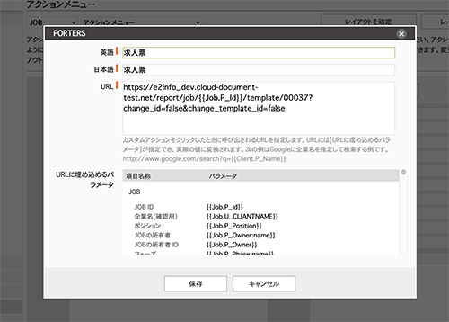  

#### URLの設定方法
クラウドドキュメントの左側のメニューの「PORTERS側の設定」から値をコピーします 

  

#### URLは下記の変更可否によって分かれています。 

|項目|内容|
|-----|-----|
|ID変更|JOBID等の各IDを変更できるかどうか|
|テンプレート変更|テンプレートを変更できるかどうか|
|テンプレート初期値|URLの【ここに帳票識別IDを指定してください】の部分を指定するかどうか=帳票を指定するかどうか|

 
※帳票識別IDは「帳票更新」画面から確認できます。 

 

指定したい帳票の帳票識別IDを【ここに帳票識別IDを指定してください】の部分に挿入してください。 
(例) 
https://XXXXX.cloud-document.net/report/job/{{Job.P_Id}}/template/【ここに帳票識別IDを指定してください】/?user={{Session.P_UserId}}　 
帳票識別IDが00035の場合下記のように挿入してください 

  

 
(6)レイアウトを確定し、設定が完了するとアクションボタンが追加されます。 

  

<h3 id="dl_sp_2">8-2.出力</h3>

### どのURLを入れるかによりアクションボタン押下で帳票出力画面に遷移後の表示が異なります。 

#### ID変更:可　　テンプレート変更:可　　　テンプレート初期値：なし 
IDを変更可能、テンプレートも変更可能 

  

#### ID変更:不可　　テンプレート変更:可　　　テンプレート初期値：なし 
IDは固定、テンプレートは変更可能 

  

#### ID変更:可　　テンプレート変更:可　　　テンプレート初期値：あり 
IDは変更可能、テンプレートは指定されたものが自動的に設定されるが変更可能 

  

#### ID変更:可　　テンプレート変更:不可　　　テンプレート初期値：あり 
IDは変更可能、テンプレートは指定されたものが自動的に設定される(変更不可) 

  

#### ID変更:不可　　テンプレート変更:可　　　テンプレート初期値：あり

IDは変更不可、テンプレートは指定されたものが自動的に設定されるが変更可能 

#### ID変更:不可　　テンプレート変更:不可　　　テンプレート初期値：あり

IDは変更不可、テンプレートは指定されたものが自動的に設定される(変更不可) 

上記を必要に応じて設定することで、帳票出力毎の設定の工程を短縮できます。

[▲TOPに戻る](#TOP)
    

-----

* 2021年8月25日新規作成
* 2023年9月15日更新


