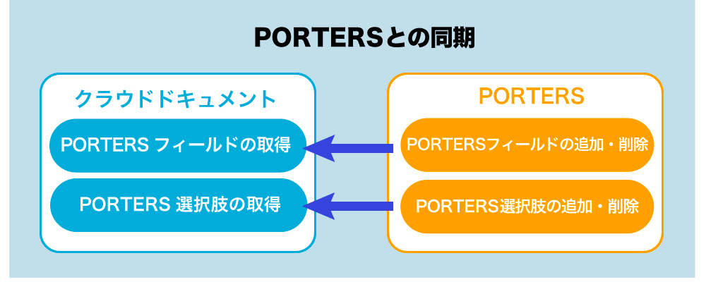
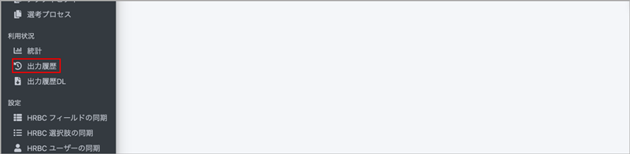

 

  

# クラウドドキュメント 作成マニュアル（標準ユーザー用）

<h2 id="TOP">目次</h2>

- [はじめに](#introduction)
  - [クラウドドキュメントの動作保証環境について](#os) 
  - [主なフローについて](#flow)
  - [クラウドドキュメントのログインについて](#login)
  - [帳票のご利用料金について](#price)
  - [処理時間の上限について](#processing_time)
- [1.PORTERSからクラウドドキュメントをダウンロードする](#porters_dl)
  - [1-1.クラウドドキュメントを1件ダウンロードする](#porters_dl_1)
  - [1-2.クラウドドキュメントを一括ダウンロードする](#porters_dl_2)
- [2.クラウドドキュメントから出力したい各階層のIDを入力して ダウンロードする](#dl)
  - [2-1.「ダウンロード」からクラウドドキュメントを出力する](#dl_1)
  - [2-2.「一括ダウンロード」からクラウドドキュメントを出力する](#dl_2)
  - [2-3.「出力履歴」からクラウドドキュメントを出力する](#dl_3)
- [3.台帳(一覧表)をダウンロードする](#dl_ledger)
  - [3-1.出力](#dl_ledger_1)
 
<h2 id="introduction">はじめに</h2>

<h3 id="os">クラウドドキュメントの動作環境について</h3>
PORTERSに準じ、動作環境を設定しています。

[クラウドドキュメント よくある質問 「クラウドドキュメントの動作環境はどちらになりますか？」](https://e2info.github.io/cloudreport-docs/faq/faq.html#about1)でご確認ください。
  

<h3 id="flow">フローについて</h3>

 

  

#### ダウンロード（管理者/標準ユーザー共通で利用可能）

帳票テンプレートを使用しPORTERSにダウンロードします。 
※PORTERS経由でのダウンロードやお使いのPCへのダウンロードが可能とするかは 
管理者ユーザーが帳票登録時に設定した設定内容により異なります。 
希望のダウンロード方法を選択できない場合は管理者ユーザーの方に設定変更を依頼してください。 
管理者の方の手順については管理者用マニュアルにてご確認ください。 
 
[クラウドドキュメント 作成マニュアル（管理者用）はこちら](https://e2info.github.io/cloudreport-docs/manual/admin.html)
  

<h3 id="login">クラウドドキュメントのログインについて</h3>
クラウドドキュメントのご利用には一度PORTERSを経由してログインする必要があります。 
お知らせしたクラウドドキュメントURLにアクセスいただき、PORTERSのログインを経てご使用いただけます。

  

<h3 id="price">帳票のご利用料金について</h3>

#### 本番環境にて出力した帳票全てが課金対象となります。(トライアル期間・テスト環境での利用を除く)

(1) 課金のタイミングについて 
「ダウンロード」ボタンを押すと１帳票分課金対象としてカウントされます。 
その後遷移する画面にて「PORTERSに保存する」のPDFやExcelのダウンロードボタンを押してもカウントされません。

(2) 出力枚数の確認について 
クラウドドキュメントの左側のメニュー「利用状況 統計」に各月における各帳票の出力枚数の確認ができます。

  

[▲TOPに戻る](#TOP)
   

<h3 id="processing_time">処理時間の上限について</h3>

各処理にはタイムアウト時間が設けられています。 
処理が完了せずタイムアウト時間に到達すると、エラーとなり帳票出力が失敗します。 
その場合は、処理件数を減らす・マッピング数を減らすなどの調整をお願いします。  

|処理分類|分類|項目|処理時間|
|-----|-----|-----|-----|
|同期処理|共通|同期処理タイムアウト|30秒|
|非処理|共通|非処理タイムアウト|60秒|
|非処理|帳票の一括作成|帳票の一括作成|30分|
|非処理|PORTERS設定|選択肢の同期|30分|
|非処理|一覧表|一覧表|30分|

[▲TOPに戻る](#TOP)
   

<h2 id="porters_dl">1.PORTERSからクラウドドキュメントをダウンロードする</h2>

#### 事前にPORTERS管理者ユーザーによる[PORTERS側の設定](https://e2info.github.io/cloudreport-docs/manual/hrbc.html)が必要です。 
#### 【ご注意ください】本番環境にて出力した帳票すべてが課金対象になります(トライアル期間内、テスト環境での利用を除く) 詳細は[帳票のご利用料金について](#price)をご確認ください。　 
#### ※マクロを使用したテンプレート(xlms形式)は出力について注意点がございます。　 詳細は[よくある質問 Q.テンプレートにマクロは使用できますか？ ](https://e2info.github.io/cloudreport-docs/faq/faq.html#template3)でご確認ください。

<h3 id="porters_dl_1">1-1.クラウドドキュメントを1件ダウンロードする</h3> 
例として「売上」階層で出力を行います 
(1) PORTERS画面左上のタブで「売上」を選択し、ドロップダウンから「すべての売上」を選択すると一覧が表示されます。

(2) クラウドドキュメントを作成したいPORTERSデータのIDをクリックします

(3) 左上のタブでアクションボタン(こちらの環境では クラウド帳票(本番))を選択し、ダウンロード画面に切り替えます。

※テスト環境がある場合、テスト環境でダウンロードしたい場合はテスト環境に遷移するアクションボタンを選択します。 
※ボタン名称は各環境で管理者ユーザーが指定した名称で表示されます。 

<h3 id="porters_dl_1_4"></h3>
(4) ダウンロード画面の出力したい各階層のID欄に表示されているIDが正しいことを確認し、
テンプレートのドロップダウンから利用したいテンプレート名称を選択します。

(5)「ダウンロードする」ボタンを押下すると、帳票ダウンロード画面に切り替わります。

  

アクション＝ 「PORTERSに保存する」
#### ※マクロを使用したテンプレート(xlms形式)はPORTERSに保存できません。

(1)「PORTERSに保存する」の右側にあるEXCEL/PDFのボタンを押下します。

(2)上部に「PORTERSにファイルを添付しました。」という緑色の帯が表示されたら「PORTERSを開く」をクリックします。

(3)PORTERS画面に切り替わり、対象階層のウィンドウが表示されます。「サブリスト｜ 添付ファイル」でダウンロードしたEXCEL/PDFファイルが確認できます。
  

  

<h3 id="porters_dl_2">1-2.クラウドドキュメントを一括ダウンロードする</h3>

まずPORTERSの設定から行います。 
※PORTERSの設定は管理者の方のみ設定可能です。 
管理者の方に依頼いただくか、 
管理者としてログインの上[管理者用マニュアル](https://e2info.github.io/cloudreport-docs/manual/admin.html#porters_dl_2)をご確認ください。
 
(1)PORTERSの各階層で、出力したいIDにチェックを入れて、先ほど設定したアクションメニューを選択します。 
もしくはページに表示されている全件のIDの出力を希望の場合はチェックを入れる必要はありません。 
  

(2)「チェックされているデータ」を選択し「OK」を押下します。 
ページに表示されている全件のIDの出力を希望の場合は「表示されているデータ」を選択し「OK」を押下します。 
  

(3)クラウドドキュメントに遷移し、先ほどチェックを入れた複数のIDが自動的に入力されます。 
テンプレートを選択して「ダウンロードする」ボタンを押下します。 
  

(4)左側のメニュー「帳票の一括作成」の中の「処理結果DL」ページに入り、 
  

(5)処理結果からExcelまたはPDFを選択します。 
※処理結果にExcelまたはPDFのボタンが表示されるまで少々お待ちください。 
※ダウンロードできるのは5の「ダウンロードする」ボタンを押してから30分以内となりますのでお気をつけください。
  

(6)zipファイルにてダウンロードされますので解凍してご確認ください。 
  

  

<h2 id="dl">2.クラウドドキュメントから各階層のIDを入力してダウンロードする</h2>

#### 【ご注意ください】本番環境にて出力した帳票すべてが課金対象になります(トライアル期間内、テスト環境での利用を除く) 詳細は[帳票のご利用料金について](#price)をご確認ください。　 

<h3 id="dl_1">2-1.「帳票の作成」からクラウドドキュメントを出力する</h3>
(1)「帳票の作成」から出力したいメニューを選択し、出力したい各階層のID欄に出力したいIDを入力します。

(2) 以降の操作は [1-1.クラウドドキュメントを1件ダウンロードする(4)](#hrbc_dl_1_4)をご参照ください。

  

<h3 id="dl_2">2-2.「帳票の一括作成」からクラウドドキュメントを出力する</h3>

(1) クラウドドキュメントの左側のメニュー「帳票の一括作成」から、該当する階層を選びます。 
 
  

(2) 出力したいIDをコンマで区切り入力し、テンプレートを選択して「ダウンロードする」ボタンを押下します。 
  

(3) 左側のメニュー「帳票の一括作成」の中の「処理結果DL」ページに入り、 
  

(4) 処理結果からExcelまたはPDFを選択します。 
※処理結果にExcelまたはPDFのボタンが表示されるまで少々お待ちください。 
※ダウンロードできるのは2の「ダウンロードする」ボタンを押してから30分以内となりますのでお気をつけください。 
  

(5) zipファイルにてダウンロードされますので解凍してご確認ください。 
  

  

<h3 id="dl_3">2-3.「出力履歴」からクラウドドキュメントを出力する</h3>
「出力履歴」では、過去に出力したクラウドドキュメントの履歴を確認し、再出力できます。

(1)「出力履歴」を選択し、右側の「対象データ」にあるIDを押下します。

(2) 別ウィンドウでPORTERSの「売上一覧」が表示されます。左上のタブで「クラウド帳票(本番)」を選択し、ダウンロード画面に切り替えます。

※検証環境がある場合、検証環境でダウンロードしたい場合は「クラウド帳票(検証)」を選択します。

(3) 以降の操作は [1-1.クラウドドキュメントを1件ダウンロードする(4)](#hrbc_dl_1_4)をご参照ください。

[▲TOPに戻る](#TOP)
   

<h2 id="dl_ledger">3.台帳(一覧表)をダウンロードする</h2>

#### 【ご注意ください】本番環境にて出力した帳票すべてが課金対象になります(トライアル期間内、テスト環境での利用を除く) 詳細は[帳票のご利用料金について](#price)をご確認ください。　 
#### ※マクロを使用したテンプレート(xlms形式)は出力について注意点がございます。　 詳細は[よくある質問 Q.テンプレートにマクロは使用できますか？ ](https://e2info.github.io/cloudreport-docs/faq/faq.html#template3)でご確認ください。

同じリソースに対して、PORTERSで複数選択したデータの台帳が出力します。

<h3 id="dl_ledger_1">3-1.出力</h3>

(1)一括アクションボタンのプルダウンから、 一覧表メニューを選びます。

  

(2)表示されているデータ全てorチェックを入れたデータかを選びます。 

  

(3)テンプレートを選択しダウンロードします。
 

(4) 以降の操作は [1-1.クラウドドキュメントを1件ダウンロードする(4)](#hrbc_dl_1_4)をご参照ください。
  

[▲TOPに戻る](#TOP)
   

  
-----
* 2021年8月25日新規作成
* 2023年12月22日更新


