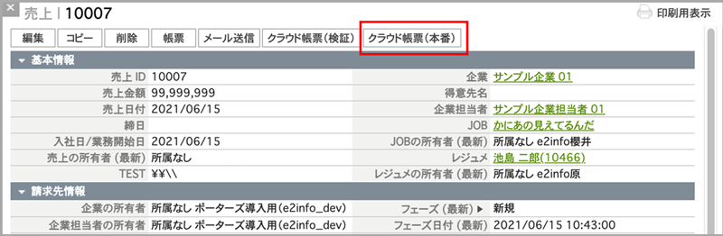
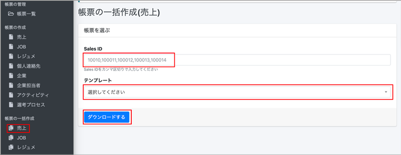
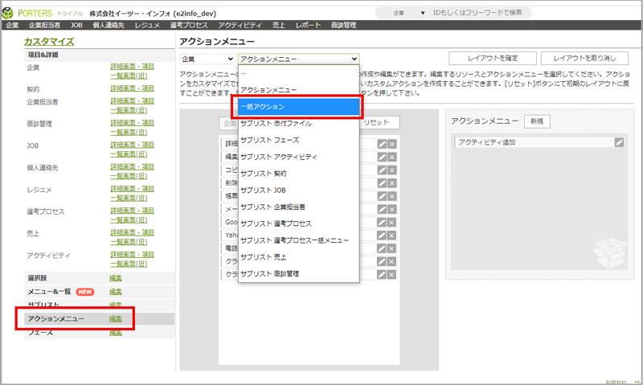

#### クラウド帳票 作成マニュアル（一般ユーザー用）

<h2 id="TOP">目次</h2>

- [はじめに](#introduction)
  - [主なフローについて](#flow)
  - [クラウド帳票のログインについて](#login)
- [1.HRBCからクラウド帳票をダウンロードする](#hrbc_dl)
  - [1-1.クラウド帳票を1件ダウンロードする](#hrbc_dl_1)
  - [1-2.クラウド帳票を一括ダウンロードする](#hrbc_dl_2)
- [2.クラウド帳票から成約IDを入力して ダウンロードする](#dl)
  - [2-1.「帳票一覧」からクラウド帳票を出力する](#dl_1)
  - [2-2.「ダウンロード」からクラウド帳票を出力する](#dl_2)
  - [2-3.「一括ダウンロード」からクラウド帳票を出力する](#dl_3)
  - [2-1.「出力履歴」からクラウド帳票を出力する](#dl_4)
- [7.台帳(一覧表)をダウンロードする](#dl_ledger)
  - [7-1.HRBCの設定](#dl_ledger_1)
  - [7-2.テンプレートの作成](#dl_ledger_2)
  - [7-3.テンプレートの登録](#dl_ledger_3)
  - [7-4.出力](#dl_ledger_4)
 
<h2 id="introduction">はじめに</h2>

<h3 id="flow">主なフローについて</h3>

#### 1.HRBCの同期（管理者のみ利用可能）

初回はクラウド帳票の「HRBCフィールド取得」「HRBC選択肢の取得」画面にて、HRBCのデータと紐づける項目を同期します。
なお、HRBCで項目の追加・削除などの変更があった場合、クラウド帳票側も都度同期する必要があります。

詳細は[1.HRBCとの同期](#hrbc)をご確認ください。

 

#### 2.帳票テンプレートの作成（管理者のみ利用可能）

「帳票一覧」画面より、クラウド帳票に出力する帳票のテンプレートを新規作成します。 
テンプレートを新規作成あるいは更新する場合、Excelファイルで作成したテンプレートを取り込みます。 
その後、「マッピング設定」画面にて、出力項目とHRBCのデータを紐づけします。

詳細は[2.帳票テンプレート用ファイルの作成](#document_temp_file)　[3.帳票テンプレートの作成](#document_temp)　[4.マッピングの設定](#mapping)をご確認ください。

 

#### 3.ダウンロード（管理者/一般ユーザー共通で利用可能）

作成した帳票テンプレートをユーザーPCかHRBCにダウンロードします。 
ダウンロードは、「HRBCから出力したい成約IDの画面から出力する方法」と「クラウド帳票から成約IDを入力する方法」があります。 

詳細は[5.HRBCからクラウド帳票をダウンロードする](#hrbc_dl)　　[6.クラウド帳票から成約IDを入力してダウンロードする](#dl)をご確認ください。
  

<h3 id="login">クラウド帳票のログインについて</h3>
作成した帳票テンプレートをユーザーPCかHRBCにダウンロードします。 
ダウンロードは、「HRBCから出力したい成約IDの画面から出力する方法」と「クラウド帳票から成約IDを入力する方法」があります。 

詳細は[5-1.クラウド帳票を1件ダウンロードする(1)～(3)](#hrbc_dl_1)　[5-2.クラウド帳票を一括ダウンロードする(1)～(3)](#hrbc_dl_2)　をご確認ください。

[▲TOPに戻る](#TOP)
   

<h2 id="hrbc_dl">1.HRBCからクラウド帳票をダウンロードする</h2>

<h3 id="hrbc_dl_1">1-1.クラウド帳票を1件ダウンロードする</h3>
(1) HRBC画面左上のタブで「成約」または「売上」を選択し、ドロップダウンから「すべての成約」または「すべての売上」を選択すると一覧が表示されます。

(2) クラウド帳票を作成したいHRBCデータのIDをクリックします

(3) 左上のタブで「クラウド帳票(本番)」を選択し、ダウンロード画面に切り替えます。

※検証環境がある場合、検証環境でダウンロードしたい場合は「クラウド帳票(検証)」を選択します。

<h3 id="hrbc_dl_1_4"></h3>
(4) ダウンロード画面のSales ID欄に表示されているIDが正しいことを確認し、
テンプレートのドロップダウンから利用したいテンプレート名称を選択します。

(5)「ダウンロードする」ボタンを押下すると、帳票ダウンロード画面に切り替わります。

  

アクション＝ 「HRBCに保存する」

(1)「HRBCに保存する」の右側にあるEXCEL/PDFのボタンを押下します。

(2)上部に「HRBCにファイルを添付しました。」という緑色の帯が表示されたら「HRBCを開く」をクリックします。

(3)HRBC画面に切り替わり、「成約」ウィンドウが表示されます。「サブリスト｜ 添付ファイル」でダウンロードしたEXCEL/PDFファイルが確認できます。
  

  

<h3 id="hrbc_dl_2">1-2.クラウド帳票を一括ダウンロードする</h3>
※現在準備中です。利用開始までもうしばらくお待ちください。

  

<h2 id="dl">6.クラウド帳票から成約IDを入力してダウンロードする</h2>

<h3 id="dl_1">2-1.「帳票一覧」からクラウド帳票を出力する</h3>

(1) 「帳票一覧」を選択し、「テスト出力」欄に成約IDを入力します。

(2) 「出力」を押下すると、帳票ダウンロード画面に切り替わります。

(3) 以降の操作は [1-1.クラウド帳票を1件ダウンロードする(4)](#hrbc_dl_1_4)をご参照ください。

  

<h3 id="dl_2">2-2.「帳票の作成」からクラウド帳票を出力する</h3>
(1)「帳票の作成」から出力したいメニューを選択し、Sales ID欄に成約IDを入力します。

(2) 以降の操作は [1-1.クラウド帳票を1件ダウンロードする(4)](#hrbc_dl_1_4)をご参照ください。

  

<h3 id="dl_3">2-3.「帳票の一括作成」からクラウド帳票を出力する</h3>
(1)「一括ダウンロード」を選択し、Sales ID欄に成約IDを入力します。複数入力する場合、成約IDの間に「,(カンマ)」で区切ります。

(2) 以降の操作は [1-1.クラウド帳票を1件ダウンロードする(4)](#hrbc_dl_2_4)をご参照ください。

  

<h3 id="dl_4">2-4.「出力履歴」からクラウド帳票を出力する</h3>
「出力履歴」では、過去に出力したクラウド帳票の履歴を確認し、再出力できます。

(1)「出力履歴」を選択し、右側の「対象データ」にあるIDを押下します。

(2) 別ウィンドウでHRBCの「売上一覧」が表示されます。左上のタブで「クラウド帳票(本番)」を選択し、ダウンロード画面に切り替えます。

※検証環境がある場合、検証環境でダウンロードしたい場合は「クラウド帳票(検証)」を選択します。

(3) 以降の操作は [1-1.クラウド帳票を1件ダウンロードする(4)](#hrbc_dl_1_4)をご参照ください。

[▲TOPに戻る](#TOP)
   

<h2 id="dl_ledger">3.台帳(一覧表)をダウンロードする</h2>
同じリソースに対して、HRBCで複数選択したデータの台帳が出力します。

<h3 id="dl_ledger_1">7-1.HRBCの設定</h3>
※HRBCにシステム管理者権限でのログインが必要です。  
(1)設定→カスタマイズの順に選択します  
(2)アクションメニュー編集を選択  
(3)アクションメニューを設定するリソースを選択します  
(4)一括アクションを選択します

 

(5)新規でアクションメニューを作成し、下の表を元にURLを設定します

|利用可能リソース|URL|
|-----|-----|
|企業|https://【利用中のドメイン】.report-cloud.com/report/list/client/\{\{Client.P_Id\}\}?user=\{\{Session.P_UserId\}\}|
|企業担当者|https://【利用中のドメイン】.report-cloud.com/report/list/recruiter/\{\{Recruiter.P_Id\}\}?user=\{\{Session.P_UserId\}\}|
|JOB|https://【利用中のドメイン】.report-cloud.com/report/list/job/\{\{Job.P_Id\}\}?user=\{\{Session.P_UserId\}\}|
|個人連絡先|https://【利用中のドメイン】.report-cloud.com/report/list/candidate/\{\{Person.P_Id\}\}?user=\{\{Session.P_UserId\}\}|
|レジュメ|https://【利用中のドメイン】.report-cloud.com/report/list/resume/\{\{Resume.P_Id\}\}?user=\{\{Session.P_UserId\}\}|
|売上|https://【利用中のドメイン】.report-cloud.com/report/list/sales/\{\{Sales.P_Id\}\}?user=\{\{Session.P_UserId\}\}|
|アクティビティ|https://【利用中のドメイン】.report-cloud.com/report/list/activity/\{\{Activity.P_Id\}\}?user=\{\{Session.P_UserId\}\}|
|選考プロセス|https://【利用中のドメイン】.report-cloud.com/report/list/process/\{\{Process.P_Id\}\}?user=\{\{Session.P_UserId\}\}|

  

<h3 id="dl_ledger_2">7-2.テンプレートの作成</h3>

繰り返し行の前後を　　　{{LOOP_START}}　　～　　{{LOOP_END}}　　　で囲みます。(この行は削除されます)  
   

<h3 id="dl_ledger_3">7-3.テンプレートの登録</h3> 

帳票一覧→新規登録から一覧表を選んで保存し、テンプレートを設定し、マッピングを行います。

  

<h3 id="dl_ledger_4">7-4.出力</h3>

(1)一括アクションボタンのプルダウンから、 [7-1.HRBCの設定](#dl_ledger_1)でHRBCに設定した一覧表メニューを選びます。

  

(2)表示されているデータ全てorチェックを入れたデータかを選びます。 

  

(3)[7-2.テンプレートの作成](#dl_ledger_2)で登録したテンプレートを選択しダウンロードします。
 

(4) 以降の操作は [5-1.クラウド帳票を1件ダウンロードする(4)](#hrbc_dl_1_4)をご参照ください。
  

[▲TOPに戻る](#TOP)
   
-----
* 2021年8月25日新規作成
* 2021年8月30日更新


