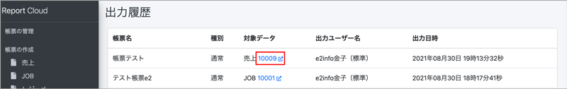
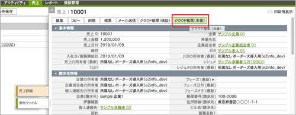
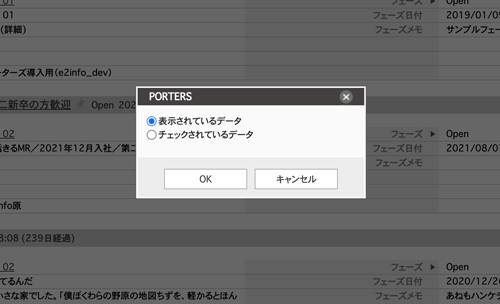

#### クラウドドキュメント 作成マニュアル（標準ユーザー用）

<h2 id="TOP">目次</h2>

- [はじめに](#introduction)
  - [主なフローについて](#flow)
  - [クラウド帳票のログインについて](#login)
- [1.HRBCからクラウドドキュメントをダウンロードする](#hrbc_dl)
  - [1-1.クラウドドキュメントを1件ダウンロードする](#hrbc_dl_1)
  - [1-2.クラウドドキュメントを一括ダウンロードする](#hrbc_dl_2)
- [2.クラウドドキュメントから成約IDを入力して ダウンロードする](#dl)
  - [2-1.「ダウンロード」からクラウドドキュメントを出力する](#dl_1)
  - [2-2.「一括ダウンロード」からクラウドドキュメントを出力する](#dl_2)
  - [2-3.「出力履歴」からクラウドドキュメントを出力する](#dl_3)
- [3.台帳(一覧表)をダウンロードする](#dl_ledger)
  - [3-1.出力](#dl_ledger_1)
 
<h2 id="introduction">はじめに</h2>

<h3 id="flow">フローについて</h3>

#### ダウンロード（管理者/標準ユーザー共通で利用可能）

帳票テンプレートを使用しHRBCにダウンロードします。 
※管理者のみ直接PCへのダウンロードが可能です。 
※HRBCへダウンロードするには事前にHRBCの同期や帳票テンプレートの作成、設定が必要となり、 この作業は管理者のみ対応可能です。 
管理者の方の手順については管理者用マニュアルにてご確認ください。 
 
[クラウド帳票 作成マニュアル（管理者用）はこちら](https://e2info.github.io/cloudreport-docs/manual/admin.html)
  

<h3 id="login">クラウドドキュメントのログインについて</h3>
クラウドドキュメントのご利用には一度HRBCを経由してログインする必要があります。 
お知らせしたクラウドドキュメントURLにアクセスいただき、HRBCのログインを経てご使用いただけます。

  

[▲TOPに戻る](#TOP)
   

<h2 id="hrbc_dl">1.HRBCからクラウドドキュメントをダウンロードする</h2>

<h3 id="hrbc_dl_1">1-1.クラウドドキュメントを1件ダウンロードする</h3>
(1) HRBC画面左上のタブで「成約」または「売上」を選択し、ドロップダウンから「すべての成約」または「すべての売上」を選択すると一覧が表示されます。

(2) クラウドドキュメントを作成したいHRBCデータのIDをクリックします

(3) 左上のタブで「クラウド帳票(本番)」を選択し、ダウンロード画面に切り替えます。

※検証環境がある場合、検証環境でダウンロードしたい場合は「クラウド帳票(検証)」を選択します。

<h3 id="hrbc_dl_1_4"></h3>
(4) ダウンロード画面のSales ID欄に表示されているIDが正しいことを確認し、
テンプレートのドロップダウンから利用したいテンプレート名称を選択します。

(5)「ダウンロードする」ボタンを押下すると、帳票ダウンロード画面に切り替わります。

  

アクション＝ 「HRBCに保存する」

(1)「HRBCに保存する」の右側にあるEXCEL/PDFのボタンを押下します。

(2)上部に「HRBCにファイルを添付しました。」という緑色の帯が表示されたら「HRBCを開く」をクリックします。

(3)HRBC画面に切り替わり、「成約」ウィンドウが表示されます。「サブリスト｜ 添付ファイル」でダウンロードしたEXCEL/PDFファイルが確認できます。
  

  

<h3 id="hrbc_dl_2">1-2.クラウド帳票を一括ダウンロードする</h3>
※現在準備中です。利用開始までもうしばらくお待ちください。

  

<h2 id="dl">2.クラウドドキュメントから成約IDを入力してダウンロードする</h2>

<h3 id="dl_1">2-1.「帳票の作成」からクラウド帳票を出力する</h3>
(1)「帳票の作成」から出力したいメニューを選択し、Sales ID欄に成約IDを入力します。

(2) 以降の操作は [1-1.クラウド帳票を1件ダウンロードする(4)](#hrbc_dl_1_4)をご参照ください。

  

<h3 id="dl_2">2-2.「帳票の一括作成」からクラウドドキュメントを出力する</h3>
(1)「一括ダウンロード」を選択し、Sales ID欄に成約IDを入力します。複数入力する場合、成約IDの間に「,(カンマ)」で区切ります。

(2) 以降の操作は [1-1.クラウド帳票を1件ダウンロードする(4)](#hrbc_dl_1_4)をご参照ください。

  

<h3 id="dl_4">2-3.「出力履歴」からクラウド帳票を出力する</h3>
「出力履歴」では、過去に出力したクラウドドキュメントの履歴を確認し、再出力できます。

(1)「出力履歴」を選択し、右側の「対象データ」にあるIDを押下します。

(2) 別ウィンドウでHRBCの「売上一覧」が表示されます。左上のタブで「クラウド帳票(本番)」を選択し、ダウンロード画面に切り替えます。

※検証環境がある場合、検証環境でダウンロードしたい場合は「クラウド帳票(検証)」を選択します。

(3) 以降の操作は [1-1.クラウドドキュメントを1件ダウンロードする(4)](#hrbc_dl_1_4)をご参照ください。

[▲TOPに戻る](#TOP)
   

<h2 id="dl_ledger">3.台帳(一覧表)をダウンロードする</h2>
同じリソースに対して、HRBCで複数選択したデータの台帳が出力します。

<h3 id="dl_ledger_1">3-1.出力</h3>

(1)一括アクションボタンのプルダウンから、 一覧表メニューを選びます。

  

(2)表示されているデータ全てorチェックを入れたデータかを選びます。 

  

(3)テンプレートを選択しダウンロードします。
 

(4) 以降の操作は [1-1.クラウドドキュメントを1件ダウンロードする(4)](#hrbc_dl_1_4)をご参照ください。
  

[▲TOPに戻る](#TOP)
   

-----
* 2021年8月25日新規作成
* 2021年9月28日更新


