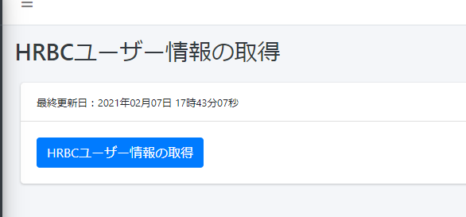
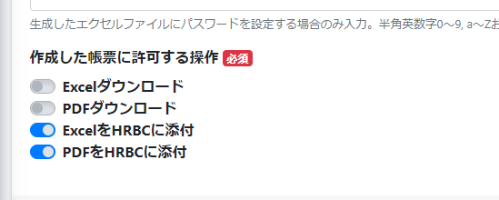

# クラウド帳票 2021年2月7日 リリースノート

## 新機能

### Contract/Activity/Recruiterへの対応

HRBCのContract/Activity/Recruiter階層の帳票が出力できるようになりました。

## 機能改善

### ユーザー情報の一括取得

任意のタイミングでユーザー情報を更新できるように、HRBCユーザー情報の取得機能を実装しました。

### HRBCリソースの日本語名指定

HRBCリソースの日本語名を自由に指定できるようになりました

### 作成済み帳票のアクションを指定

帳票作成後に許可するアクションを帳票ごとに指定できるようになりました

## 不具合修正

いくつかの細かい不具合を修正しました

-----
* 2021年2月7日 新規作成

