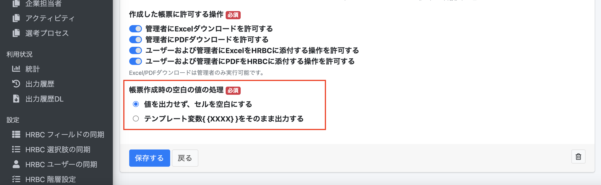
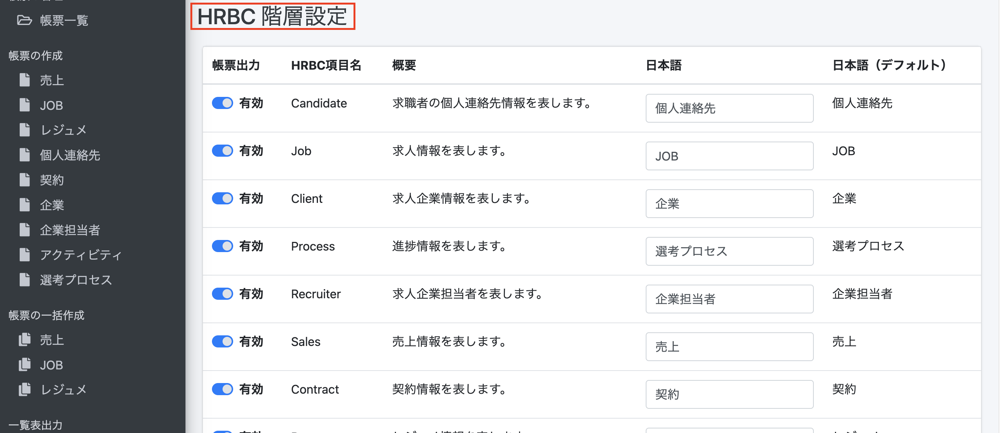

# 【リリース完了】クラウド帳票  2021年7月7日 リリース 

## 新機能

### マッピング先の値が未入力だった場合の空白変換処理

#### テンプレート作成時、帳票作成時の空白の値の処理について選択できるようになりました

今まではマッピング先の値が未入力だった場合、テンプレート変数{ {XXXX} }がそのまま出力されていましたが、帳票作成時に
・テンプレート変数{ {XXXX} }をそのまま出力する
・値を出力せず、セルを空白にする
のどちらかを選択できるようになりました。

※現在ご利用中のお客様に影響が無いよう、初期値は「テンプレート変数{ {XXXX} }をそのまま出力する」としています。

## 不具合修正

### いくつかの細かい不具合を修正しました

 

## ※お詫びと訂正
本日予定しておりました下記のリリースが事情により延期となりました。
何卒ご了承のほどよろしくお願いいたします。

### 帳票出力メニューの制限

#### HRBC管理者が帳票を出力できるリソースを制限できる機能を追加しました。
「HRBC メニュー名称」が、「HRBC 階層設定」に変更されました。
HRBC 階層設定で無効にしたリソースは帳票の作成メニューから非表示となります。

-----
* 2021年7月5日新規作成
* 2021年7月7日更新


