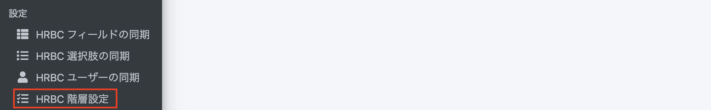

# 【リリース予定】クラウド帳票  2021年7月28日 リリース  

## 新機能

### 画像出力対応
#### 出力する項目に、画像が指定できるようになりました。


<br>

### 台帳(一覧表)対応
#### 同じリソースに対して、HRBCで複数選択したデータの台帳が出力できるようになりました。


HRBCのアクションメニューは以下の様に設定してください<br>
（以下、https://e2info.github.io/cloudreport-docs/manual/hrbc.html  の表のイメージになります）

URL一覧

|  利用可能リソース |  URL  |
| ---- | ---- |
|  企業  |  https://【利用中のドメイン】.report-cloud.com/report/list/client/\{\{Client.P_Id\}\}?user=\{\{Session.P_UserId\}\}  |
|  企業担当者  |  https://【利用中のドメイン】.report-cloud.com/report/list/recruiter/\{\{Recruiter.P_Id\}\}?user=\{\{Session.P_UserId\}\}  |
|  JOB  |  https://【利用中のドメイン】.report-cloud.com/report/list/job/\{\{Job.P_Id\}\}?user=\{\{Session.P_UserId\}\}  |
|  個人連絡先  |  https://【利用中のドメイン】.report-cloud.com/report/list/candidate/\{\{Person.P_Id\}\}?user={{Session.P_UserId\}\}  |
|  レジュメ  |  https://【利用中のドメイン】.report-cloud.com/report/list/resume/\{\{Resume.P_Id\}\}?user=\{\{Session.P_UserId\}\}  |
|  売上  |  https://【利用中のドメイン】.report-cloud.com/report/list/sales/\{\{Sales.P_Id\}\}?user=\{\{Session.P_UserId\}\}  |
|  アクティビティ  |  https://【利用中のドメイン】.report-cloud.com/report/list/activity/\{\{Activity.P_Id\}\}?user=\{\{Session.P_UserId\}\}  |
|  選考プロセス  |  https://【利用中のドメイン】.report-cloud.com/report/list/process/\{\{Process.P_Id\}\}?user=\{\{Session.P_UserId\}\}  |


```
利用可能リソースとURL
・企業
https://【利用中のドメイン】.report-cloud.com/report/list/client/{{Client.P_Id}}?user={{Session.P_UserId}}
・企業担当者
https://【利用中のドメイン】.report-cloud.com/report/list/recruiter/{{Recruiter.P_Id}}?user={{Session.P_UserId}}
・JOB
https://【利用中のドメイン】.report-cloud.com/report/list/job/{{Job.P_Id}}?user={{Session.P_UserId}}
・個人連絡先
https://【利用中のドメイン】.report-cloud.com/report/list/candidate/{{Person.P_Id}}?user={{Session.P_UserId}}
・レジュメ
https://【利用中のドメイン】.report-cloud.com/report/list/resume/{{Resume.P_Id}}?user={{Session.P_UserId}}
・売上
https://【利用中のドメイン】.report-cloud.com/report/list/sales/{{Sales.P_Id}}?user={{Session.P_UserId}}
・アクティビティ
https://【利用中のドメイン】.report-cloud.com/report/list/activity/{{Activity.P_Id}}?user={{Session.P_UserId}}
・選考プロセス 
https://【利用中のドメイン】.report-cloud.com/report/list/process/{{Process.P_Id}}?user={{Session.P_UserId}}
```


### 帳票出力メニューの制限

#### HRBC管理者が帳票を出力できるリソースを制限できる機能を追加しました。

「HRBC メニュー名称」が、「HRBC 階層設定」に変更されました。
HRBC 階層設定で無効にしたリソースは帳票の作成メニューから非表示となります。




## 不具合修正　

### いくつかの細かい不具合を修正しました

<br>
<br>

## 夏季休業について

誠に勝手ながら、2021年8月7日（土）～ 2020年8月15日（日）を夏期休業とさせていただきます。<br>
上記期間内にお問い合わせの際は、クラウド帳票サポートデスク( support_cloudreport@e2info.com )<br>
までメールにてご連絡をお願いいたします。<br>
8月16日(月)より順番にご連絡いたします。

-----
* 2021年7月26日新規作成
* 2021年7月26日更新



