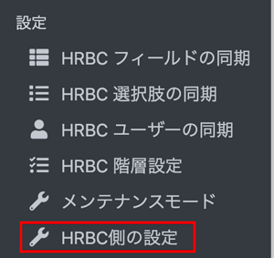

# 【リリース完了】クラウドドキュメント  2021年11月4日 リリース  

## 新機能

### HRBC設定用リンク一覧を追加しました
#### HRBCに設定するリンクを一覧で表示し、コピーできるようになりました。
ご利用のドメインに合わせたHRBC設定用のリンクを一覧で確認いただけます。
コピーも可能ですので設定の際ぜひご活用ください。

一覧表の出力の設定用のURLもございます。

クラウドドキュメントのメニュー　→　設定 →「HRBCの設定」からご確認いただけます

 

### PDFプレビュー機能
#### ダウンロード前にPDFのプレビューができるようになりました。 
ダウンロード前の内容の確認にぜひご活用ください。

 
 

## 不具合修正　

### いくつかの細かい不具合を修正しました

  

-----
* 2021年11月1日新規作成
* 2021年11月5日更新



