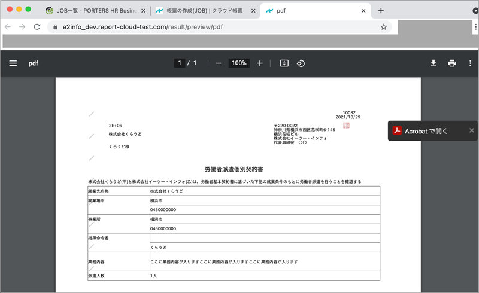

# 【リリース完了】クラウドドキュメント  2021年11月17日 リリース  

## 新機能

### PDFプレビュー機能
#### ダウンロード前にPDFのプレビューができるようになりました。 
ダウンロード前の内容の確認にぜひご活用ください。

 
 

### ユーザー一覧
#### HRBCからクラウドドキュメントに同期したユーザーの一覧を画面から確認できるようになりました。 
クラウドドキュメントの「HRBCユーザーの同期」よりご確認いただけます。
権限(管理者or標準)と状態(有効or無効)を確認できます。

HRBCユーザーの同期から入っていただき、件数をクリックいただくと一覧が表示されます。

 
 

### HRBCの英語環境から出力した場合の出力結果についての変更

#### HRBCの英語環境から出力した場合、年齢を「age」として出力可能となりました。 
今まで、HRBC上で「age」で表示されている場合でも出力は日本語で「年齢」と出力されていましたが 
言語のデフォルト値が「英語」の場合、「yyyy/mm/dd Age 99」の形式で出力するように変更いたしました。

出力結果は下記の通りとなります。 

言語のデフォルト設定の確認・設定は下記の通り行ってください。

 
 

###  出力帳票名を指定できるようになりました
#### 帳票一覧→帳票の更新画面で出力する帳票に任意で名前をつけられるようになりました 
出力する帳票のファイル名を指定することができます。 
半角英数字、全角文字、アンダーバー、二重波括弧で囲んだエイリアス名（例：{{Client.P_Name}}）が利用できます(テキスト1行型のみ)。

 

## 不具合修正　

### いくつかの細かい不具合を修正しました

  

-----
* 2021年11月15日新規作成
* 2021年11月17日更新



