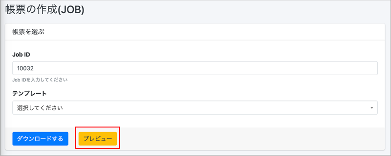
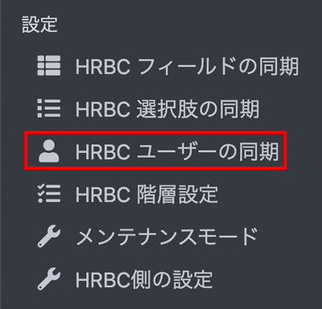

# 【リリース予定】クラウドドキュメント  2021年11月17日 リリース  

## 新機能

### PDFプレビュー機能
#### ダウンロード前にPDFのプレビューができるようになりました。 
ダウンロード前の内容の確認にぜひご活用ください。

 
 

### ユーザー一覧
#### HRBCからクラウドドキュメントに同期したユーザーの一覧を画面から確認できるようになりました。 
クラウドドキュメントの「HRBCユーザーの同期」よりご確認いただけます。
権限(管理者or標準)と状態(有効or無効)を確認できます。

HRBCユーザーの同期から入っていただき、件数をクリックいただくと一覧が表示されます。

 
 

### ユーザー一覧
#### HRBCの英語環境から出力した場合、年齢を「age」として出力可能となりました。 
今まで、HRBC上で「age」で表示されている場合でも出力は日本語で「年齢」と出力されていましたが 
言語のデフォルト値が「英語」の場合、「yyyy/mm/dd Age 99」の形式で出力するように変更いたしました。

出力結果は下記の通りとなります。 

言語のデフォルト設定の確認・設定は下記の通り行ってください。

 

## 不具合修正　

### いくつかの細かい不具合を修正しました

  

-----
* 2021年11月15日新規作成



