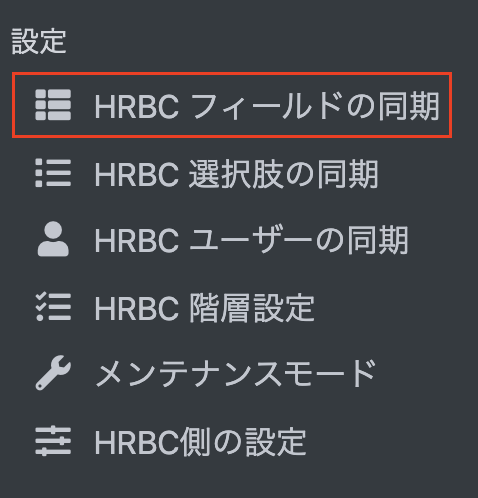
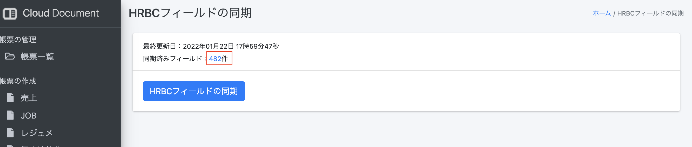
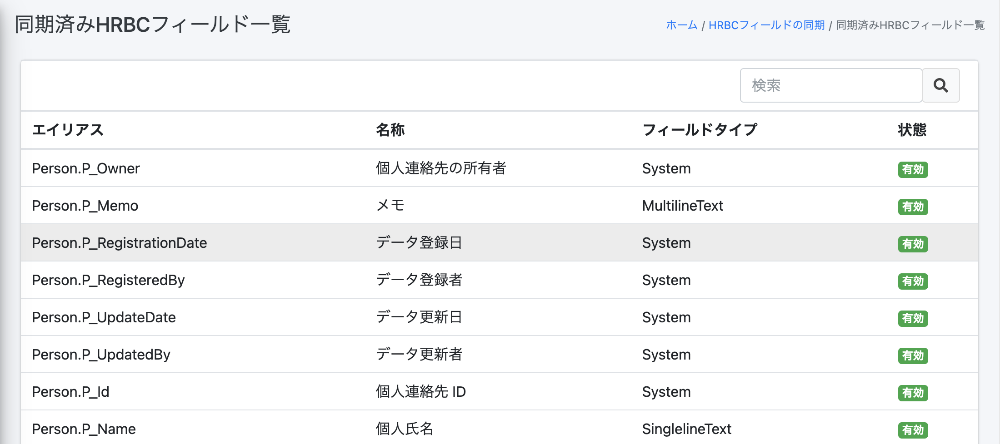
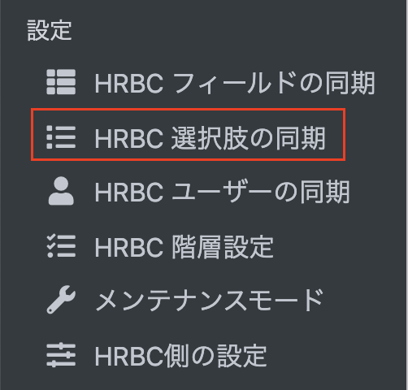
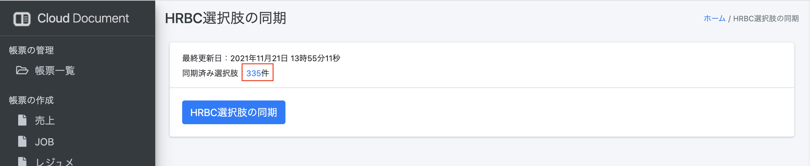
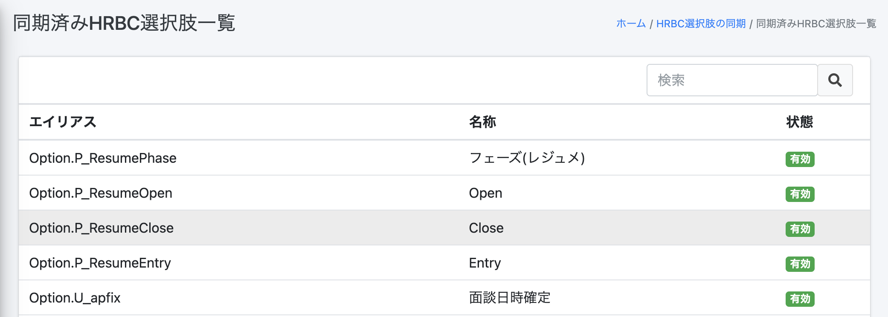

#  【リリース予定】クラウドドキュメント  2022年2月9日 リリース

## 新規機能

### HRBCフィールドの一覧
#### 同期済みHRBCフィールド一覧を確認できるようになりました 
左側のメニュー 設定→HRBCフィールドの同期を選択 

同期済みフィールドの件数を押下 

一覧で表示されます 

  

### HRBC選択肢の一覧 
#### 同期済みHRBC選択肢一覧を確認できるようになりました 
左側のメニュー 設定→HRBC選択肢の同期を選択 

同期済み選択肢の件数を押下 

一覧で表示されます 

 

-----
* 2022年1月21日新規作成
* 2022年2月7日更新



