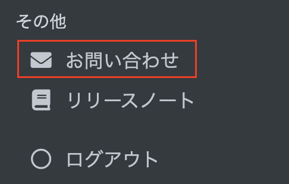
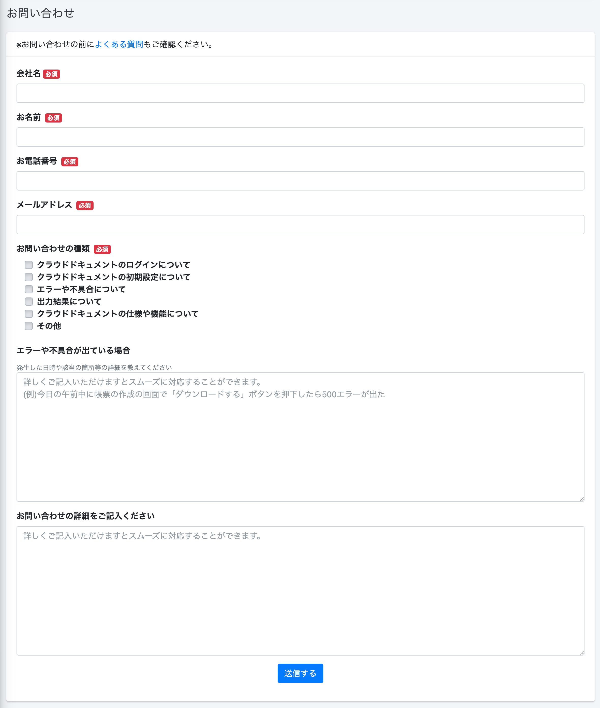
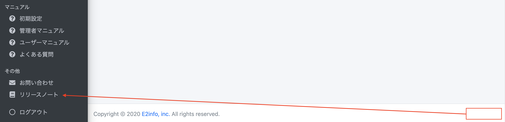
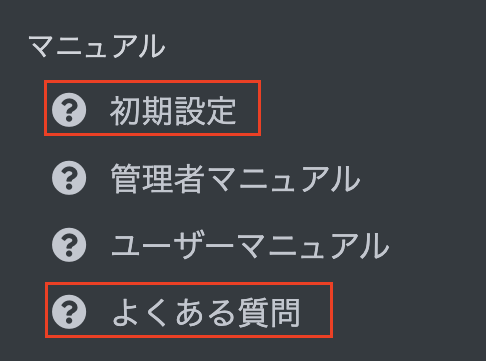

 

  

# 【お知らせ】利用規約の改定とクラウドドキュメントページのメニューの変更について

## 利用規約の改定について

本申し込みされているお客様へはメールにて既にご案内させていただいている通り 
2022年3月1日より利用規約を一部改訂いたしました。 

[新しい利用規約はこちらよりご確認ください。](https://e2info.github.io/cloudreport-docs/terms)

## クラウドドキュメントページのメニューの変更について

本日よりメニューの表示について一部変更となりました 

#### ①お問い合わせフォームの設置について 
クラウドドキュメント上からお問い合わせできるようになりました。 

特に不具合等でのお問い合わせをいただく際には、 
初回のお問い合わせ時にご状況について詳細にお知らせいただくことでその後スムーズに対応に入らせていただけます。 
恐れ入りますがご協力の程よろしくお願いいたします。  

#### ②「リリースノート」の位置が移動となりました 

#### ③「よくある質問」と「初期設定」をメニューに追加しました

今後もより一層サービスの向上に努めてまいりますので、是非変わらぬご利用をお願い申し上げます。 

 

-----
* 2022年3月1日新規作成



