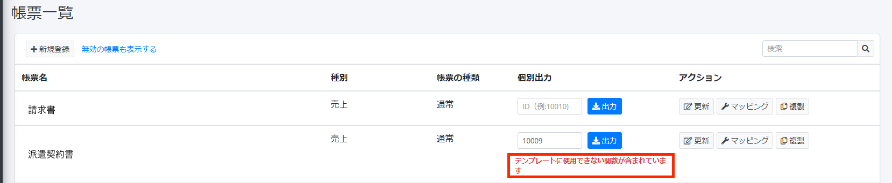
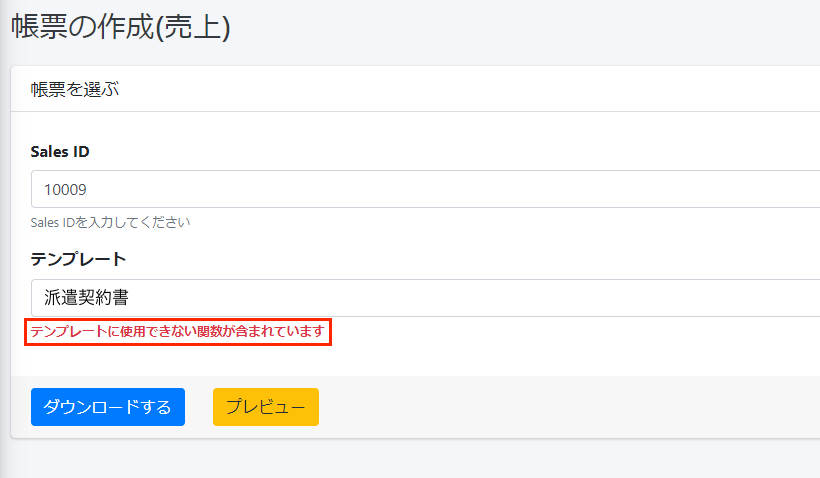
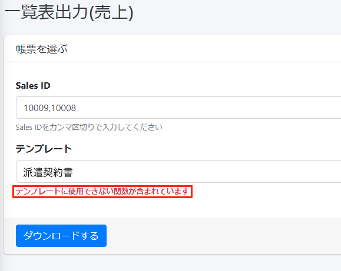
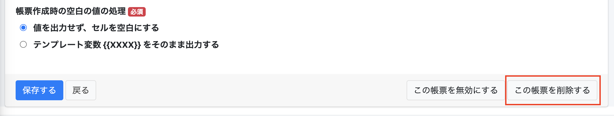
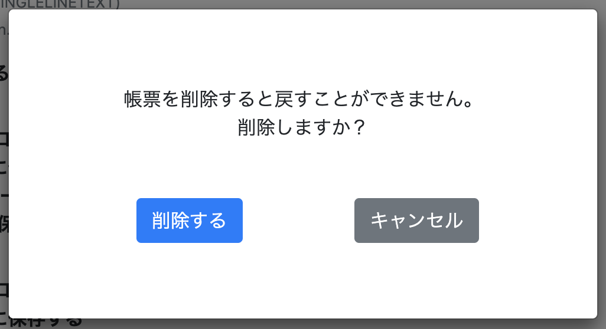
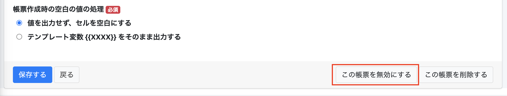
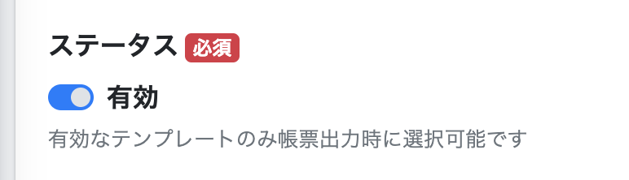

 

  

# 【リリース完了】クラウドドキュメント 2022年4月7日 リリース

## 機能改修

### 対応していない関数が含まれている場合のエラー文表示
#### テンプレートに対応していない関数が含まれている場合エラー文を出るようになりました 
テンプレートに対応していない関数が含まれている場合、エラー文が表示されます。 
<a href= "https://e2info.github.io/cloudreport-docs/faq/faq.html#output4" >使用できない関数はこちらからご確認ください。</a>  
帳票一覧でのエラーメッセージ 
  
帳票の作成でのエラーメッセージ 
  
一覧表出力でのエラーメッセージ 
  

  
### 帳票の削除機能追加
#### 不要になった帳票をクラウドドキュメント上から削除できるようになりました。使わなくなった帳票の整理等にご活用ください。 

下記の手順でクラウドドキュメント上から削除することができるようになりました 
「帳票の更新」画面の一番下の「この帳票を削除する」ボタンを押下してください
  
再度確認をしますので、「削除する」を押下してください 
#### 削除すると戻すことができませんのでご注意ください。  
  

従来どおり、ステータス「無効」も利用可能です。 
  

帳票を無効することで、一時的に利用できなくすることが可能です。 
帳票一覧で「有効な帳票のみ表示させる」を選択することで表示されなくなりますが 
再びステータスを「有効」に設定いただくことで再度利用することが可能です。
 

 

-----
* 2022年4月6日新規作成



