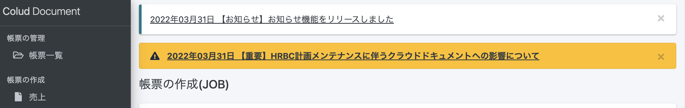
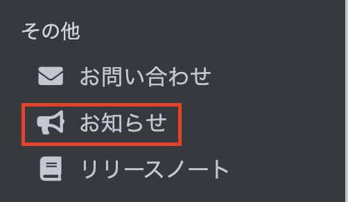

 

  

# 【お知らせ】HRBC計画メンテナンスに伴うクラウドドキュメントへの影響について

2022/04/18(月) AM 02:00〜AM 05:00に、HRBCとHRBC APIの計画メンテナンスが予定されています。  

一時的にHRBC Connect APIのエラーが生じる可能性があるため、 
帳票出力や項目同期がエラーになる可能性があります。 
上記時間帯を避けてクラウドドキュメントをご利用いただきますようお願いいたします。  

ご不便をおかけしますが何卒よろしくお願いいたします。 

 

# 【お知らせ】お知らせ機能のリリースについて

いつもクラウドドキュメントをご利用いただきありがとうございます。  

このたび、クラウドドキュメント上でユーザーの方々へ各お知らせを表示する「お知らせ機能」を追加いたしました。 
今後は「お知らせ機能」で、リリース情報、障害報告等をお知らせいたします。  
 
※各お知らせは「×」で消すことが可能です。一度消しますと再度表示されません。  

左側のメニュー「お知らせ」からもご確認いただけます。 
  

-----
* 2022年3月31日新規作成



