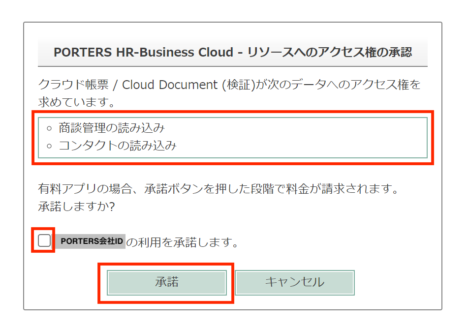

 

  

# PORTERS商談管理階層とコンタクト階層の対応開始に伴う事前承認について

### まず初めに
・PORTERSと新たな階層を連携することに伴い、 
　PORTERSの商談管理階層（Oppourtunity）並びにコンタクト階層(Contact)へのクラウドドキュメントのアクセス権の承認を 
　対応開始前に事前に行なっていただく必要がございます。 
・承認はクラウドドキュメントの1つの環境あたり1回のみ実施をお願いします。 
　(例)PORTERSに本番環境とテスト環境の２環境ある場合はそれぞれ実施が必要です。  

### 事前承認の期間について
機能リリースまでの期間(2023年10月6日(金)頃まで) 
※事前承認を行わない場合、機能リリース後、管理者・標準ユーザーに関わらず初めてログインした方に承認画面が表示されます。 
承認内容の把握のため、事前に管理者ユーザーの方が承認することをお勧めいたします。 
 
### 承認の手順
PORTERS管理者ユーザーの方に実施いただくことをお勧めいたします。 
①PORTERS管理者ユーザーでPORTERSにログインします。 
②下記URLにアクセスしてください 
https://e2info_dev.cloud-document-test.net/approval/opportunity_and_contact
  
アクセスすると承認画面が表示されます。 
PORTERS会社IDを確認して、チェックボックスにチェックを入れて、「承認」ボタンを押してください。 
  

以上で商談管理階層（Oppourtunity）並びにコンタクト階層(Contact)へのクラウドドキュメントのアクセス権の承認が完了です。  

### 注意事項
・商談管理階層（Oppourtunity）とコンタクト階層(Contact)の利用有無に関わらず承認が必要となります。 
・この作業は1環境あたり1度の承認が必要です 
・こちらの作業を行わない場合、商談管理階層とコンタクト階層の機能リリース後、管理者・標準ユーザーに関わらず 
初めてログインした方に承認画面が表示されます。  

### 各階層の利用開始のための機能リリース時期について 
下記のスケジュールで機能リリース予定です。  

商談管理階層（Oppourtunity）　　　　2023年10月中旬ごろ 
コンタクト階層(Contact)　      2023年12月ごろ 

 
ご不明点がある場合はサポートデスクまでお問い合わせください 
クラウドドキュメント サポートデスク 
(平日9:00〜17:00) 
support_cloudreport@e2info.com 
 

-----
* 2023年9月22日新規作成



